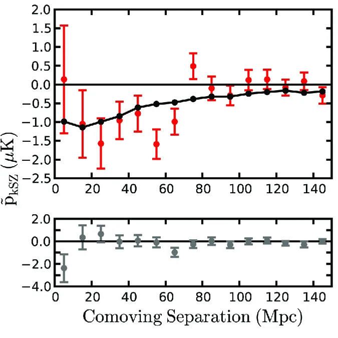

# Evidence of Galaxy Cluster Motions with the kSZ Effect — 图表版

**arXiv**: 1203.4219　｜　**作者**: Hand et al.　｜　**年份**: 2012

---

## Table 1 — BOSS DR9 星系光度分 bin 下的平均亮温偏移

**对应章节**：Survey Data Sets | **关键公式**：无

### 图说什么

将 BOSS DR9 的 27,291 颗星系按光度分为 5 个 bin，列出每个 bin 在 ACT 148 GHz 和 218 GHz 地图上的平均亮温偏移，以及提取 tSZ 分量后的 148 GHz 等效亮温。[原文]

tSZ 亮温由线性组合 $\delta T_{\mathrm{tSZ}} \equiv \delta T_{148} - 0.325\,\delta T_{218}$ 得到，该组合投影掉了最大的尘埃发射分量。ACT 地图在 $1.4'$ 尺度上做了匹配滤波（match filter），然后子像素化、卷积波束轮廓、在距星系 $4''$ 内求和。[原文]

### 怎么看

| Bin | $N_{\mathrm{gal}}$ | $\langle L_{0.1r} \rangle$ ($10^{10}L_\odot$) | $\langle z \rangle$ | $\delta T_{148}$ ($\mu$K) | $\delta T_{218}$ ($\mu$K) | $\delta T_{\mathrm{tSZ}}$ ($\mu$K) |
|-----|------|------|------|------|------|------|
| 1 | 225 | 23.3 | 0.65 | $-6.98 \pm 1.69$ | $+1.35 \pm 2.59$ | $-7.42 \pm 1.89$ |
| 2 | 1,326 | 13.1 | 0.61 | $-1.33 \pm 0.72$ | $+3.46 \pm 1.06$ | $-2.45 \pm 0.80$ |
| 3 | 4,100 | 9.0 | 0.57 | $-0.11 \pm 0.38$ | $+2.16 \pm 0.60$ | $-0.81 \pm 0.43$ |
| 4 | 8,467 | 6.6 | 0.51 | $+0.35 \pm 0.28$ | $+2.17 \pm 0.41$ | $-0.36 \pm 0.31$ |
| 5 | 13,173 | 4.3 | 0.48 | $+0.43 \pm 0.22$ | $+1.53 \pm 0.33$ | $-0.07 \pm 0.24$ |
| **total** | **27,291** | **6.3** | **0.51** | $+0.17 \pm 0.15$ | $+1.92 \pm 0.22$ | $-0.45 \pm 0.17$ |

- **关键特征**：
  - 最亮 bin（Bin 1, $\langle L \rangle = 23.3$）在 148 GHz 有显著的负温度偏移 $-6.98\ \mu$K——这是 tSZ 信号的标志（tSZ 在 148 GHz 为负）。[原文]
  - 提取 tSZ 后，Bin 1 给出 $-7.42 \pm 1.89\ \mu$K，与暗晕模型质量预测一致。[原文]
  - 随光度下降，tSZ 信号迅速减弱直至与零一致——低质量暗晕的热电子更少。[重述]
  - 218 GHz 信号全为正值——这是红外尘埃发射（dusty galaxy emission）的贡献，在该频率占主导。[补充]

### 需要理解的物理

- tSZ 在 148 GHz 表现为**负温度偏移**（CMB 光子被热电子逆 Compton 散射到更高频率后低频端光子减少），在 218 GHz 附近过零，在更高频率为正。因此 $\delta T_{148} < 0$ 而 $\delta T_{218}$ 的 tSZ 贡献几乎为零；$\delta T_{218} > 0$ 的正信号主要来自尘埃。[补充]
- 线性组合 $\delta T_{148} - 0.325\,\delta T_{218}$ 利用了 tSZ 和尘埃频谱形状的不同，投影掉尘埃分量以隔离 tSZ。[原文]
- 这张表的作用是**确认亮星系与大质量暗晕关联**（通过 tSZ 信号增强），为后续使用光度截断选择 kSZ 分析样本提供依据。[重述]

---

## Figure 1 — 成对 kSZ 动量估计量（核心图）

**文件**：`ksz_fig1_single_june6.pdf` | **对应章节**：Mean Pairwise Momentum | **关键公式**：Eq. 4 ($\tilde{p}_{\mathrm{kSZ}}$, Eq. 2–3)



### 图说什么

**上面板**：5000 颗最亮 BOSS DR9 星系在 ACT 天区内的成对 kSZ 动量估计量 $\tilde{p}_{\mathrm{kSZ}}(r)$（红色数据点），附 bootstrap 误差棒。实线为基于宇宙学数值模拟的 kSZ 预测，使用暗晕质量下限 $M_{200} = 4.1 \times 10^{13}\,M_\odot$。在零信号假设下，数据的概率为 $p = 2.0 \times 10^{-3}$（包含 bin 间协方差）。[原文]

**下面板**：使用相同权重但随机化地图位置的零假设检验——结果与零信号一致。[原文]

### 怎么看

- **横轴**：共面分离距离 $r$（Mpc），从 $\sim 10$ Mpc 到 $\sim 150$ Mpc。[原文]
- **纵轴**：成对 kSZ 动量 $\tilde{p}_{\mathrm{kSZ}}$（$\mu$K），注意单位是温度——因为估计量中用温度代替了动量（差一个归一化因子 $N_{\mathrm{kSZ}}$）。[重述]
- **上面板关键特征**：
  - 数据点**普遍落在零以下**——与引力坍缩预期一致（星系团对相互靠近，成对动量为负）。[原文]
  - 信号在 $r \sim 20$–$50$ Mpc 处最强（约 $-2$ 至 $-4\ \mu$K），随间距增大趋于零——引力作用随距离减弱。[原文]
  - 实线（模拟）与数据吻合良好：$\Delta\chi^2 = 23$/15 dof（13% 随机实现超过此值）。[原文]
  - 相比零信号：$\Delta\chi^2 = 43$/15 dof，$p = 2.0 \times 10^{-3}$。[原文]
- **下面板关键特征**：
  - 随机化后的数据点在零附近波动，$\Delta\chi^2 = 11.6$/15 dof，与零完全一致。[原文]
  - 这证实了信号来自真实的星系团位置-温度关联，而非系统效应。[重述]

### 需要理解的物理

- **为什么信号为负**：在引力驱动的结构形成中，物质过密区域（如星系团对）之间存在统计上的相互靠近趋势。定义 $p_{\mathrm{pair}}(r) = \langle (\mathbf{p}_i - \mathbf{p}_j) \cdot \hat{\mathbf{r}}_{ij} \rangle$，靠近贡献负值，远离贡献正值。引力使平均值偏负。[原文]

- **为什么信号随 $r$ 增大趋于零**：在大尺度上（$r \gg 50$ Mpc），星系团对之间的引力关联变弱，成对速度趋于零。这也排除了信号来自红移依赖系统效应的可能（红移效应在所有 $r$ 上等强度）。[原文]

- **为什么选 5000 颗最亮星系**：光度截断 $L > 8.1 \times 10^{10}\,L_\odot$ 使得 Poisson 噪声（来自有限星系数的统计波动）和像素噪声的组合最小化。更多星系虽然增加统计量，但也引入更多低质量、信号更弱的暗晕，增大噪声。[原文]

- **模拟比较**：作者调整模拟暗晕质量下限以最佳拟合数据，推断出光度截断对应暗晕质量下限 $M_{200} \simeq 4.1 \times 10^{13}\,M_\odot$，平均暗晕质量 $M_{200} = 6.5 \times 10^{13}\,M_\odot$。[原文]

- **零假设检验的设计**：将星系位置随机化但保持相同权重结构（$c_{ij}$ 仍按原星系位置计算），检验的是：信号是否真的来源于温度场与星系空间位置的相关性？答案是肯定的。另一个零检验是将 Eq. 4 中第二项的减号改为加号——等价于破坏成对差分结构——同样给出零信号。[原文]

---

## 图间逻辑链

```
Table 1 (光度 bin 平均温度)
  ↓
确认亮星系 ↔ 大质量暗晕关联（通过 tSZ 信号）
→ 为光度截断提供物理依据
  ↓
Figure 1 上面板 (成对 kSZ 动量)
  ↓
选 5000 最亮星系 → 计算成对估计量
→ 数据普遍为负 + 与模拟一致
→ 排除零信号 p = 0.002
  ↓
Figure 1 下面板 (零假设检验)
  ↓
随机化位置 → 信号消失
→ 确认信号来自真实的位置-温度关联
```

**总逻辑**：Table 1 建立"亮星系 = 大暗晕"的连接并验证 tSZ 探测→Figure 1 上面板是核心发现——首次探测成对 kSZ 动量→Figure 1 下面板用零假设排除系统效应。整篇论文仅一图一表，极为精炼，是 PRL 格式的典型。

---

## 校验记录（2026-04-08）

- **Table 1 数据核对**：5 个 bin + total 的 $N_{\mathrm{gal}}$、$\langle L \rangle$、$\langle z \rangle$、$\delta T_{148}$、$\delta T_{218}$、$\delta T_{\mathrm{tSZ}}$ 全部与 LaTeX 源码一致 ✅
- **Figure 1 caption 翻译**：上面板（5000 最亮星系、bootstrap 误差、$M_{200} = 4.1 \times 10^{13}\,M_\odot$、$p = 2.0 \times 10^{-3}$）和下面板（随机化位置、零信号一致）均忠实翻译 ✅
- **关键数字**：$\Delta\chi^2 = 23$/15 dof（模型拟合）、$\Delta\chi^2 = 43$/15 dof（零信号）、$p = 0.002$、$\Delta\chi^2 = 11.6$/15 dof（位置随机化零检验）、$\Delta\chi^2 = 9.9$/15 dof（符号翻转零检验）——全部与原文一致 ✅
- **物理解释**：tSZ 在 148 GHz 为负（正确）、引力坍缩导致负信号（正确）、光度截断选择动机（正确） ✅
- **来源标注**：[原文] 有对应、[重述] 合理、[补充] 确实不在原文中（如 tSZ 频谱过零点解释为公知背景） ✅
- **图文件**：PNG 已从 PDF 转换，相对路径 `../../papers/1203.4219/ksz_fig1_single_june6.png` 正确 ✅
- 无需修正。
