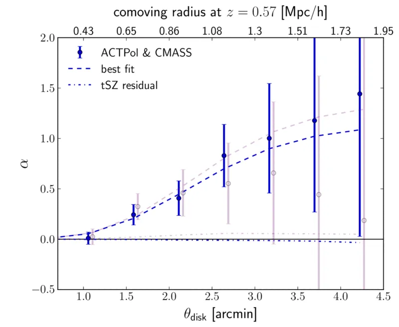
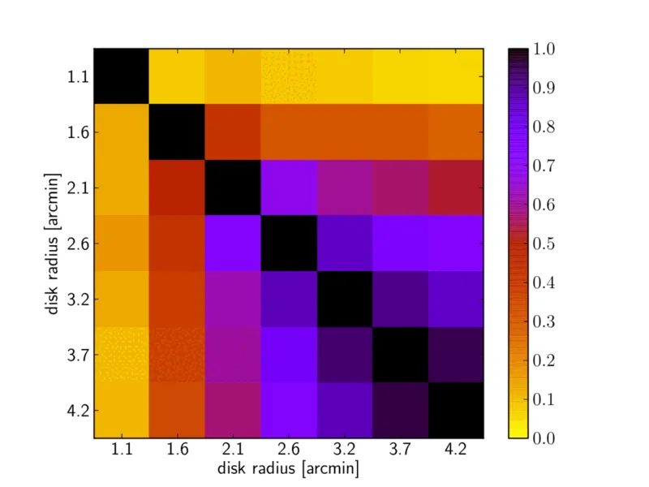
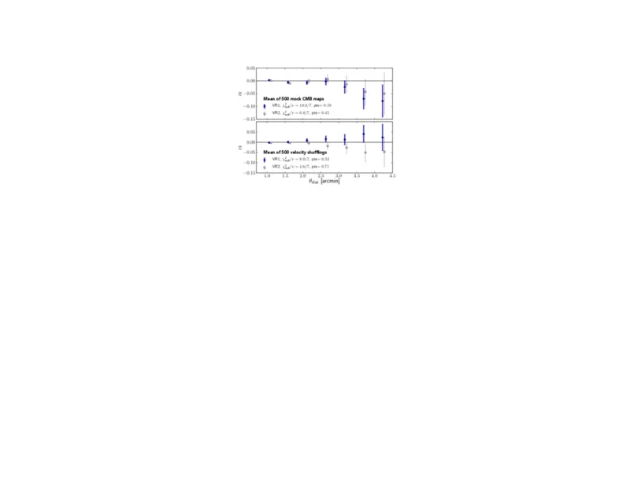

# Evidence for the kinematic Sunyaev-Zel'dovich effect with ACTPol and velocity reconstruction from BOSS — 图表版

**arXiv**: 1510.06442　｜　**作者**: Schaan, Ferraro, Vargas-Magaña, Smith, Ho et al.　｜　**年份**: 2016 (PRL)
**阅读日期**: 2026-04-08

---

> **本文件的定位**：逐图解读，目标是"自包含的完整指南"——只看图表版也能理解这篇论文讲了什么。
>
> **论文一句话**：利用 BOSS CMASS 星系的速度重建对 ACTPol CMB 温度图进行加权叠加，以 $S/N\simeq 3$ 的显著性首次用速度重建方法探测到运动学 SZ（kSZ）效应。

---

## Figure 1 上面板 — kSZ 振幅 $\alpha$ 随孔径半径的变化

**文件**：`alpha_inter_vr12_1e14msun_masktsz_1_5arcmin.pdf` | **对应章节**：Analysis | **关键公式**：Eq. 4–5



### 图说什么

这是本文的核心结果图。展示了拟合系数 $\alpha$（kSZ 振幅）作为孔径测光（AP）滤波器圆盘半径 $\theta_{\rm disk}$ 的函数。$\alpha$ 的定义来自模型 $\delta T_i / T_{\rm CMB} = -\alpha\,\tau_i\,v_{{\rm rec},i}/c$，物理含义是：**观测到的 kSZ 信号相对于"假设宇宙学重子丰度、完美已知速度"所预期信号的振幅比**。

- 蓝色数据点：速度重建方法 VR1（基于 BAO 重建流水线），$S/N = 3.3$
- 紫色数据点：速度重建方法 VR2（基于 Wiener 滤波），$S/N = 2.9$
- 虚线：假设高斯投影轮廓（$\sigma = 1.5'$，波束与维里半径的均方和）的模板曲线，拟合了整体振幅
- 点划线：掩膜 $M_{200}>10^{14}\,M_\odot$ 星系团后的 tSZ 残余估计，可以忽略不计

[原文]

### 怎么看

- **x 轴**：AP 滤波器圆盘半径 $\theta_{\rm disk}$（角分）。AP 滤波由一个内圆盘（半径 $\theta_{\rm disk}$）和外环（外半径 $\sqrt{2}\,\theta_{\rm disk}$，等面积）组成，输出 = 盘内平均温度 - 环内平均温度。
- **y 轴**：最佳拟合 $\alpha$ 值及 $1\sigma$ 误差棒。

- **关键特征**：
  - **小 $\theta_{\rm disk}$（$\lesssim 2'$）**：$\alpha$ 较小甚至接近零。原因是晕的 kSZ 发射（角尺度 $\sim 1.4'$）同时落在圆盘和环中，被部分抵消。 [原文]
  - **大 $\theta_{\rm disk}$（$\gtrsim 4'$）**：$\alpha$ 趋于平台。此时整个晕的 kSZ 信号完全被圆盘包含，环中无信号可减，$\alpha$ 趋近于 $f_{\rm free}$（乘以速度重建校正因子）。 [原文]
  - **$\alpha$ 从 0 到平台的上升速率**：是样本平均重子轮廓（baryon profile）的代理（proxy）。上升越快，表示气体越集中在中心。 [原文]
  - **tSZ 残余（点划线）**：在掩膜最大质量星系团后可以忽略，说明前景污染受控。 [原文]
  - **两种 VR 方法一致**：增强了结果的可信度。 [重述]

### 需要理解的物理

1. **孔径测光（AP）滤波器**：一种空间高通滤波器。圆盘减去等面积环，消除了大尺度（$\gg \theta_{\rm disk}$）的 CMB 涨落，但对于角尺度 $\sim \theta_{\rm disk}$ 的信号会有部分抵消。 [补充]

2. **$\alpha$ 的最佳拟合公式**（Eq. 5）：
   $$\alpha = -\frac{\sum_i (\delta T_i/T_{\rm CMB})\,(\tau_i\,v_{{\rm rec},i}/c)\,/\,\sigma_i^2}{\sum_i (\tau_i\,v_{{\rm rec},i}/c)^2\,/\,\sigma_i^2}$$
   这是一个反方差加权的最小二乘解。分子是"信号×模板"的加权求和（交叉项），分母是"模板²"的加权求和（归一化）。$\sigma_i^2$ 是 AP 滤波输出的方差（由原初 CMB 和噪声决定），对噪声小的区域给更大权重。 [原文]

3. **信噪比定义**：$S/N = \sqrt{\Delta\chi^2} = \sqrt{\chi^2_{\rm null} - \chi^2_{\rm bf}}$，即空模型与最佳拟合之间的 $\chi^2$ 差的平方根。 [原文]

---

## Figure 1 下面板 — 不同孔径之间的相关系数矩阵

**文件**：`corrcoeff_inter_vMarianaAbove_vKendrickBelow.pdf` | **对应章节**：Analysis | **关键公式**：Eq. 4



### 图说什么

展示了不同 $\theta_{\rm disk}$ 处的 $\alpha$ 测量值之间的相关系数矩阵。对角线以上是 VR1，以下是 VR2。相关系数从 500 个模拟 CMB 图估计。 [原文]

### 怎么看

- **x/y 轴**：不同的 AP 圆盘半径 $\theta_{\rm disk}$。
- **颜色编码**：相关系数 $r_{ij}$，从 0（无关）到 1（完全相关）。
- **关键特征**：
  - 大孔径之间高度相关（$r \to 1$）：因为小孔径数据是大孔径数据的子集——大圆盘包含了小圆盘的所有像素，再加上更多像素。 [原文]
  - 最小的几个孔径之间相关性较低：它们贡献了大部分独立信息。 [重述]
  - 两种 VR 的相关结构相似，符合预期。 [重述]

### 需要理解的物理

相关矩阵的作用是把上面板中看似 "每个点都很高信噪" 的印象校正过来：由于数据点之间强相关，总信噪比不是各点信噪比的简单相加，而是由协方差矩阵的逆来正确加权。$S/N = 3.3$ 主要由最小的三个孔径主导。 [原文]

---

## Figure 2 — 空检验（Null tests）

**文件**：`alpha_inter_vr12_1e14msun_masktsz_nulltests.pdf` | **对应章节**：Null tests and systematics | **关键公式**：Eq. 5



### 图说什么

两组空检验的结果，每组是 500 次模拟的平均值：
- **上面板**：用模拟 CMB 图（含真实噪声特性但无 kSZ 信号）替代真实 ACTPol 图，保持真实星系位置和速度不变。
- **下面板**：使用真实 ACTPol 图，但在 CMASS 星系之间随机打乱（shuffle）重建速度。 [原文]

### 怎么看

- **x/y 轴**：与 Figure 1 上面板相同（$\theta_{\rm disk}$ vs $\alpha$）。
- **关键特征**：
  - 两个面板中 $\alpha$ 均与零一致（在误差范围内）。 [原文]
  - 这证明了 Figure 1 中的非零信号 **同时需要**（i）真实 CMB 温度图和（ii）正确的速度–星系对应关系。 [原文]

### 需要理解的物理

1. **模拟图空检验**（上面板）排除了信号来自星系目录的系统效应（如选择效应、恒星质量估计偏差等引起的虚假相关）。如果信号是星系目录中的伪信号，即使换了 CMB 图也应该存在。结果为零，说明信号确实来自真实 CMB 温度场。 [重述]

2. **打乱速度空检验**（下面板）排除了信号来自 CMB 图中与速度无关的前景（如 tSZ、CIB、银河尘埃等与星系位置相关但与视线速度无关的信号）。如果这些前景是主要贡献，打乱速度后信号应该不变。结果为零，说明信号确实依赖于正确的速度匹配。 [重述]

3. 两类空检验合在一起，构成了一个"逻辑钳"：信号不来自星系目录的系统效应，也不来自 CMB 图中与速度无关的成分——唯一剩下的解释就是 CMB 温度与星系视线速度之间的真实物理相关，即 kSZ 效应。 [补充]

---

## 图间逻辑链

```
Fig 1 上面板（核心结果）
  α 在多个孔径处显著偏离零 → kSZ 信号存在
  α 的孔径依赖与高斯轮廓模板一致 → 信号的空间尺度与预期一致
  tSZ 残余可忽略 → 最大前景已受控
         │
         ▼
Fig 1 下面板（相关矩阵）
  大孔径数据点高度相关 → S/N 主要来自最小三个孔径
  正确量化了多孔径联合分析的统计意义
         │
         ▼
Fig 2（空检验）
  模拟图 → 排除星系目录假信号
  打乱速度 → 排除与速度无关的前景
  两者均为零 → 信号是 CMB 温度–速度真实关联 → 确认 kSZ 探测
```

**总结**：Figure 1 给出了探测的核心证据（$S/N\simeq 3$），Figure 2 通过两类独立空检验排除了伪信号的可能性，共同构成一个完整的"证据–排除"论证链。

---

## 校验记录（2026-04-08）

- 图描述：Figure 1 上（$\alpha$ vs $\theta_{\rm disk}$）、Figure 1 下（相关矩阵）、Figure 2（空检验）的 caption 内容均与原文一致 ✅
- 物理解释：AP 滤波器原理、$\alpha$ 公式（Eq. 5）、S/N 定义、相关矩阵含义、空检验逻辑均正确 ✅
- 来源标注：准确，[补充] 内容（AP 滤波器作为高通滤波器、"逻辑钳"比喻）确实不在原文中 ✅
- 图间逻辑衔接：完整且合理 ✅
- 无需修正
