# 1511.02846 — 图表完整导读

> **目标**：只看这份文件，就能理解整篇论文在讲什么。每张图都配有：前因（为什么要画这张图）、图本身（怎么看）、后果（这张图推动了什么结论）。
>
> 标注规则：**[原文]** = 论文正文/caption 直接说明；**[补充]** = Agent 的解释。

---

## 论文全局地图

**论文标题**：Large-scale kinetic Sunyaev-Zel'dovich effect from reionization（再电离的大尺度运动学 SZ 效应）

**一句话摘要**：CMB 光子穿过再电离时代的自由电子时被 Doppler 频移（kSZ 效应），本文用解析理论 + 数值模拟计算了这个效应在**所有角度尺度**（$\ell \sim 3$–$3000$）的功率谱，并预测了 kSZ 与 21 cm 的交叉相关。

**论文的逻辑链**：

```
§1 Introduction — kSZ 是什么，为什么重要
     ↓
§2 解析理论 — 推导 kSZ 功率谱的公式
   §2.1 基本表达式：温度涨落 = 视线积分(散射概率 × 电子动量)
   §2.2 Doppler 功率谱：大尺度 ℓ~20-30 的峰来自"再散射面"
   §2.3 Doppler-LSS 交叉相关：密度峰是热点还是冷点？
   §2.4 单个 HII 区的冷点估计
     ↓
§3 数值模拟 — 验证解析理论 + 处理解析理论无法处理的非线性效应
   §3.1 Patchy 再电离模拟（excursion set 算法）
   §3.2 光锥投影（模拟盒子 → 全天地图）
   §3.3 kSZ 地图的四分量分离
   §3.4 功率谱的十项解剖 → patchy 主导小尺度
     ↓
§4 kSZ–21cm 交叉相关 — 唯一能分辨红移信息的手段
   §4.1 交叉功率谱和信噪比
   §4.2 频率（红移）依赖 → 追踪再电离历史
     ↓
§5 Summary — 两个主要特征：ℓ~20-30 Doppler 峰 + ℓ≳300 patchy 平台
```

**关键物理量速查**：

| 符号 | 含义 | 直觉 |
|------|------|------|
| $g(z)$ | 可见度函数 | "此处电子散射 CMB 光子的概率密度" |
| $\mathbf{q} = (1+\delta)(1+\delta_x)\mathbf{v}$ | 比动量 | 密度 × 电离 × 速度 三者的耦合 |
| $u(z) = g(z)\dot{D}/D/(1+z)$ | 速度-可见度耦合函数 | "此红移处速度场产生 kSZ 信号的效率" |
| $\delta$ | 物质密度对比度 | 某处比平均密多/少多少 |
| $\delta_x$ | 电离对比度 | 某处比平均电离多/少多少（HII 区内 ~$1/\bar{x}-1$，中性区 $= -1$）|
| $\tau$ | Thomson 光学深度 | "总共有多少电子参与了散射" |
| $C_\ell$ | 角功率谱 | "在角尺度 $\theta \sim 180°/\ell$ 上温度涨落的统计强度" |

---

## Figure 1 — Doppler 功率谱的红移微分贡献

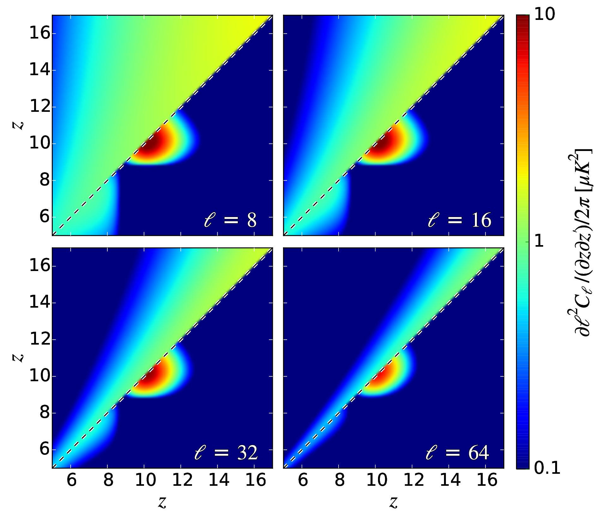

**对应章节**：§2.2　｜　**关键公式**：Eq.4–7

### 前因：为什么要画这张图

kSZ 温度涨落（Eq.3）是沿视线方向的积分——不同红移 $z$ 处的电子运动都有贡献。那么问题来了：**贡献集中在哪些红移？** 如果所有红移都均匀贡献，信号会因为远近端电子运动方向相反而互相抵消（"视线消去"，line-of-sight cancellation）。只有当贡献**集中在某个窄红移范围**时，消去才不完全，才有可测的信号。

### 图说什么

四个面板（不同 $\ell$ 值）展示功率谱的**红移微分贡献** $dC_\ell / dz\,dz'$。每个面板分两半：

- **左上三角**：假设宇宙一直完全电离（$x = 1$，无再电离）
- **右下三角**：有再电离（tanh 模型，$z_r = 10$，$\Delta z = 0.5$）

### 怎么看

1. **颜色深** = 该 $(z, z')$ 红移组合对 $C_\ell$ 贡献大
2. **左上三角**（无再电离）：贡献沿对角线分散，到处都有一点但哪儿都不集中——视线消去使得总信号很弱。**[原文]**
3. **右下三角**（有再电离）：贡献**集中在 $z \approx 10$ 的十字线上**！十字的横竖分别对应 $z = z_r$ 和 $z' = z_r$。**[原文]**
4. 十字线交叉处 ($z = z' = z_r$)：这是"再散射面"的自相关 → 对应 Figure 3 中的 $C_\ell^{\rm R}$ 项。**[补充]**
5. 对比四个面板：$\ell$ 越大（越小的角尺度），十字线越集中 → 小尺度 kSZ 几乎全部来自 $z_r$ 附近。**[补充]**

### 需要理解的物理

**视线消去的数学根源**：纵向功率谱 $C_\ell^\parallel$ 正比于 $(\partial u / \partial \chi)^2$（Eq.6）。$u(z) = g(z)\dot{D}/D/(1+z)$ 在 $x = 1$ 时光滑变化 → 导数小 → 信号弱。但再电离时 $g(z)$ 在 $z_r$ 处从零陡然升起 → $\partial u / \partial \chi$ 出现尖峰 → 打破视线消去 → 信号集中在 $z_r$。**[原文]**

**核心结论**：再电离为大尺度 kSZ 提供了一个"再散射面"，类似于原初 CMB 的"最后散射面"，只不过不是发生在 $z \sim 1100$ 而是 $z \sim 10$。

### 后果

这张图建立了核心直觉——再电离的存在打破视线消去，从而产生可测信号。接下来 Figure 3 将把这个信号分解为三项。

---

## Figure 2 — 再电离如何翻转密度-Doppler 相关的符号

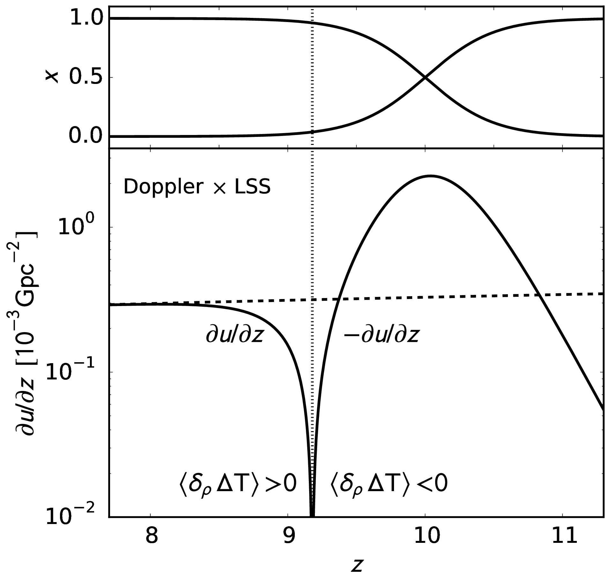

**对应章节**：§2.3　｜　**关键公式**：$\partial u / \partial z = \bar{x}(\partial u_0 / \partial z) + u_0(\partial \bar{x} / \partial z)$

### 前因：为什么要画这张图

知道了 kSZ 功率谱的形状（Figure 1），下一个问题是：**kSZ 信号和大尺度结构（密度场）是怎么相关的？** 如果高密度区对应 CMB 热点，那交叉相关为正；如果对应冷点，则为负。这对探测策略至关重要——特别是计划用 21 cm 做交叉相关时，需要知道符号。

### 图说什么

- **上面板**：再电离历史 $x(z)$（tanh 模型，$z_r = 10$）
- **下面板**：关键量 $\partial u / \partial z$ 随红移的变化。它的**符号直接决定了密度峰是热点还是冷点**。

### 怎么看

1. **竖虚线**标出符号翻转的红移（约 $z \sim 9$）
2. 虚线**左侧**（低 $z$，再电离完成后）：$\partial u / \partial z > 0$ → 高密度区 = **热点** **[原文]**
3. 虚线**右侧**（高 $z$，再电离进行中）：$\partial u / \partial z < 0$ → 高密度区 = **冷点** **[原文]**
4. **虚线** = 恒定电离（$x = 1$）时的 $\partial u / \partial z$，始终为正 → 说明**符号翻转完全是再电离造成的** **[原文]**

### 需要理解的物理

$u = u_0 \cdot x$，其中 $u_0$ 编码速度增长，$x$ 编码电离分数。对 $z$ 求导：

$$\frac{\partial u}{\partial z} = \bar{x}\frac{\partial u_0}{\partial z} + u_0\frac{\partial \bar{x}}{\partial z}$$

- **第一项**（速度增长）始终为正
- **第二项**（电离演化）：再电离期间 $z$ 减小时 $x$ 增大 → $\partial \bar{x} / \partial z < 0$ → 负贡献

两项竞争。当第二项的负贡献压过第一项时，$\partial u / \partial z < 0$ → **密度峰变成冷点**。**[原文]**

**冷点的物理直觉**：想象一个高密度区正在坍缩——近端电子远离你（红移），远端电子朝向你（蓝移）。如果整个区域均匀电离，远近两端部分抵消。但在再电离期间，**近端比远端"更早"被电离**（近端对应更低红移 → 更高电离分数）。所以光子在近端被更多地散射 → 净效应是红移 → 冷点。**[补充]**

### 后果

这个符号翻转直接预测了 §2.4 中孤立 HII 区的冷点，以及 §4 中 kSZ–21cm 交叉相关的**正号**（经过 21 cm 端再翻转一次后）。

---

## Figure 3 — 瞬时再电离的 Doppler 功率谱分解

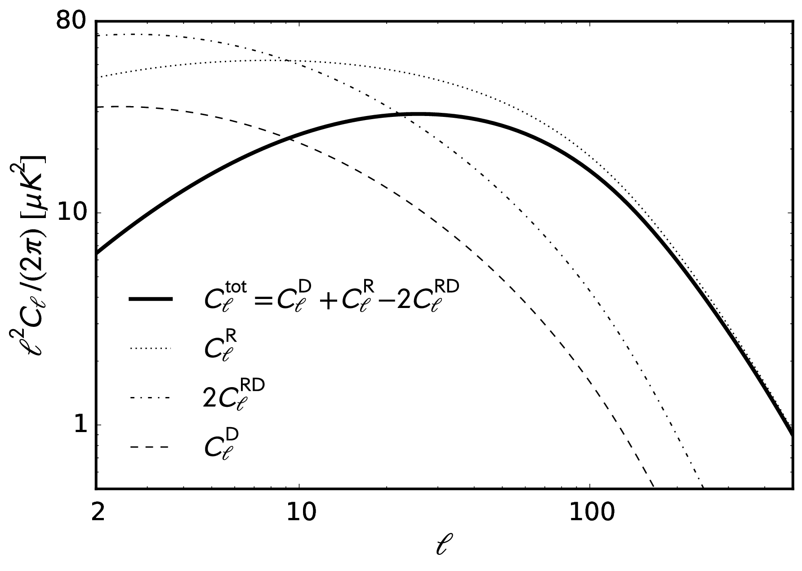

**对应章节**：§2.2　｜　**关键公式**：Eq.8（$C_\ell = C_\ell^{\rm D} + C_\ell^{\rm R} - 2C_\ell^{\rm RD}$）

### 前因：为什么要画这张图

Figure 1 告诉我们信号集中在 $z_r$ 附近，但具体由几个物理过程贡献？瞬时再电离（$\Delta z \to 0$）是一个理想化的极限，在这个极限下 $x(z)$ 从 0 跳到 1 → $\partial u / \partial z$ 的导数含一个 $\delta$ 函数 → 功率谱可以**精确分解为三项**，每项有清晰的物理含义。

### 图说什么

三条曲线代表 Doppler 功率谱的三项分解（$z_r = 10$）：

| 曲线 | 对应项 | 物理含义 |
|------|--------|---------|
| 虚线 $C_\ell^{\rm R}$ | 再散射面 | $z = z_r$ 那个壳层上速度场的一次性投影 |
| 虚线 $C_\ell^{\rm D}$ | Doppler | 再电离**之后**，速度场持续增长的贡献（视线积分） |
| 虚线 $2C_\ell^{\rm RD}$ | 交叉抵消 | $C^{\rm R}$ 和 $C^{\rm D}$ 的干涉（总是负号 = 部分抵消）|
| 实线 | 总功率谱 | $C^{\rm D} + C^{\rm R} - 2C^{\rm RD}$ |

### 怎么看

1. **$C_\ell^{\rm R}$ 主导**：在 $\ell \gtrsim 10$，$C^{\rm R}$ 远大于 $C^{\rm D}$ → 信号主要来自再散射面的一次性投影。**[原文]**
2. **峰在 $\ell \sim 20$–$30$**：对应再散射面处的速度相关长度投影到天球上的角度 → $\theta \sim 5°$–$10°$。**[补充]**
3. **$C^{\rm D}$ 较小且峰在更大尺度**：因为它是视线积分，受视线消去压制。**[原文]**
4. **$2C^{\rm RD}$ 为负**：近端速度（$z < z_r$）与再散射面速度反相关 → 部分冲销再散射面信号。**[补充]**
5. **总功率谱的峰**：$\ell^2 C_\ell / (2\pi) \sim 30\ \mu\text{K}^2$ → 这是大尺度 kSZ Doppler 峰的典型振幅。**[原文]**

### 需要理解的物理

**为什么 $C^{\rm R}$ 主导？** 再散射面上，速度场在 $z_r$ 的一个时刻"冻结"在天球上，没有时间让远近两端的速度抵消。这就像拍了一张快照——不受视线消去影响。相比之下，$C^{\rm D}$ 是一个积分，前后的速度指向不同方向，积分后大部分抵消了。**[补充]**

**为什么峰在 $\ell \sim 20$–$30$ 而不是更大/更小？** 这由 $z_r \sim 10$ 处的速度相关长度决定。线性理论下 $v(k) \propto \delta(k)/k$，速度功率谱在 $k \sim 0.01\ \text{Mpc}^{-1}$ 附近最大 → 投影到 $\chi(z_r) \sim 10$ Gpc 的角距离，得到 $\ell \sim k\chi \sim 100$——但因为是纵向分量，视线消去再压低一些，最终峰移到 $\ell \sim 20$–$30$。**[补充]**

### 后果

建立了 Doppler 峰的解析理解。Figure 4 接下来探索：如果再电离不是瞬时的（$\Delta z > 0$），峰会怎么变？

---

## Figure 4 — 不同再电离持续时间的 Doppler 功率谱

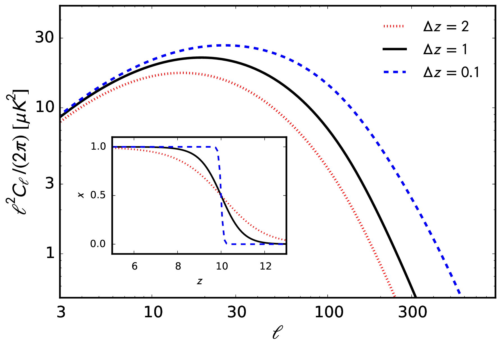

**对应章节**：§2.2　｜　**关键公式**：Eq.7，tanh 参数化

### 前因：为什么要画这张图

Figure 3 用了理想化的**瞬时**再电离。真实的再电离不会瞬间完成——它可能持续几亿年。持续时间 $\Delta z$ 是再电离最重要的参数之一。这张图回答：**$\Delta z$ 怎么影响 Doppler 峰？**

### 图说什么

固定 $z_r = 10$，画三条曲线对应 $\Delta z_{\rm reion} = 0.1$（近乎瞬时）、$1$（中等）、$2$（缓慢）。插图是对应的 $x(z)$ 曲线。

### 怎么看

1. **再电离越短 → 峰越高**：$\Delta z = 0.1$ 的振幅 ~$30\ \mu\text{K}^2$；$\Delta z = 2$ 只有 ~$5\ \mu\text{K}^2$。**[原文]**
2. **峰的位置几乎不变**（$\ell \sim 20$–$30$）：因为位置由 $z_r$ 处的速度相关长度决定，与 $\Delta z$ 无关。**[补充]**
3. **大尺度（$\ell < 10$）差异小**：因为这些尺度上速度相关本来就很长程，不太受消去影响。**[补充]**

### 需要理解的物理

**为什么短的再电离 → 大的信号？**

$\Delta z$ 小 → $x(z)$ 跳变更陡 → $\partial u / \partial z$ 的尖峰更窄更高 → 功率谱 $\propto (\partial u / \partial \chi)^2$ 更大。物理上说：再电离越快，"再散射面"越薄、越锋利 → 信号在一个窄壳层上集中 → 远近两端没有足够的距离来做消去。**[原文 + 补充]**

反过来说，如果再电离缓慢（$\Delta z = 2$），$x(z)$ 缓变 → $u(z)$ 也缓变 → 视线消去更有效 → 信号被压低。**[补充]**

**观测意义**：如果未来能测到 Doppler 峰的振幅，就能**约束再电离的持续时间**。但注意——这与小尺度 patchy 信号的趋势**相反**（见 §5 总结：更长的再电离 → 更多小尺度功率），所以联合大/小尺度的测量可以同时约束 $z_r$ 和 $\Delta z$。**[原文]**

### 后果

自然引出 Figure 5 的问题：除了 $\Delta z$，另一个关键参数 $\tau$（光学深度）如何影响峰值振幅？

---

## Figure 5 — Doppler 峰值振幅 vs. $\tau$

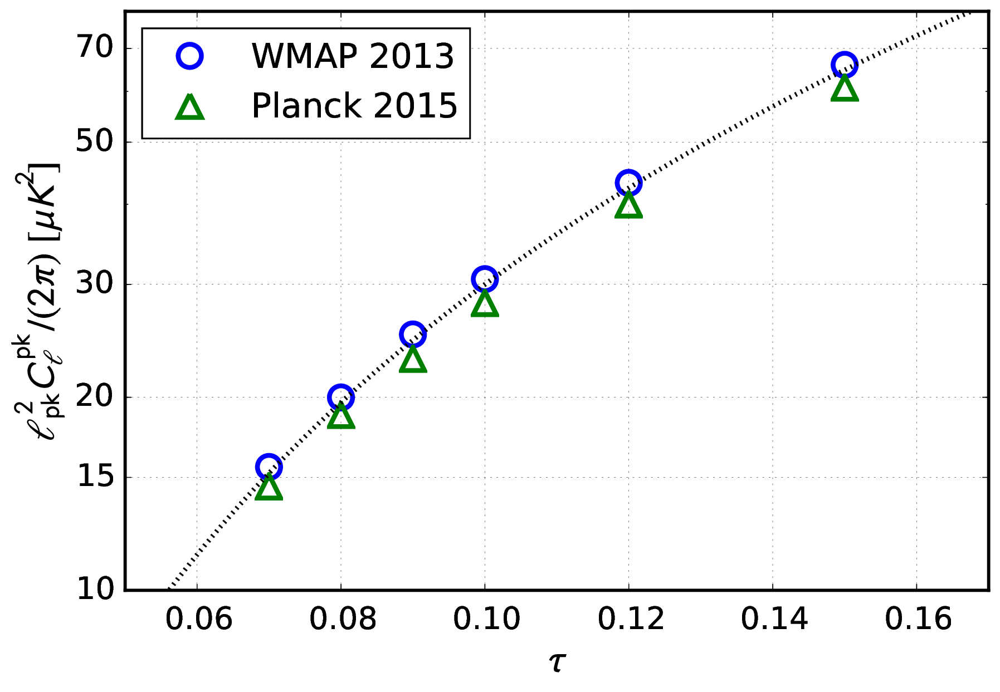

**对应章节**：§2.2　｜　**关键公式**：$\ell_{\rm pk}^2 C_\ell^{\rm pk}/(2\pi) \simeq 30(\tau/0.1)^{1.9}\ \mu\text{K}^2$

### 前因：为什么要画这张图

Figure 4 展示了 $\Delta z$ 的影响。另一个关键可观测量是 Thomson 光学深度 $\tau$——由 CMB 大尺度偏振独立测量（$\tau \sim 0.05$–$0.09$）。$\tau$ 直接决定了"有多少电子参与散射"。这张图给出了 **Doppler 峰值振幅与 $\tau$ 的定量关系**，以便观测者把 kSZ 测量转化为 $\tau$ 约束。

### 图说什么

横轴 $\tau$，纵轴 Doppler 峰值振幅 $\ell_{\rm pk}^2 C_\ell^{\rm pk}/(2\pi)$（单位 $\mu\text{K}^2$）。两组宇宙学参数（WMAP、Planck）分别画出。虚线是幂律拟合。

### 怎么看

1. **近乎 $\tau^2$** 的标度——指数 1.9。这符合 Kaiser (1984) 的简单估计 $C_\ell \sim \langle v^2 \rangle \tau^2$。**[原文]**
2. 指数**略小于 2**：因为 $\tau$ 越大 → $z_r$ 越高 → 速度场更弱（$\langle v^2 \rangle$ 对 $\tau$ 弱反依赖）。**[原文]**
3. **当前最佳值** $\tau \sim 0.07$ → 峰值约 $15$–$20\ \mu\text{K}^2$。**[补充]**
4. WMAP 和 Planck 的差异主要来自 $n_s$ 和 $\sigma_8$ 的不同——$n_s$ 更大 → 更多小尺度功率 → 速度涨落稍大。**[原文]**

### 需要理解的物理

为什么 $C_\ell \sim \langle v^2 \rangle \tau^2$？直觉：

- $\tau$ = 光子被散射的**总概率** → 信号振幅 $\propto \tau$
- kSZ 是 Doppler 效应 → $\Delta T / T \propto v \cdot \tau$
- 功率谱 $\propto (\Delta T)^2 \propto v^2 \cdot \tau^2$

这就是为什么 $\tau$ 出现平方——kSZ 是一阶效应（$\propto \tau$），但功率谱是平方量。**[补充]**

### 后果

Figure 1–5 完成了**解析理论**部分。核心结论：大尺度 kSZ 有一个 $\ell \sim 20$–$30$ 的 Doppler 峰，振幅 $\sim 10$–$30\ \mu\text{K}^2$，对 $\tau$ 和 $\Delta z$ 都很敏感。接下来 Figure 6–9 进入**数值模拟**，验证这些解析预测并研究解析理论无法处理的小尺度 patchy 效应。

---

## Figure 6 — 全天 kSZ 温度地图

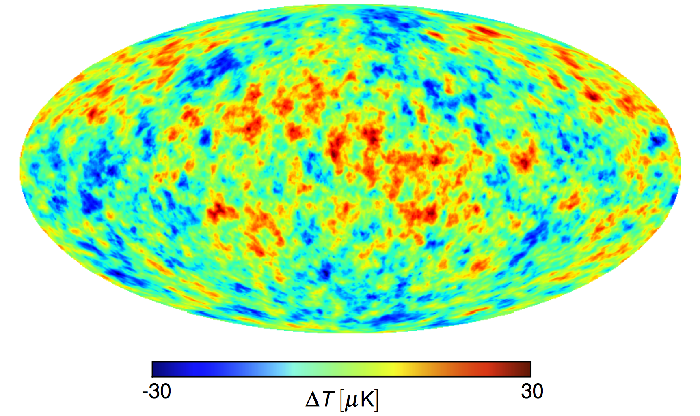

**对应章节**：§3.2–3.3　｜　**关键公式**：Eq.3, 16

### 前因：为什么要画这张图

解析理论（§2）只能处理线性情况。真实的再电离是**高度非线性**的——HII 区有复杂的空间结构，$\delta_x$ 是非高斯的"开关量"。必须用数值模拟来生成全天 kSZ 地图，才能研究小尺度上的信号。

**模拟方法**（§3.1–3.2）：
1. 在 $8\ \text{Gpc}/h$ 的周期盒子中用 $4096^3$ 个格点演化线性密度场
2. 用 excursion set 算法把密度场转化为再电离红移场 $z_r(\mathbf{x})$
3. 沿地球观测者到每个方向的视线，积分 $\Delta T / T = \int g(z)(1+\delta)(1+\delta_x)\mathbf{v}\cdot\hat{\gamma}\,d\chi$
4. 得到全天 Mollweide 投影的 kSZ 温度地图

### 图说什么

这就是模拟产生的全天 kSZ 温度地图。$\tau = 0.09$。

### 怎么看

1. **色标 $\pm 30\ \mu\text{K}$**：最亮/最暗的区域 $|\Delta T| \sim 30\ \mu\text{K}$，与 Figure 5 预测的 Doppler 峰振幅一致。**[补充]**
2. **大尺度色块**（几度以上 = $\ell \lesssim 100$）= Doppler 效应，来自大体积的 coherent bulk flows（同一方向运动的电子云）。颜色取决于电子整体运动是朝向还是远离观测者。**[原文]**
3. **小尺度噪点状结构**（$\ell \gtrsim 300$）= patchy + OV 效应。叠在大色块之上。**[补充]**
4. 注意：大尺度热区（红色）内部的小尺度噪点**更强烈**——这是大尺度速度调制小尺度功率的表现。Figure 7 将把这个现象放大来看。**[原文]**

### 需要理解的物理

**为什么 kSZ 地图看起来不像原初 CMB？** 原初 CMB 是几乎纯高斯的随机场，kSZ 则不是——它由 $\mathbf{v}(1+\delta+\delta_x+\delta\delta_x)$ 产生，$\delta_x$ 的空间分布（HII 区的泡壁）是高度非高斯的。这导致地图上的统计特性与高斯场明显不同，Figure 9 将定量展示这一点。**[补充]**

### 后果

全天地图验证了模拟流水线。但要看清楚每个分量的贡献，需要 Figure 7 的分量分离。

---

## Figure 7 — $32° \times 32°$ 区域的 kSZ 四分量分离

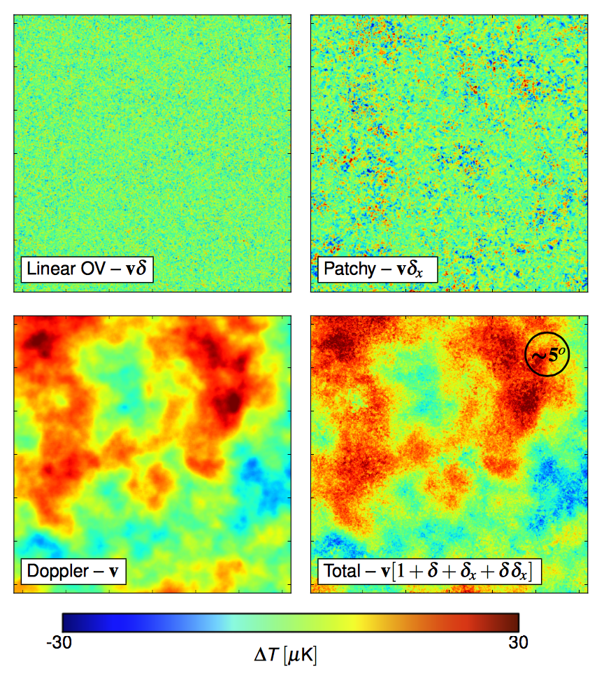

**对应章节**：§3.3　｜　**关键公式**：Eq.16（$\Delta T \propto \mathbf{v}(1+\delta+\delta_x+\delta\delta_x)$）

### 前因：为什么要画这张图

Figure 6 的全天地图是四个物理分量的叠加。要理解每个分量的贡献，需要**分别生成四张地图**（每张只保留一项），然后视觉对比。

### 图说什么

取 Figure 6 的一个 $32° \times 32°$ 区域，分成四个面板：

| 面板 | 数学内容 | 物理名称 | 描述 |
|------|---------|---------|------|
| **左下** | $\mathbf{v}$（$\delta = \delta_x = 0$） | Doppler | 纯速度场 |
| **左上** | $\mathbf{v}\delta$ | OV（Ostriker-Vishniac） | 密度调制速度 |
| **右上** | $\mathbf{v}\delta_x$ | Patchy | 电离调制速度 |
| **右下** | $\mathbf{v}(1+\delta+\delta_x+\delta\delta_x)$ | Total | 四项之和 |

### 怎么看

1. **左下 Doppler**：大尺度的平滑热/冷区域，角尺度约 $5°$–$10°$。这是 coherent bulk flows——大尺度速度场在天球上的投影。**[原文]**
2. **左上 OV**：小尺度结构，但振幅**最弱**——密度涨落 $\delta$ 是连续的平滑场，对速度的调制效果温和。**[补充]**
3. **右上 Patchy**：小尺度结构，振幅明显更强。而且——**仔细看会发现 Patchy 面板中小尺度功率增强的区域，恰好对应 Doppler 面板中热/冷色块的位置**。这不是巧合！**[原文]**
4. **右下 Total**：视觉上 = Doppler 的大色块 + Patchy 的小噪点叠加在上面。

### 需要理解的物理

**核心发现——大尺度速度调制小尺度 patchy 功率**：

为什么左下的热区 → 右上的同一区域小尺度功率更强？

因为 patchy 信号 = $\delta_x \cdot \mathbf{v}$。$\delta_x$ 的空间分布（HII 区的泡泡结构）在整个天球上大致均匀，但 $\mathbf{v}$ 不是——大尺度速度场在某些区域大、某些区域小。在 $|\mathbf{v}|$ 大的区域，乘积 $\delta_x \cdot \mathbf{v}$ 的振幅自然更大 → 小尺度功率更强。**[原文 + 补充]**

这种"大尺度-小尺度耦合"是 patchy kSZ 最显著的**非高斯特征**——高斯随机场不具有这种特性。未来可以利用这一特征把 kSZ 从其他小尺度噪声（如 SZ 热效应、点源）中分离出来。**[补充]**

### 后果

视觉对比告诉我们定性的结论。要定量比较，需要 Figure 8 的功率谱。

---

## Figure 8 — 模拟 vs. 解析功率谱：大尺度解析完胜，小尺度 patchy 接管

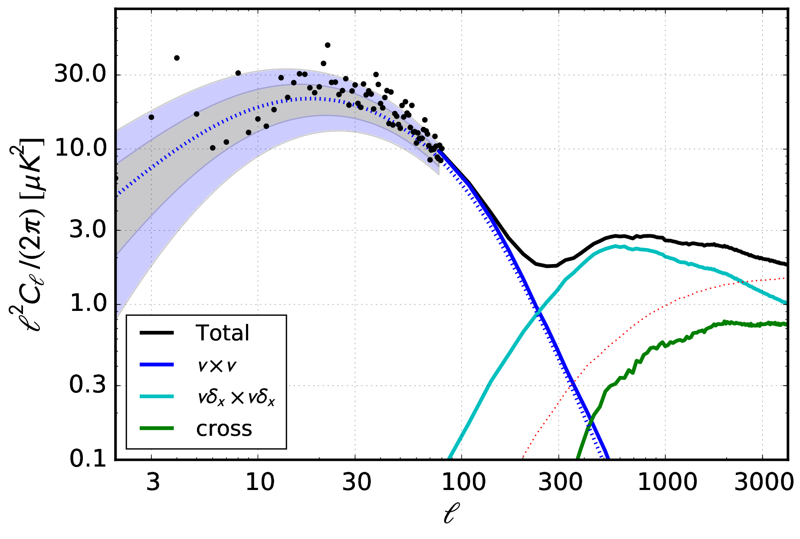

**对应章节**：§3.4　｜　**关键公式**：Eq.4, 7, 18

### 前因：为什么要画这张图

有了 Figure 7 的四张地图，自然要计算它们的功率谱，并与 §2 的解析预测对比。这张图有两个目的：(1) **验证模拟流水线**——解析结果和数值结果应该在大尺度上一致；(2) **定量展示 Doppler 和 patchy 的相对重要性在哪个 $\ell$ 切换**。

### 图说什么

横轴 $\ell$（$3$–$3000$），纵轴 $\ell^2 C_\ell / (2\pi)$（$\mu\text{K}^2$）。多条曲线：

| 曲线 | 含义 |
|------|------|
| 蓝色实线 | 纯 $\mathbf{v}$（Doppler 模拟） |
| 红色平滑线 | §2 的解析 Doppler 公式（Eq.7） |
| 黑色实线 | Total（四项全部） |
| 阴影 | $1\sigma$ 和 $2\sigma$ 宇宙方差 |

### 怎么看

1. **蓝色 ≈ 红色**（$\ell \lesssim 200$）：解析公式与模拟完美一致 → **模拟流水线通过验证**。解析公式唯一用到的模拟信息是 $x(z)$（再电离历史），其他全是理论计算。**[原文]**
2. **$\ell \sim 20$–$30$**：Doppler 峰清晰可见，$\ell^2 C_\ell / (2\pi) \sim 15$–$30\ \mu\text{K}^2$。**[原文]**
3. **$\ell \lesssim 200$**：纯 Doppler 线（蓝色）与 Total 线（黑色）几乎重合 → **密度和电离涨落在大尺度上可以忽略**。**[原文]**
4. **$\ell \gtrsim 300$**：Total 线明显高于 Doppler 线 → patchy + OV 效应开始主导。功率趋于一个"平台"，$\ell^2 C_\ell / (2\pi) \sim 1$–$5\ \mu\text{K}^2$。**[原文]**
5. **宇宙方差**（阴影）在 $\ell \lesssim 10$ 非常大 → 大尺度 Doppler 峰的测量不可避免地受到宇宙方差限制。**[补充]**
6. OV 的减去与否不影响 $\ell \lesssim 200$ 的结论 → OV 在大尺度上也可忽略。**[原文]**

### 需要理解的物理

**两个尺度区间，两种物理**：

| 尺度 | 主导机制 | 物理来源 | 对再电离的敏感方式 |
|------|---------|---------|-----------------|
| $\ell \lesssim 200$ | Doppler | 大尺度 coherent bulk flows | 对 $\tau$ 和 $\Delta z$ 敏感（再电离越短信号越大）|
| $\ell \gtrsim 300$ | Patchy + OV | HII 区的不均匀电离 | 对 $\Delta z$ 和 HII 区尺度/分布敏感（再电离越长信号越大）|

两个区间对 $\Delta z$ 的依赖**方向相反**——这是全文最重要的观测预言之一。**[原文]**

### 后果

Figure 9 接下来深入解剖小尺度（$\ell \gtrsim 300$）的 patchy 功率谱——它由哪些分量主导？

---

## Figure 9 — Patchy 功率谱的十项解剖

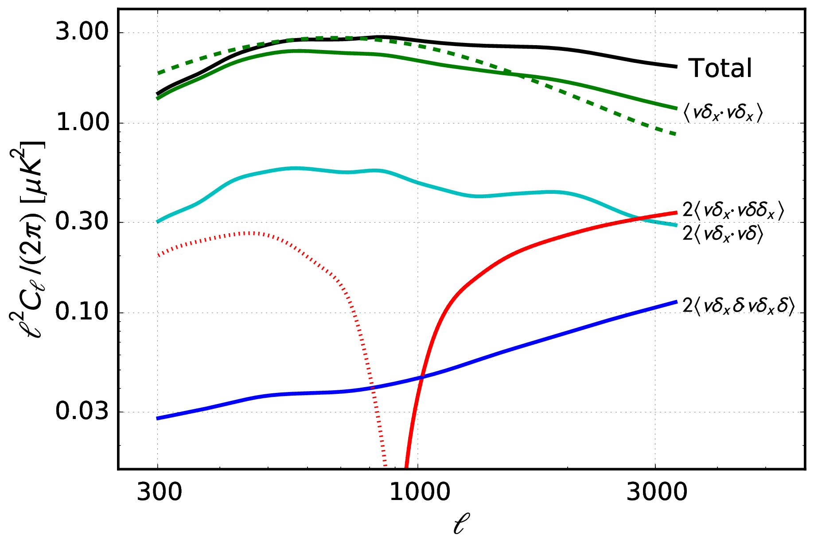

**对应章节**：§3.4　｜　**关键公式**：Eq.17–20

### 前因：为什么要画这张图

Figure 8 表明小尺度被 patchy 效应主导，但"patchy"不是一个单一的东西——它是 $(1+\delta+\delta_x+\delta\delta_x)$ 四项展开后 $C_4^2 + 4 = 10$ 个自/交叉相关项之和（Eq.17）。这张图把这十项（减去已知的 Doppler 和 OV 后剩余七项）逐一画出来，回答：**小尺度 kSZ 到底被哪一项主导？**

### 图说什么

减去了 Doppler（$\langle\mathbf{v}\cdot\mathbf{v}\rangle$）和 OV（$\langle\mathbf{v}\delta\cdot\mathbf{v}\delta\rangle$）后的七项功率谱。标为 "Total" 的黑线是七项之和。

### 怎么看

**按贡献从大到小排序**：

| 排名 | 项 | 在 $\ell \sim 3000$ 处的贡献 | 特征 |
|------|---|--------------------------|------|
| 1 | $\langle\mathbf{v}\delta_x\cdot\mathbf{v}\delta_x\rangle$（patchy-patchy） | **~65%** | 最主导，形状与 Total 近似 |
| 2 | $\langle\mathbf{v}\delta\cdot\mathbf{v}\delta_x\rangle$（OV-patchy） | **~13%** | 振幅约 patchy 的 1/5 |
| 3 | $\langle\mathbf{v}\delta_x\cdot\mathbf{v}\delta\delta_x\rangle$（patchy-三阶） | 可比 OV-patchy | 在 **$\ell \sim 900$ 翻转符号**（从正变负）|
| 4 | $\langle\mathbf{v}\delta\delta_x\cdot\mathbf{v}\delta\delta_x\rangle$（三阶自相关） | **~5%** | 六阶统计量，出乎意料地不小 |
| 5–7 | 含纯 $\mathbf{v}$ 的交叉项 | **$< 0.01\ \mu\text{K}^2$** | 完全可忽略（数值噪声水平）|

**[原文]**

### 怎么看——关键特征详解

1. **Patchy-patchy 绝对主导**：这符合直觉——$\delta_x$ 是一个"硬边界"开关量（HII 区内 $\sim +1/\bar{x}-1$，中性区 $= -1$），空间跳变剧烈，与速度场相乘后产生的信号远大于平滑的密度涨落 $\delta$。**[补充]**

2. **$\ell \sim 900$ 符号翻转**：$\langle\mathbf{v}\delta_x\cdot\mathbf{v}\delta\delta_x\rangle$ 从正变负。$\ell \sim 900$ 对应共动尺度 $\sim 15$–$20$ Mpc —— 非常接近再电离中点的**典型 HII 区半径**。物理上：HII 区内部是密度峰（$\delta > 0$），越过 HII 区边界后密度下降（$\delta < 0$），所以 $\delta \cdot \delta_x$ 的相关在 HII 区尺度上翻转。**[原文 + 补充]**

3. **含纯 $\mathbf{v}$ 的交叉项为零**：$\mathbf{v}$ 是零均值的矢量场，$\delta_x$ 是标量场。在线性阶，$\langle\mathbf{v}\cdot\mathbf{v}\delta_x\rangle = 0$——因为 $\mathbf{v}$ 的方向与 $\delta_x$ 没有系统性的对齐。**[补充]**

4. **高斯近似（Eq.20）低估实际值**：用 Wick 定理（四阶矩 → 二阶矩之积）近似 patchy-patchy 项，结果比模拟值**低 10–30%**。差异来自连通四阶矩——$\delta_x$ 的非高斯性是不可忽略的。这意味着以往的解析模型系统性低估了 patchy kSZ 功率谱。**[原文]**

### 需要理解的物理

**为什么这个分解如此重要？**

- 以往的解析模型（McQuinn et al. 2005 等）只能计算 patchy-patchy 项的高斯近似（Eq.20），且忽略了 OV-patchy 交叉和三阶项。本文首次用模拟显式分离了所有十项，发现 (a) 高斯近似低估 10–30%，(b) 三阶项贡献 5% 不可忽略，(c) OV-patchy 有 13% 的贡献。**[原文]**
- 这些结果为未来的解析模型指明了改进方向：至少需要包含连通四阶矩和 OV-patchy 交叉。**[补充]**

### 后果

Figure 1–9 完成了 kSZ **自功率谱**的全部分析。接下来 Figure 10–11 转向一个新问题：能不能通过**交叉相关**来探测 kSZ？

---

## Figure 10 — kSZ–21cm 交叉相关：正相关、$\ell \sim 100$ 峰、5–10σ 可探测

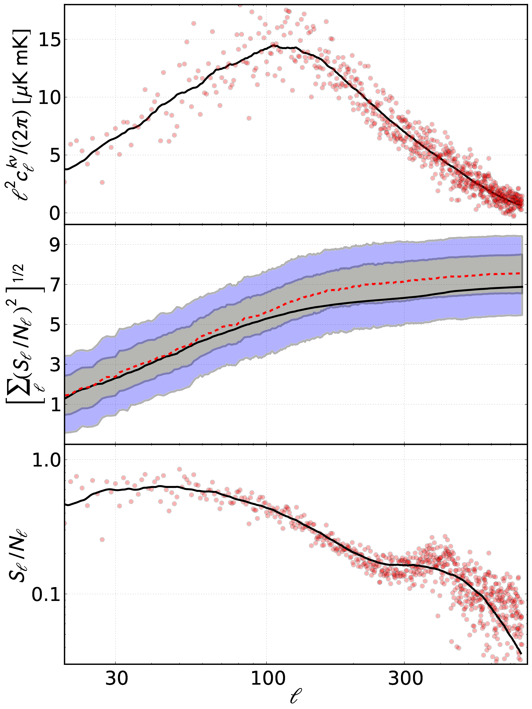

**对应章节**：§4.1　｜　**关键公式**：Eq.21–24

### 前因：为什么要画这张图

kSZ 自功率谱有一个致命问题：**它把所有红移的信号堆在一起**，无法分辨哪些来自再电离、哪些来自后期。而且 kSZ 信号在小尺度上被热 SZ 效应（tSZ）、点源等前景淹没。

解决方案：**与 21 cm 做交叉相关**。21 cm 信号天然带有频率（= 红移）信息，而且 CMB 的系统偏差（前景、噪声）与 21 cm 的系统偏差不相关 → 交叉相关更"干净"。

但交叉相关能测到吗？信噪比够吗？

### 图说什么

三个子面板（从上到下）：

| 面板 | 横轴 | 纵轴 | 展示内容 |
|------|------|------|---------|
| 上 | $\ell$ | $C_\ell^{T\nu}$ | kSZ 与 21 cm 的交叉功率谱 |
| 中 | $\ell$ | cumulative S/N | 积分信噪比（从 $\ell = 3$ 到该 $\ell$）|
| 下 | $\ell$ | $r_\ell^{k\nu}$ | 每个 $\ell$ 模式的信噪比 |

### 怎么看

1. **上面板**：交叉相关在 $\ell \sim 100$ 处有一个**正峰**。灰色散点是单个 $\ell$ 模式（方差很大），实线是 bin 平均。**[原文]**

2. **为什么是正的？** 这很微妙——Figure 2 表明再电离期间密度峰 → kSZ 冷点（负相关）。但 21 cm 端又翻转了一次：高密度区电离源更多 → HI 更少 → 21 cm 信号更弱。两次"负" → 正相关。**[原文]**

3. **$\ell \sim 100$ 的峰值位置**：对应物质功率谱 $P(k)$ 的峰值 $k \sim 0.01\ \text{Mpc}^{-1}$ 在 $\chi(z_r) \sim 10$ Gpc 处的角投影 → $\ell \sim k\chi \sim 100$。**[原文]**

4. **中面板**：积分信噪比在 $\ell \sim 500$ 处达到 ~**5–10σ**。黑实线 = Eq.24 的解析估计；红虚线 = Monte Carlo；阴影 = $1\sigma$/$2\sigma$ 范围。两者高度一致 → 非高斯效应不严重影响信噪。**[原文]**

5. **下面板**：单模式信噪比 $r_\ell^{k\nu}$ 在 $\ell \sim 100$ 处峰值 ~0.01–0.02——非常小！但累加 $(2\ell+1)$ 个独立模式后总信噪可以达到几个 σ。**[补充]**

### 需要理解的物理

**为什么单模式信噪这么低？**

因为 CMB 温度的主要贡献是原初涨落（$C_\ell^{\rm pp} \gg C_\ell^{\rm kk}$），kSZ 只是一个微小的附加信号。交叉相关的信噪比 ∝ $C_\ell^{k\nu} / \sqrt{C_\ell^{TT} C_\ell^{\nu\nu}}$，分母中的 $C_\ell^{TT} \approx C_\ell^{\rm pp}$ 很大 → 每个 $\ell$ 的信噪很小。好在有 $(2\ell+1)$ 个独立模式可以累加。**[补充]**

**假设条件**：这里的 5–10σ 是在**最理想条件**下（全天观测、无噪声、无前景）。现实中前景清除、有限天区、仪器噪声都会降低信噪比。但交叉相关的关键优势是：CMB 前景和 21 cm 前景**性质完全不同**，不相关 → 不贡献假信号。**[原文 + 补充]**

### 后果

知道了交叉相关的 $\ell$ 依赖后，下一个问题是：它的**红移/频率**依赖是什么？这直接关系到能不能用它追踪再电离历史。

---

## Figure 11 — kSZ–21cm 交叉相关的红移切片：追踪再电离历史

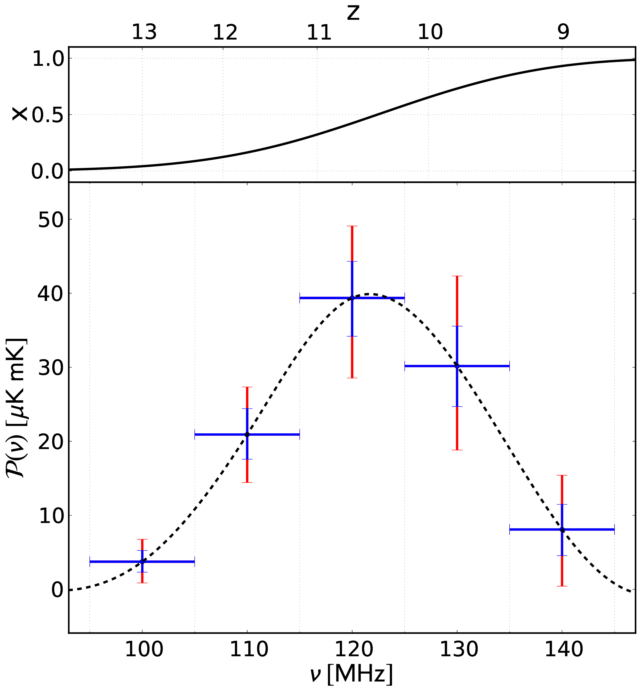

**对应章节**：§4.2　｜　**关键公式**：$\mathcal{P}^{T\nu}(\nu_i) = \sum_\ell \int w_\ell(\nu) C_\ell^{T\nu}(\nu)\,d\nu$

### 前因：为什么要画这张图

Figure 10 展示了所有红移加在一起的交叉相关。但 21 cm 的独特优势是**频率 = 红移**（$\nu = 1420/(1+z)$ MHz）。如果把 21 cm 观测按频率分 bin，就可以看到交叉相关的**红移演化**——这直接追踪再电离历史 $x(z)$。

### 图说什么

将交叉相关沿 $\ell$（到 500）积分后，画出对 21 cm 频率（$\nu$，上轴 = 红移 $z$）的依赖。每个点是 $\Delta\nu = 20$ MHz 的频率 bin。

### 怎么看

1. **信号峰值在 $\nu \sim 130$–$160$ MHz**（$z \sim 8$–$12$）= 再电离正在进行的中段。**[原文]**
2. **高频端**（$\nu > 200$ MHz，$z < 6$）→ 再电离已完成，$\delta_x = 0$ → 没有 patchy 信号 → 交叉相关**消失**。**[补充]**
3. **低频端**（$\nu < 100$ MHz，$z > 14$）→ 宇宙几乎全部中性，$x \approx 0$ → kSZ 信号极弱 → 消失。**[补充]**
4. **峰的位置和宽度直接编码了 $x(z)$** → 红移分辨率约 $\Delta z \sim 1$（对应 $\Delta\nu \sim 20$ MHz）。**[原文]**

### 需要理解的物理

**这张图是全文最具观测价值的结果之一**。

纯 kSZ 功率谱（Figure 8）是所有红移的积分——你只看到一个数字，不知道信号来自 $z = 7$ 还是 $z = 12$。但这张图告诉你：如果你有一台覆盖 100–200 MHz 的射电阵列（如 SKA、HERA），可以逐频率测交叉相关，每 20 MHz 一个 bin → 得到再电离历史 $x(z)$ 的粗略形状。**[补充]**

**为什么 $\Delta\nu = 20$ MHz？** 太细（$\Delta\nu = 1$ MHz）→ 每个 bin 里信噪太低；太粗（$\Delta\nu = 100$ MHz）→ 红移信息被平均掉。$\Delta\nu \sim 20$ MHz（$\Delta z \sim 1$）是一个折中——足够分辨再电离从"开始"到"结束"的演化，同时每个 bin 有足够信噪。**[原文]**

### 后果

这是论文的最后一张关键物理图。它回答了"kSZ–21cm 交叉相关能告诉我们什么"——答案是：再电离发生在哪些红移、持续了多久。

---

## Figure 12 — （论文正文未引用）

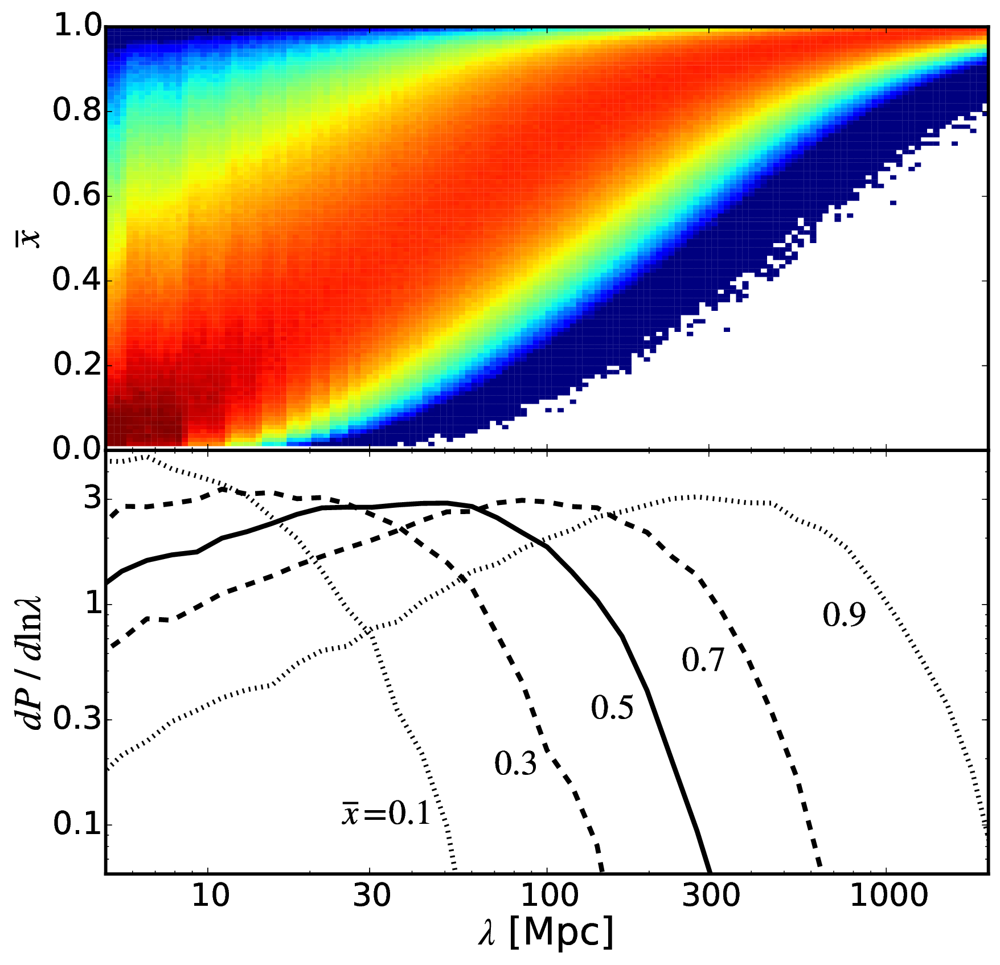

**文件**：`fig12.pdf`

此图存在于 `figures/` 目录中但未被论文正文或 `figures.tex` 引用。可能是作者在准备论文时生成的辅助图（如不同参数的比较），最终未被采用。

---

## 宇宙学参数（论文脚注 1）

本文无独立编号的表格。宇宙学参数以脚注形式给出，论文的所有计算使用以下两组参数：

| 参数集 | $\Omega_m$ | $\Omega_b$ | $h$ | $n_s$ | $\sigma_8$ | 来源 |
|--------|-----------|-----------|-----|-------|-----------|------|
| WMAP 2013 | 0.286 | 0.0463 | 0.69 | 0.96 | 0.82 | WMAP 9-year |
| Planck 2015 | 0.31 | 0.0486 | 0.68 | 0.967 | 0.816 | Planck 2015 |

两组参数的主要差异：Planck 的 $n_s$ 更接近 1（更少红倾斜）、$\sigma_8$ 稍低。影响 kSZ 功率谱的主要途径是改变速度涨落的振幅。**[补充]**

---

## 全文结论一览

| 结论 | 对应图 | 关键数字 |
|------|--------|---------|
| kSZ 功率谱有两个特征：$\ell \sim 20$–$30$ Doppler 峰 + $\ell \gtrsim 300$ patchy 平台 | Fig 8 | 峰 ~$10$–$30\ \mu\text{K}^2$；平台 ~$1$–$5\ \mu\text{K}^2$ |
| Doppler 峰的振幅 $\propto \tau^{1.9}$ | Fig 5 | 当前 $\tau \sim 0.07$ → ~$15$–$20\ \mu\text{K}^2$ |
| 再电离越快 → Doppler 峰越大；再电离越长 → patchy 平台越大 | Fig 4, 8 | $\Delta z$ 和两个尺度区间的关系**相反** |
| Patchy 功率谱中 patchy-patchy 项占 ~65% | Fig 9 | $\langle\mathbf{v}\delta_x\cdot\mathbf{v}\delta_x\rangle$ 主导 |
| 高斯近似低估 patchy 功率谱 10–30% | Fig 9 | 连通四阶矩不可忽略 |
| kSZ–21cm 交叉相关可在理想条件下 5–10σ 探测 | Fig 10 | 全天、无噪声、无前景 |
| 交叉相关的频率依赖追踪再电离历史 | Fig 11 | $\Delta z \sim 1$ 的分辨率 |
