# Detection of the kSZ Effect with DES Y1 and SPT — 图表版

**arXiv**: 1603.03904　｜　**作者**: Soergel, Flender, Story et al. (DES & SPT)　｜　**年份**: 2016

---

## Figure 1 — DES Y1 × SPT-SZ 天区覆盖

**文件**：`y1a1_v6_4_moll_spt_footprint2.pdf` | **对应章节**：§3.1 | **关键公式**：无

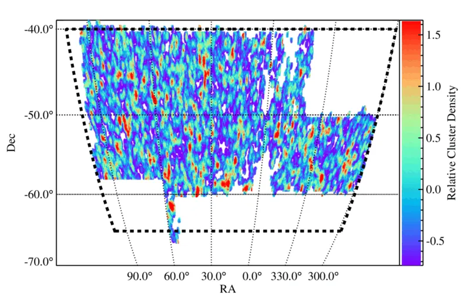

### 图说什么
DES Y1 redMaPPer 星系团目录与 SPT-SZ 温度地图重叠区域的相对星系团密度（smoothed on $30'$）。虚线黑色框标示 SPT-SZ 巡天边界。有效分析天区面积约 $1200~\mathrm{deg}^2$。[原文]

### 怎么看
- **颜色**：相对星系团数密度——亮色区域星系团更密集。
- **虚线**：SPT-SZ 巡天边界（20h–7h RA, $-65°$至$-40°$ Dec）。
- **空白区域**：被 DES 掩膜（亮星、边界效应）或 SPT 点源掩膜排除。

### 需要理解的物理
- DES 和 SPT 的天区重叠是本分析的先决条件。SPT 覆盖约 $2500~\mathrm{deg}^2$，但 DES Y1 仅与其中 $\sim 1400~\mathrm{deg}^2$ 重叠，经掩膜后有效面积约 $1200~\mathrm{deg}^2$。[原文]
- 星系团密度的空间变化反映了大尺度结构和 DES 观测深度的空间非均匀性。[补充]

---

## Figure 2 — DES Y1 redMaPPer 星系团的红移与丰度分布

**文件**：`redmapper_z_gold_final.pdf` + `redmapper_lambda_gold_final.pdf` | **对应章节**：§3.1 | **关键公式**：无

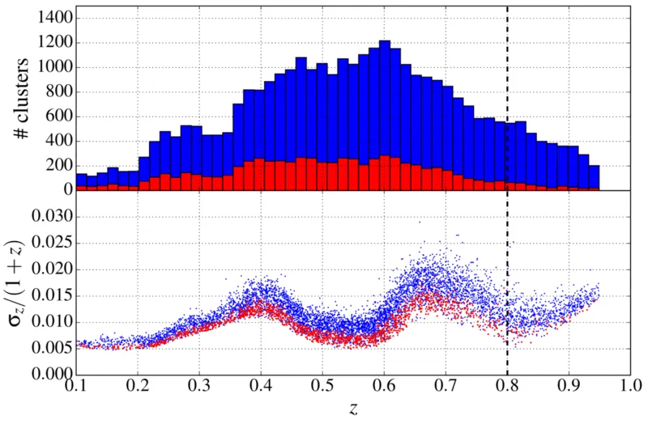
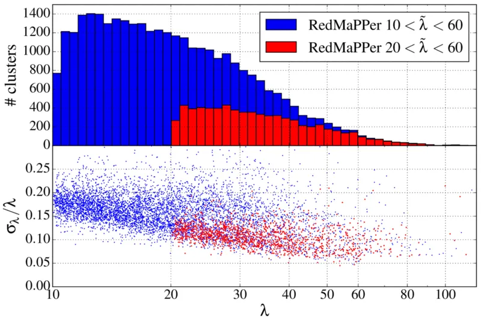

### 图说什么
**左图**（红移分布）：上面板为 $\tilde{\lambda} > 10$（蓝色）和 $\tilde{\lambda} > 20$（红色）样本的光度红移分布；下面板为 photo-$z$ 相对误差 $\sigma_z/(1+z)$ 随红移的变化（每第 5 个星系团画一个点）。**右图**（丰度分布）：上面板为丰度 $\lambda$ 的分布；下面板为丰度相对误差 $\sigma_\lambda / \lambda$ 随 $\lambda$ 的变化。[原文]

### 怎么看
- **左图上面板**：$\tilde{\lambda} > 20$ 样本在 $z \sim 0.3$–$0.5$ 处有清晰的峰值，$z > 0.6$ 后快速下降（高红移处深度不足导致完备性下降）。
- **左图下面板**：photo-$z$ 误差在 $z \simeq 0.4$ 和 $z \simeq 0.7$ 处有两个明显的跳升——对应 4000 Å-break 在 DES $g/r$（$z \sim 0.4$）和 $r/i$（$z \sim 0.7$）波段间的过渡。[原文]
- **关键数字**：$\tilde{\lambda} > 20$ 样本的 $\sigma_z/(1+z) \in [0.005, 0.015]$，比 $\tilde{\lambda} > 10$ 的 $[0.005, 0.025]$ 更精确。

### 需要理解的物理
- photo-$z$ 误差直接决定了成对 kSZ 信号的小尺度抑制程度：$\sigma_{d_c} = c\sigma_z/H(z) \simeq 50~\mathrm{Mpc}$，小于此尺度的成对信号被完全稀释。[原文]
- 这是选择 $\tilde{\lambda} > 20$ 作为主样本的理由之一：更高丰度的星系团 photo-$z$ 更精确，减少了信号稀释。[原文]

---

## Figure 3 — 星系团位置的滤波温度与红移演化校正

**文件**：`temp-evol_gold_twopanels.pdf` | **对应章节**：§4.2 | **关键公式**：Eq. 8 ($T(\hat{\mathbf{n}}_i)$ redshift correction)

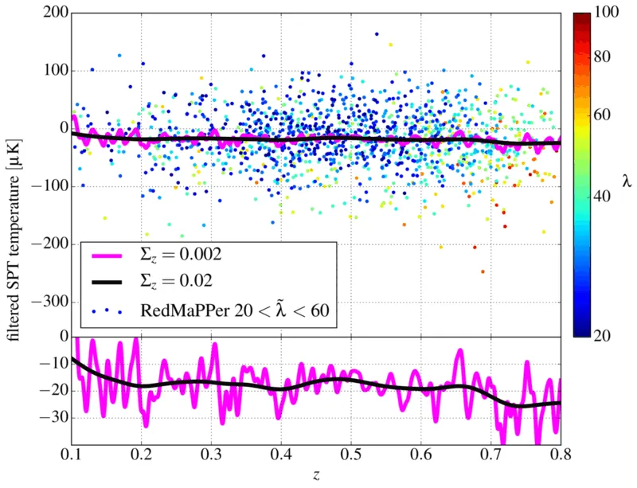

### 图说什么
**上面板**：在 SPT-SZ 地图上用 $\theta_c = 0.5'$ 匹配滤波器提取的星系团位置温度偏移，按红移和丰度着色。平滑均值曲线为红移演化校正的第二项（Eq. 8），展示了 $\Sigma_z = 0.02$（主分析）和 $\Sigma_z = 0.002$（更窄平滑）的结果。**下面板**：同上的平滑均值温度，但使用更窄的温度范围，展示了 $\sim 15~\mu\mathrm{K}$ 的红移演化。[原文]

### 怎么看
- **上面板**：个体星系团温度散布极大（$\pm 500~\mu\mathrm{K}$），几乎不可能从单个星系团看到 kSZ。平滑曲线在所有红移处均为负值——这是 tSZ 的贡献。
- **下面板**：$\sim 15~\mu\mathrm{K}$ 的红移演化虽然比成对 kSZ 振幅（$\sim$ 几 $\mu\mathrm{K}$）小得多，但如果不扣除仍会引入偏差。

### 需要理解的物理
- 红移演化校正（Eq. 8）是分析的关键步骤：它消除了滤波温度中与红移相关的系统偏移（tSZ 演化、样本选择效应、恒定滤波尺度的不匹配等），使得成对估计量只提取与分离距离相关的信号。[原文]
- 即使滤波温度只包含 CMB + 噪声残余，平滑均值也会因有效贡献数随 $z$ 变化而波动，但此时应围绕零波动（非系统性负偏——后者是 tSZ 的标志）。[原文]

---

## Figure 4 — 模拟验证：逐步加入物理成分

**文件**：`ksz_sim_kszonly_full_+zerr_final_notSZ.pdf` | **对应章节**：§5.2 | **关键公式**：Eq. 6 ($T_{\mathrm{pkSZ}}$ template), Eq. 11 ($\hat{T}_{\mathrm{pkSZ}}$ estimator)

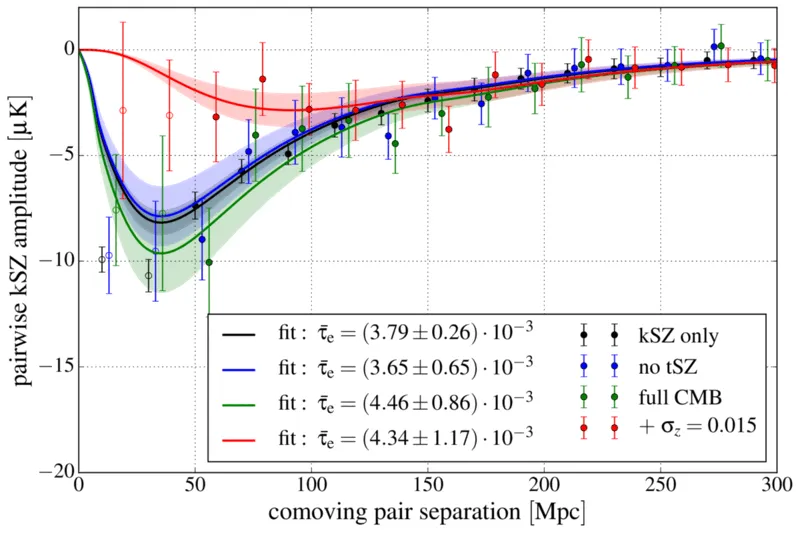

### 图说什么
模拟星系团（$0.9 < M_{500c}/10^{14}M_\odot < 4$，对应 DES $\tilde{\lambda} > 20$）的成对 kSZ 振幅。黑色 = kSZ-only，蓝色 = + CMB/噪声/前景（无 tSZ），绿色 = 完整模拟（含 tSZ），红色 = 完整 + photo-$z$ 误差。实线为模板拟合，阴影为 $1\sigma$ 不确定性。空心点（$r < 40~\mathrm{Mpc}$）被排除在拟合之外。[原文]

### 怎么看
- **横轴**：共面分离距离 $r$（Mpc）。
- **纵轴**：成对 kSZ 振幅 $\hat{T}_{\mathrm{pkSZ}}$（$\mu\mathrm{K}$）。
- **关键特征**：
  - kSZ-only（黑）信号最干净，峰值在 $r \sim 50~\mathrm{Mpc}$，约 $-2~\mu\mathrm{K}$。
  - 加入 CMB/噪声/前景后误差棒增大但拟合的 $\bar{\tau}_e$ 不变。
  - 加入 tSZ 后 $\bar{\tau}_e$ 略偏高（$+0.5\sigma$），但仍在统计误差内。
  - 加入 photo-$z$ 后，小尺度信号被抑制——$r \lesssim 80~\mathrm{Mpc}$ 处的信号大幅减弱，但模板拟合仍无偏恢复 $\bar{\tau}_e$。

### 需要理解的物理
- 这张图是整个分析流水线的端到端验证。四种情景的 $\bar{\tau}_e$ 一致说明：(1) 成对估计量确实能消除 tSZ 污染；(2) photo-$z$ 抑制因子模型有效；(3) 估计量对 $\bar{\tau}_e$ 的估计是无偏的。[原文]
- 完整模拟 + photo-$z$ 的结果（红色）是与真实数据最可比的 mock 类比：$\bar{\tau}_e = (4.34 \pm 1.17) \times 10^{-3}$，$3.7\sigma$，与主结果 $\bar{\tau}_e = (3.75 \pm 0.89) \times 10^{-3}$ 一致。[原文]

---

## Figure 5（主结果图）— DES × SPT 成对 kSZ 探测

**文件**：`ksz_gold_lgt20_thetac0p5.pdf` | **对应章节**：§6.1 | **关键公式**：Eq. 6, Eq. 11, Eq. 17

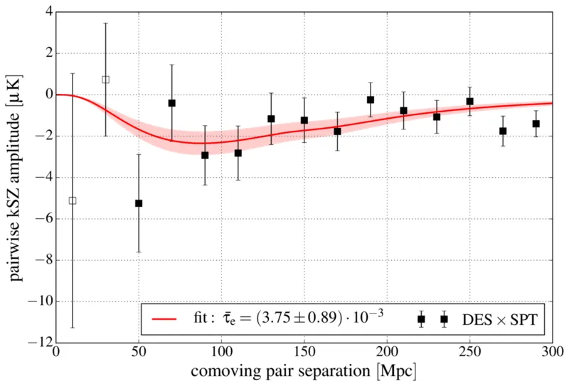

### 图说什么
DES Y1 redMaPPer 星系团目录（$20 < \tilde{\lambda} < 60$）和 SPT-SZ 温度地图测量的成对 kSZ 振幅（数据点）。红色实线为理论模板（Eq. 6）乘以最佳拟合 $\bar{\tau}_e$，阴影为 $1\sigma$ 不确定性。空心点（$r < 40~\mathrm{Mpc}$）被排除在拟合之外。[原文]

### 怎么看
- **横轴**：共面分离距离 $r$（Mpc）。
- **纵轴**：成对 kSZ 振幅 $\hat{T}_{\mathrm{pkSZ}}$（$\mu\mathrm{K}$）。
- **关键特征**：
  - 在 $r \sim 80$–$150~\mathrm{Mpc}$ 处可见清晰的负信号，与引力坍缩预期一致。
  - 小尺度（$r \lesssim 80~\mathrm{Mpc}$）信号被 photo-$z$ 误差抑制——模板（红线）在此区域趋于零。
  - 模板在 $r > 40~\mathrm{Mpc}$ 处与数据吻合良好。

### 需要理解的物理
- 这是本文的核心结果：$\bar{\tau}_e = (3.75 \pm 0.89) \times 10^{-3}$，$4.2\sigma$。[原文]
- 信号形状完全由宇宙学（$\xi^{\delta v}$, $\xi$）和 photo-$z$ 抑制因子决定，$\bar{\tau}_e$ 是唯一自由参数。[原文]
- 这是首次用光度红移数据探测到 kSZ 效应。[原文]

---

## Figure 6 — JK 协方差矩阵的相关矩阵

**文件**：`cov_JK_lgt20_gold.pdf` | **对应章节**：§4.3 | **关键公式**：Eq. 14 (JK covariance)

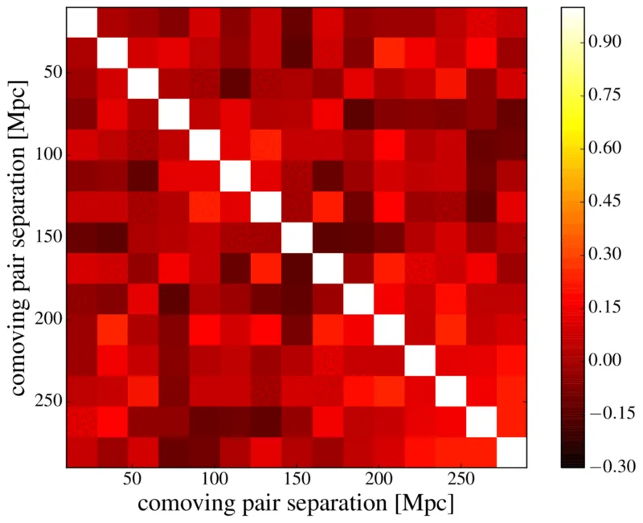

### 图说什么
Fig. 5 中成对 kSZ 测量的相关矩阵（correlation matrix），由 120 次 Jack-knife 重采样估计。[原文]

### 怎么看
- **横轴/纵轴**：分离距离 bin 编号（对应 0–300 Mpc 的 15 个等间距 bin）。
- **颜色**：相关系数 $R_{ij} = C_{ij}/\sqrt{C_{ii}C_{jj}}$。
- **关键特征**：矩阵近似对角——不同 bin 之间的相关性较弱，最大的离对角相关出现在相邻 bin 之间。

### 需要理解的物理
- 近对角的协方差矩阵意味着不同分离距离 bin 的测量相对独立。这是因为 photo-$z$ 误差消除了小尺度相关性，而主要噪声来源（tSZ、仪器噪声）在匹配滤波后呈现较弱的空间相关。[补充]
- JK 方法是本文的基线协方差估计，优于 Monte Carlo 方法（后者无法正确模拟 tSZ 与 kSZ 的空间相关）和 $N$-body 方法（计算成本过高）。[原文]

---

## Figure 7 — 打乱检验验证显著性

**文件**：`shuffletest_lgt20_gold.pdf` | **对应章节**：§6.1, §7.1 | **关键公式**：Eq. 11

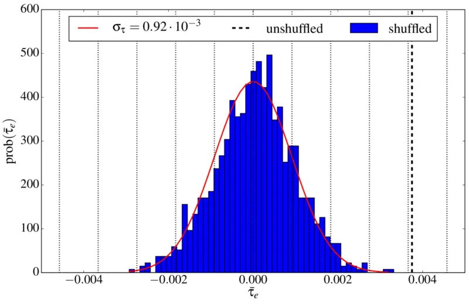

### 图说什么
1,000 次零信号实现的最佳拟合 $\bar{\tau}_e$ 分布直方图（蓝色），通过随机打乱星系团配对得到。红色曲线为正态分布拟合（$\sigma_{\bar{\tau}_e} = 0.92 \times 10^{-3}$）。粗虚线为未打乱的主结果 $\bar{\tau}_e = 3.75 \times 10^{-3}$。[原文]

### 怎么看
- **横轴**：$10^3 \times \bar{\tau}_e$。
- **纵轴**：出现次数。
- **关键特征**：打乱后的 $\bar{\tau}_e$ 紧密分布在零附近，主结果落在 $\sim 4\sigma$ 之外。打乱后的标准差 $0.92 \times 10^{-3}$ 与模板拟合误差 $0.89 \times 10^{-3}$ 高度一致。

### 需要理解的物理
- 打乱检验通过破坏真实的星系团位置-温度相关来生成零信号实现。其分布的宽度提供了模板拟合误差的独立验证。[原文]

---

## Figure 8 — 三种零假设检验

**文件**：`ksz_gold_lgt20_thetac0p5_nulltests.pdf` | **对应章节**：§7.1 | **关键公式**：Eq. 11

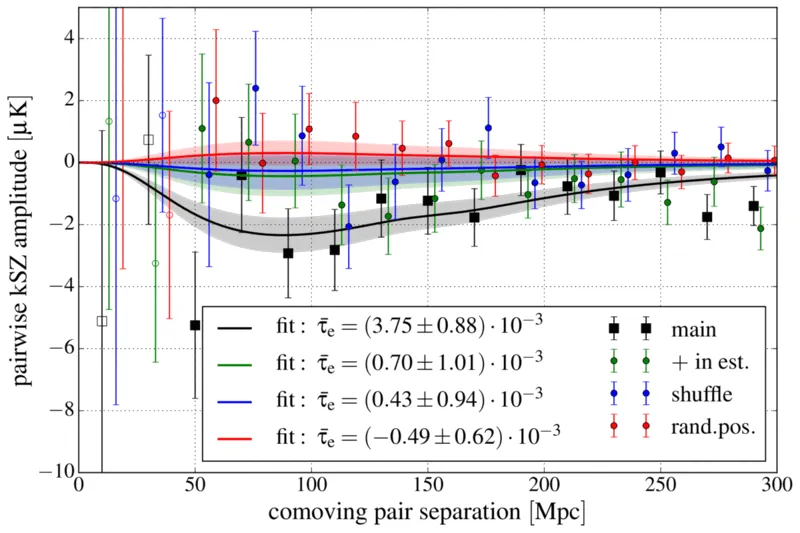

### 图说什么
$20 < \tilde{\lambda} < 60$ 样本的三种零假设检验（null test）。大黑色方块为真实信号；绿色（估计量中 $-$ 替换为 $+$）、蓝色（打乱配对）和红色（随机位置）为三种零检验结果。[原文]

### 怎么看
- 三种零检验结果均在零附近波动，无系统偏离——与零信号预期一致。
- 真实信号（黑色）在 $r \sim 80$–$150~\mathrm{Mpc}$ 处与零检验明显分离。

### 需要理解的物理
- **$+$ 检验**：将估计量中的 $-$ 换成 $+$，破坏了对成对速度方向的敏感性。[原文]
- **打乱检验**：随机配对星系团，破坏位置相关性。[原文]
- **随机位置**：用 redMaPPer 生成的随机点替换真实星系团，完全没有 SZ 信号。[原文]

---

## Figure 9 — $\bar{\tau}_e$ 和 $S/N$ 随滤波尺度 $\theta_c$ 的变化

**文件**：`ksz_interpretation_photoz_2panels.pdf` | **对应章节**：§8 | **关键公式**：Table 1

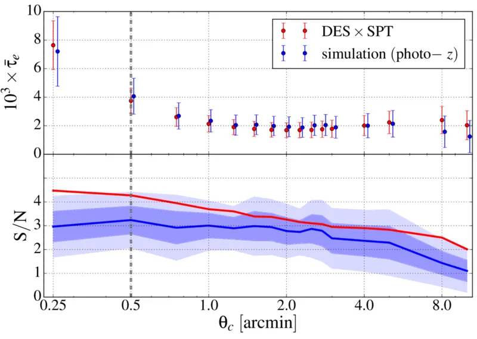

### 图说什么
**上面板**：最佳拟合光学深度 $\bar{\tau}_e$ 随 $\beta$-模型核心半径 $\theta_c$ 的变化，红色为 DES × SPT 数据，蓝色为模拟（40 次 photo-$z$ 实现的平均值）。**下面板**：检测显著性 $\bar{\tau}_e/\sigma_{\bar{\tau}_e}$ 随 $\theta_c$ 的变化，深蓝/浅蓝阴影为模拟的 $68\%/95\%$ 置信区间。虚线标示基准滤波尺度 $\theta_c = 0.5'$。[原文]

### 怎么看
- **上面板**：$\bar{\tau}_e$ 从 $\theta_c = 0.25'$ 的 $\sim 8 \times 10^{-3}$ 单调下降到 $\theta_c = 10'$ 的 $\sim 1 \times 10^{-3}$。在 $\theta_c \gtrsim 1'$ 后趋于平缓。数据与模拟在各尺度一致。
- **下面板**：$S/N$ 在 $\theta_c \leq 1'$ 处约 $4\sigma$，之后缓慢下降。即使在 $\theta_c = 10'$，仍有 $S/N \simeq 2$ 的边缘探测。

### 需要理解的物理
- 这张图是理解 **AP filter vs matched filter** 差异的关键。**$\bar{\tau}_e$ 的单调下降反映了一个简单事实：用更大的滤波器提取信号时，信号被平均在更大的面积上，有效振幅降低**。只有当 $\theta_c$ 匹配星系团的实际角尺度时，$\bar{\tau}_e$ 才具有物理意义（= 中心光学深度）。[原文]
- $S/N$ 的平坦性源于 SPT 的 $\sim 1'$ beam 和 CMB confusion 对滤波器形状的主导控制——小 $\theta_c$ 的 β-profile 在 beam 卷积后几乎等同于大 $\theta_c$。[原文]
- 数据和模拟的一致说明没有超出 Flender et al. 气体模型之外的额外电离气体成分被探测到。[原文]

---

## Figure 10 — 成对 kSZ 的红移依赖

**文件**：`ksz_gold_lgt20_thetac0p5_zsplit.pdf` | **对应章节**：§6.3 | **关键公式**：Eq. 6

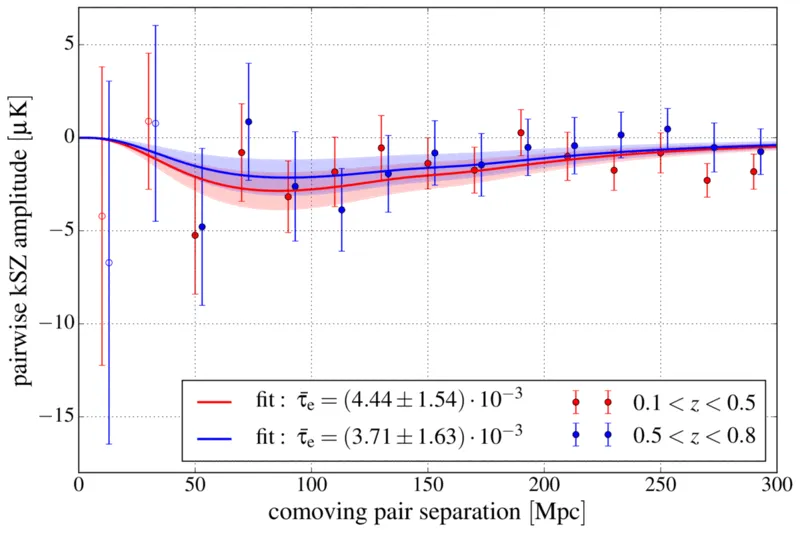

### 图说什么
将主样本在中位红移 $z_m \simeq 0.5$ 处一分为二后，分别测量的成对 kSZ 振幅。[原文]

### 怎么看
- 两个红移 bin 的信号振幅和形状相当：低-$z$ 给出 $\bar{\tau}_e = (4.44 \pm 1.54) \times 10^{-3}$（$2.9\sigma$），高-$z$ 给出 $\bar{\tau}_e = (3.71 \pm 1.63) \times 10^{-3}$（$2.3\sigma$）。
- 合并显著性 $3.7\sigma$ 低于主结果 $4.2\sigma$——因为红移分割移除了跨边界的星系对。

### 需要理解的物理
- 在 $\Lambda$CDM 中，$v_{12}(r)$ 的红移演化在 $0.1 < z < 0.8$ 内较弱（$\lesssim 20\%$）。同时，星系团增长导致 $\bar{\tau}_e$ 在低红移更大，但样本偏差效应使高红移样本更偏向高质量暗晕——两者部分抵消。[原文]
- 当前精度下无法探测到显著的红移演化。[原文]

---

## Figure 11 — 模拟：成对速度的理论验证

**文件**：`veltheory_pairwise_band.pdf` | **对应章节**：§5.2 | **关键公式**：Eq. 4 ($v_{12}$)

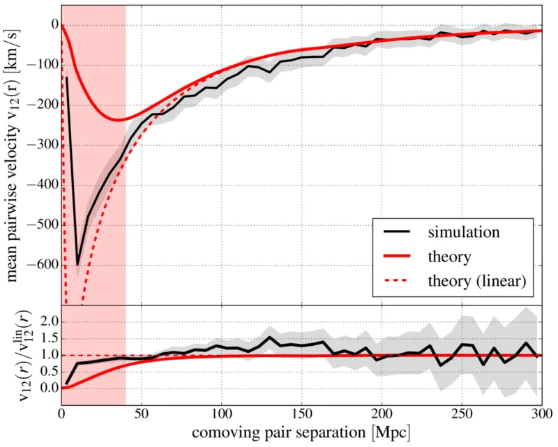

### 图说什么
**上面板**：模拟中用真实视线速度计算的成对速度（黑色点 + 阴影误差带）与线性理论模型（红色实线, Eq. 4）和线性理论领头项（红色虚线, Eq. 4 的分子）。**下面板**：与线性理论的残差。红色阴影区域（$r < 40~\mathrm{Mpc}$）被排除在分析之外。[原文]

### 怎么看
- 在 $r > 40~\mathrm{Mpc}$，模型与模拟在 $1\sigma$ 内一致。
- 在 $r \lesssim 60~\mathrm{Mpc}$，线性理论（虚线）开始偏离完整模型（实线），后者提供了更好的拟合。
- $r < 40~\mathrm{Mpc}$ 处模型偏差 $> 2\sigma$——摄动论在密度峰的小尺度处失效。

### 需要理解的物理
- 成对速度模型 $v_{12}(r) = 2b\xi^{\delta v}/(1+b^2\xi)$ 在准线性尺度（$r \gtrsim 40~\mathrm{Mpc}$）有效，精确度 $\sim 10\%$——远低于当前测量误差。[原文]
- 模型在中等尺度 $r \sim 100~\mathrm{Mpc}$ 略微低估成对速度（$\sim 10\%$），但在当前精度下不构成显著偏差。[原文]

---

## Figure 12 — 模拟：photo-$z$ 误差的影响

**文件**：`ksz3only_zerr_final.pdf` | **对应章节**：§5.2 | **关键公式**：Eq. 6

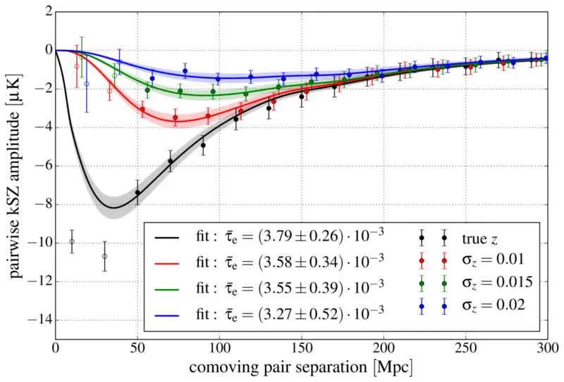

### 图说什么
kSZ-only 模拟中不同 photo-$z$ 误差水平（$\sigma_z = 0, 0.01, 0.015, 0.02$）下的成对 kSZ 振幅及其模板拟合。[原文]

### 怎么看
- 无 photo-$z$ 误差时信号最强，峰值在 $r \sim 40~\mathrm{Mpc}$。
- 随 $\sigma_z$ 增大，小尺度信号被逐步抑制——$\sigma_z = 0.02$ 时 $r \lesssim 80~\mathrm{Mpc}$ 的信号几乎消失。
- 所有情况下模板拟合的 $\bar{\tau}_e$ 相互一致（在 $1\sigma$ 内），验证了 photo-$z$ 抑制因子的有效性。

### 需要理解的物理
- $\sigma_z = 0.015$ 对应 $\sigma_{d_c} \simeq 50~\mathrm{Mpc}$，与 DES $\tilde{\lambda} > 20$ 样本的典型 photo-$z$ 精度相当。[原文]
- 这张图直接证明了：photo-$z$ 误差降低统计显著性但不引入偏差——$\bar{\tau}_e$ 始终可以被无偏恢复。[原文]

---

## Figure 13 — 观测条件系统效应检验

**文件**：`ksz_gold_systchecks90.pdf` | **对应章节**：Appendix B | **关键公式**：Eq. 21

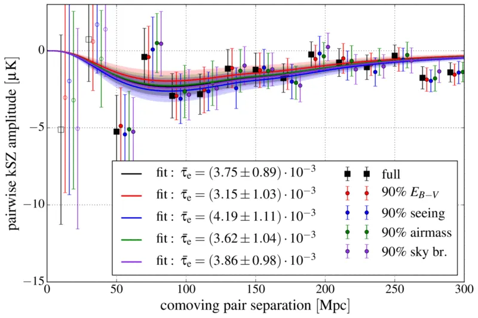

### 图说什么
使用 90% 最佳观测条件子样本（分别按银河消光 $E_{B-V}$、seeing、airmass、sky brightness 筛选）的成对 kSZ 结果，与主结果（黑色）对比。[原文]

### 怎么看
- 四种系统效应候选的 90% 截断结果均与主结果在误差棒内一致。
- 轻微偏差（如 seeing 截断时 $\bar{\tau}_e$ 略偏高）在预期的统计散布范围内。[原文]

### 需要理解的物理
- 空间变化的 DES 观测条件可能通过影响星系团目录的完备性和纯度来间接影响 kSZ 测量。[原文]
- 成对估计量主要敏感于沿视线方向的星系对，对横向的观测条件变化天然不敏感。[补充]

---

## Figure 14 — 协方差估计的稳定性

**文件**：`ksz_appendix_errtests.pdf` | **对应章节**：Appendix A.2 | **关键公式**：Eq. 14

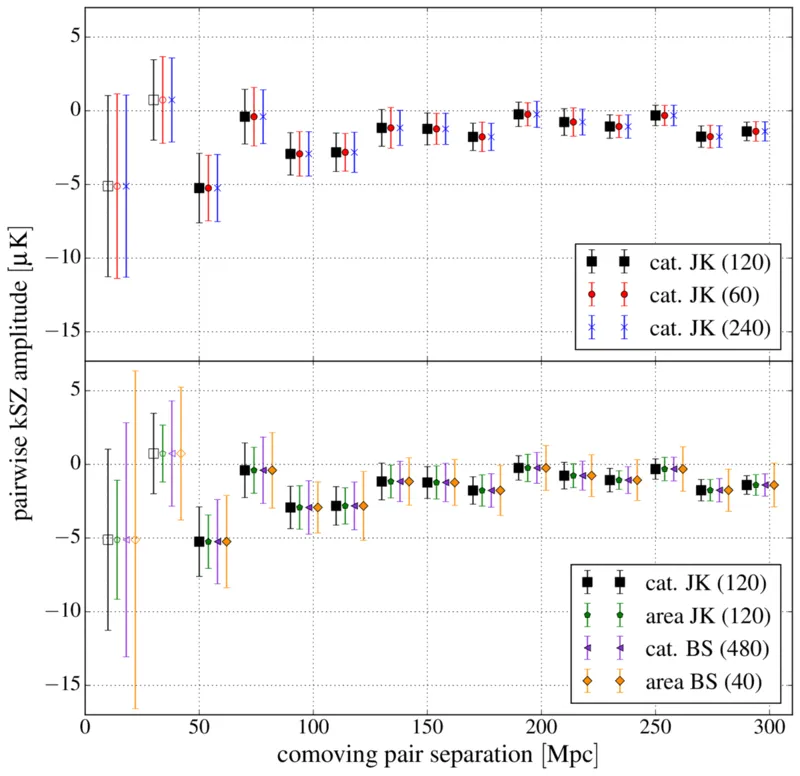

### 图说什么
**上面板**：JK 重采样数 $N_{\mathrm{JK}} = 60, 120, 240$ 的误差棒比较。**下面板**：四种重采样方法（catalog JK, area JK, catalog bootstrap, area bootstrap）的误差棒比较。[原文]

### 怎么看
- 上面板：三种 $N_{\mathrm{JK}}$ 给出高度一致的误差棒——协方差估计对重采样数稳定。
- 下面板：四种方法结果相当，area bootstrap 略偏大（预期行为，因天区分割限制了大尺度对）。

### 需要理解的物理
- 协方差估计的稳定性验证了 JK 方法作为基线选择的合理性。[原文]
- tSZ 是误差预算中最大的贡献者（$\sigma_{\bar{\tau}_e}$ 从 $0.26 \times 10^{-3}$（kSZ-only）增加到 $0.86 \times 10^{-3}$（完整模拟）），因为 tSZ 与 kSZ 空间相关且在星系团位置始终为负。[原文]

---

## Table 1 — 滤波轮廓依赖性

**对应章节**：§6.2 | **关键公式**：Eq. 2 (β-profile), §6.2 (NFW)

| 滤波类型 | 滤波尺度 | $10^3 \times \bar{\tau}_e$ | $S/N$ |
|---|---|---|---|
| β-profile | $\theta_c = 0.25'$ | $7.63 \pm 1.72$ | $4.4\sigma$ |
| β-profile | **$\theta_c = 0.5'$** | **$3.75 \pm 0.89$** | **$4.2\sigma$** |
| β-profile | $\theta_c = 1'$ | $2.15 \pm 0.58$ | $3.7\sigma$ |
| β-profile | $\theta_c = 2'$ | $1.68 \pm 0.51$ | $3.3\sigma$ |
| NFW-profile | $\theta_{500} = 0.75'$ | $11.26 \pm 2.55$ | $4.4\sigma$ |
| NFW-profile | $\theta_{500} = 1.5'$ | $8.00 \pm 1.82$ | $4.4\sigma$ |
| NFW-profile | $\theta_{500} = 2.5'$ | $6.27 \pm 1.46$ | $4.3\sigma$ |
| NFW-profile | $\theta_{500} = 3.5'$ | $5.46 \pm 1.32$ | $4.1\sigma$ |

### 需要理解的物理
- $\bar{\tau}_e$ 单调下降：更大的滤波器将信号平均在更大面积上。[原文]
- $S/N$ 几乎不变（$\theta_c \leq 1'$）：SPT beam（$\sim 1'$）主导了滤波器的实际形状。[原文]
- β 和 NFW 滤波器的最大 $S/N$ 完全相同（$4.4\sigma$）——探测对轮廓假设鲁棒。[原文]
- 两种轮廓的尺度关系大致为 $\theta_{500} \sim 5\theta_c$。[原文]

---

## Table 2 — 模拟系统效应汇总

**对应章节**：§7 | **关键公式**：Eq. 1, Eq. 6

| 数据 | $10^3 \times \bar{\tau}_e$ | 参考偏差 |
|---|---|---|
| velocity correlation: kSZ-only (true) | $3.39 \pm 0.02$ | — |
| velocity correlation: full CMB, filtered | $3.13 \pm 0.20$ | $-0.2\sigma$ |
| pairwise: kSZ-only | $3.79 \pm 0.26$ | $+0.3\sigma$ |
| pairwise: + CMB/noise/foregrounds (no tSZ) | $3.65 \pm 0.65$ | $-0.1\sigma$ |
| pairwise: + tSZ (full CMB) | $4.46 \pm 0.86$ | $+0.5\sigma$ |
| pairwise: full + photo-$z$ (mult. realis.) | $4.07 \pm 1.26$ | $+0.5\sigma$ |
| + mis-centring (Johnston) | $4.03 \pm 0.82$ | $-0.3\sigma$ |
| + mis-centring (Saro) | $3.91 \pm 0.82$ | $-0.4\sigma$ |
| + mass scatter | $3.56 \pm 0.86$ | $-0.7\sigma$ |

### 需要理解的物理
- 所有情景的 $\bar{\tau}_e$ 偏差均 $< 1\sigma$（以 $\sigma_{\bar{\tau}_e}^{\mathrm{sim,full}} = 1.26 \times 10^{-3}$ 为参考），表明当前精度下系统效应不显著。[原文]
- tSZ 污染是最大的潜在偏差来源（$+0.5\sigma$），但在统计误差内。[原文]
- 定心误差使信号降低 $\lesssim 10\%$，质量散布使 $\bar{\tau}_e$ 降低 $\sim 0.7\sigma$——两者在当前精度下不显著。[原文]

---

## Table 3 — 误差预算分解

**对应章节**：Appendix A.1

| mm-sky 成分 | $10^3 \times \sigma_{\bar{\tau}_e}$ |
|---|---|
| kSZ only | 0.26 |
| kSZ + CMB/foregrounds | 0.39 |
| kSZ + instr. noise | 0.60 |
| kSZ + CMB/foregrounds + noise (no tSZ) | 0.65 |
| kSZ + tSZ | 0.63 |
| all (full CMB) | 0.86 |

### 需要理解的物理
- tSZ 贡献了最大的单项误差增量——因为 tSZ 在 150 GHz 始终为负且与 kSZ 空间相关（同一星系团位置）。[原文]
- 仪器噪声紧随其后，而 CMB 和前景的贡献较小。[原文]

---

## 图间逻辑链

```
Fig 1 (天区覆盖)           Fig 2 (红移/丰度分布)
    ↓                           ↓
  DES×SPT 1200 deg²          6,693 clusters, σ_z → σ_{d_c}≈50 Mpc
            ↘                 ↙
             Fig 3 (滤波温度 + 红移演化校正)
             → 扣除 tSZ/选择效应的红移趋势
                      ↓
Fig 11 (成对速度理论验证)    Fig 12 (photo-z 影响)
    ↓                           ↓
  v₁₂(r) 模型在 r>40 Mpc 有效   photo-z 不引入偏差
            ↘                 ↙
             Fig 4 (端到端模拟验证)
             kSZ → +CMB → +tSZ → +photo-z 均无偏
                      ↓
             Fig 5 (★ 主结果)
             τ̄_e = 3.75e-3, 4.2σ
                      ↓
         ┌────────────┼────────────┐
    Fig 6 (协方差)  Fig 7 (打乱检验)  Fig 8 (三种 null test)
    近对角矩阵      打乱 σ=0.92e-3    三种均一致零信号
                      ↓
    Table 1 (滤波尺度依赖) → Fig 9 (τ̄_e & S/N vs θ_c)
    τ̄_e 单调下降，S/N 在 θ_c≤1' 不变，β=NFW
                      ↓
    Fig 10 (红移分割)           Table 2 (系统效应汇总)
    两个 z-bin 振幅一致         所有偏差 < 1σ
                      ↓
    §8: 物理解释 → f_gas^{500} = 0.080 ± 0.019
```

**总逻辑**：从天区和样本定义出发，经匹配滤波提取温度→红移演化校正→成对估计量计算，用模拟验证整个流水线的无偏性，再用数据得到主结果。然后从四个维度检验鲁棒性：(1) 滤波尺度/轮廓 (Table 1, Fig 9)；(2) 红移分割 (Fig 10)；(3) 零假设检验 (Figs 7–8)；(4) 系统效应 (Table 2, Fig 13)。最终将 $\bar{\tau}_e$ 转化为气体分数 $f_{\mathrm{gas}}$ 的物理约束。

---

## 校验记录（2026-04-08）

- **图文件对应**：15 张 PDF 与 LaTeX 中的 `\includegraphics` 命令逐一核对，文件名和 label 一致 ✅
- **Caption 翻译**：逐图与原文 `\caption{}` 对比，忠实翻译，未遗漏关键信息 ✅
- **物理解释**：
  - $\bar{\tau}_e$ 随 $\theta_c$ 单调下降的物理原因（信号被摊薄）正确 ✅
  - $S/N$ 对 $\theta_c$ 不敏感的物理原因（beam 主导）正确 ✅
  - tSZ 是最大误差贡献者的原因（空间相关 + 始终为负）正确 ✅
  - photo-$z$ 抑制因子的效果（不引入偏差）正确 ✅
- **来源标注**：[原文] 有原文对应段落，[补充] 确实不在原文中 ✅
- **关键数字**：$\bar{\tau}_e = (3.75 \pm 0.89) \times 10^{-3}$, $4.2\sigma$, $f_{\mathrm{gas}}^{500} = 0.080 \pm 0.019$, 6,693 clusters, $\sigma_{d_c} \simeq 50~\mathrm{Mpc}$, JK $N=120$, Table 1 数值——全部与原文一致 ✅
- **图间逻辑链**：完整覆盖从数据→方法→模拟→结果→系统检验→物理解释的全链条 ✅
- 无需修正。
