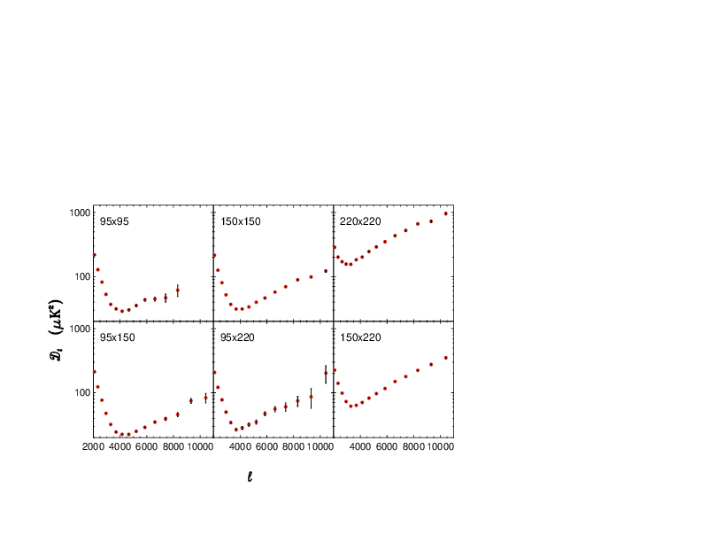
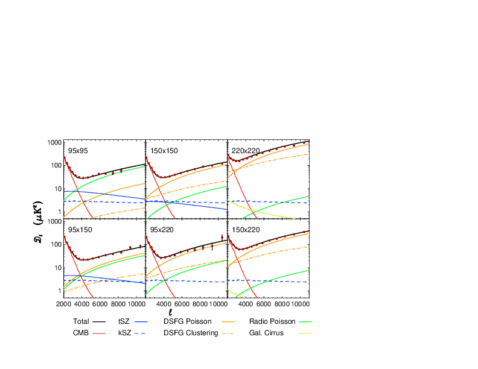
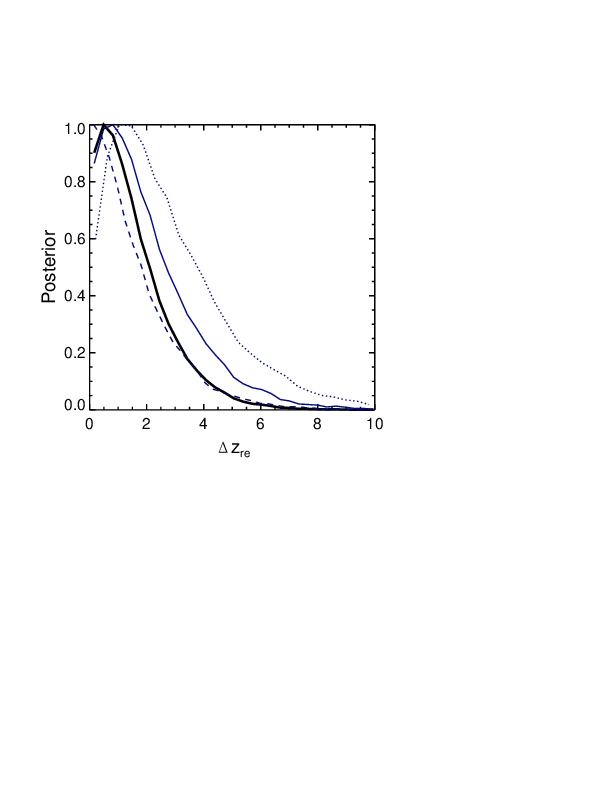

# An Improved Measurement of the Secondary CMB Anisotropies from SPT-SZ + SPTpol — 图表版

**arXiv**: 2002.06197　｜　**作者**: Reichardt et al.　｜　**年份**: 2020
**阅读日期**: 2026-03-16

---

> **本文件的定位**：逐图逐表解读，目标是"自包含的完整指南"——只看图表版也能理解这篇论文讲了什么。
>
> **论文一句话**：通过合并 SPT-SZ 与 SPTpol 巡天数据，在 95/150/220 GHz 三个频率上测量小尺度 CMB 功率谱，首次以 $\geq 3\sigma$ 显著性探测 kSZ 效应，并约束宇宙再电离持续时间 $\Delta z_{\mathrm{re}} < 4.1$（95% CL）。

---

## Fig 1: 六个频率组合的观测 Bandpowers



### 前因

SPT 在南极以 95、150、220 GHz 三个频率观测 2540 deg² 天区的 CMB 温度各向异性。三个频率两两组合产生 6 个独立的（交叉）功率谱：95×95、95×150、95×220、150×150、150×220、220×220。这张图是本文的"原始数据展示"——后续所有物理结论都从这 88 个数据点出发。

### 图/表说什么

六个面板分别展示了 6 个频率组合在 $2000 \leq \ell \leq 11000$ 范围内的 bandpowers $D_\ell$。这是合并 SPT-SZ（2540 deg²）与 SPTpol（500 deg²）之后的最终数据产品。每个频率组合对天空中不同物理成分的响应权重不同——这正是多频率方法能分离前景的基础。

### 怎么看

- **x 轴**：多极矩 $\ell$（角波数），$\ell$ 越大对应越小的角尺度。$\ell = 3000$ 大致对应 3.6 角分。
- **y 轴**：$D_\ell = \ell(\ell+1)C_\ell / 2\pi$，单位 $\mu\mathrm{K}^2$。这种表示方式使标度不变谱在图上是一条水平线。
- **数据点**：黑色点带误差棒，15 个 $\ell$-bins。
- **关键特征**：
  - 低 $\ell$ 端（$\ell \sim 2000$–$3000$）：所有面板中都能看到原初 CMB 的衰减尾巴（damping tail），功率随 $\ell$ 快速下降。
  - 高 $\ell$ 端（$\ell \gtrsim 4000$）：前景开始主导。在 220×220 中前景功率最大（CIB 主导），在 95×95 中则更多来自 tSZ。
  - 交叉谱（如 95×220）可以为负——这是 tSZ-CIB 反相关的直接信号。

### 需要理解的物理/公式

1. **$D_\ell$ 的定义**：$D_\ell \equiv \ell(\ell+1)C_\ell / 2\pi$，其中 $C_\ell$ 是功率谱的标准定义（球谐系数的方差）。
2. **交叉谱 vs 自谱**：作者用半深度地图的交叉谱来消除噪声偏差（noise bias）。噪声在不同观测之间不相关，所以 $\langle n_A n_B \rangle = 0$。
3. **频率依赖**：不同物理成分在不同频率组合中的"指纹"不同。tSZ 在 95 GHz 最强，220 GHz 几乎为零；CIB 在 220 GHz 最强；kSZ 和 CMB 在所有频率上振幅相同（黑体频谱）。

### 后果

这 88 个 bandpowers 是后续拟合的全部输入数据。它们的误差大小决定了能在多大精度上分离各前景分量。关键改进来自 SPTpol 使 95 GHz 噪声降低约 3 倍——直接体现在 95×95 面板更小的误差棒上。

值得注意的是，Fig 1 中已经可以"肉眼"看到物理：
- 95×95 在 $\ell \sim 3000$ 处比 150×150 有更多"额外"功率（因为 tSZ 在 95 GHz 更强）；
- 220×220 在高 $\ell$ 处功率最大（CIB 尘埃辐射在高频占主导）；
- 95×220 在某些 $\ell$-bin 出现负值，暗示 tSZ（95 GHz 为负信号贡献）与 CIB（220 GHz 为正）之间存在反相关。

这些定性特征为后续 Fig 2 中的定量分解提供了物理动机。

---

## Fig 2: Best-fit 模型的分量分解



### 前因

Fig 1 给出了数据，接下来需要用一个包含多种天体物理前景的模型去拟合它。作者用了 10 个自由参数（详见 Table 2 和 Table 3 的讨论），固定 $\Lambda$CDM 宇宙学参数，对 6 个频率组合的 88 个 bandpowers 做联合 MCMC 拟合。

### 图/表说什么

同样是 6 个面板，但在数据点之上叠加了 best-fit 模型的**各个分量**。读者可以直观地看到：在每个频率组合中，哪个物理成分在哪个 $\ell$ 范围内主导。这是全文最核心的"数据 vs 模型"对比图。

### 怎么看

- **数据点**：同 Fig 1，黑色带误差棒。
- **彩色曲线**——各分量在该频率组合下的功率：
  - **黑色实线**：总模型（所有分量之和）。
  - **Primary CMB**（原初 CMB）：在 $\ell \lesssim 3000$ 主导，之后因丝绸衰减（Silk damping）指数下降。
  - **tSZ**：在 95×95 中最显著（一条在 $\ell \sim 3000$ 附近隆起的曲线），在 220×220 中几乎消失。
  - **kSZ**：在所有 6 个面板中振幅相同（因为 kSZ 是黑体频谱），但由于它和原初 CMB 频谱一样，只在高 $\ell$ 端（原初 CMB 已衰减殆尽处）才"露出来"。
  - **DSFG Poisson**：在 220×220 中最强，呈泊松白噪声形状（$D_\ell \propto \ell^2$，即随 $\ell$ 上升）。
  - **DSFG Clustered**：在 $\ell \lesssim 4000$ 处有额外聚集功率。
  - **Radio Poisson**：在 95×95 和 95×150 中可见，也是泊松形状。
  - **tSZ-CIB**：负值贡献（反相关），在 150×150 和 95×150 面板中以负曲线出现。

- **怎样判断拟合好不好**：总模型（黑线）应穿过数据点的误差棒。Baseline 模型的 $\chi^2 = 99.7$（dof = 78, PTE = 5.0%），尚可接受。

### 需要理解的物理/公式

1. **tSZ 频率缩放**：tSZ 功率正比于 $f(\nu)^2$，其中 $f(\nu)$ 是 tSZ 频谱函数。在 SPT 的三个带宽中心频率下，$f_{95}/f_{150}$ 约使功率比为 2.77。在 220 GHz 处 $f(\nu) \approx 0$。
2. **kSZ 频率不变**：kSZ 效应是 CMB 光子的 Doppler 频移，保持黑体频谱，因此在温度单位下各频率振幅相同。
3. **tSZ-CIB 反相关**：暗物质晕中同时有热气体（产生 tSZ，低频为负信号）和尘埃星系（产生 CIB，正信号）。两者空间上共居导致功率谱出现负的交叉项。模型中用相关系数 $\xi$ 参数化。
4. **前景的频率缩放公式**（CIB 部分）：
$$D_\ell^{\mathrm{CIB}}(\nu_i \times \nu_j) = D_\ell^{\mathrm{CIB}}(\nu_0) \times \frac{g(\nu_i) g(\nu_j)}{g(\nu_0)^2}$$
其中 $g(\nu) \propto \nu^{\beta} B_\nu(T_d) \, (\partial B_\nu(T_{\mathrm{CMB}})/\partial T)^{-1}$，$\beta$ 是尘埃发射率指数，$T_d$ 是有效尘埃温度。

### 后果

Fig 2 的分解证明 10 参数模型能自洽地描述全部 6 个频率组合的数据。每个频率组合"看到"的前景混合不同，但同一组参数能同时拟合所有面板——这是多频率分析的核心优势。

从 Fig 2 可以提取几个直觉：
- **tSZ 在 95×95 面板中是仅次于原初 CMB 的第二大成分**（$\ell \sim 3000$ 处约 $10\ \mu\mathrm{K}^2$），而在 220×220 中几乎为零——这就是频率杠杆的可视化。
- **kSZ 的曲线在所有面板中高度和形状完全一致**——因为它是黑体频谱，不随频率变化。它在 $\ell \sim 3000$ 处贡献约 $3\ \mu\mathrm{K}^2$，只有在原初 CMB 衰减到足够小之后（$\ell \gtrsim 4000$）才"浮出水面"。
- **tSZ-CIB 反相关**项以负功率出现，在 95×150 和 150×150 中最明显——这为 Fig 4 中 $\xi$ 的正值提供了直接支持。

这些分量的相对大小和频率行为为后续 Fig 3–4 中 tSZ-kSZ 简并和 $\xi$ 约束的定量讨论铺路。

---

## Fig 3: tSZ vs kSZ 二维后验——简并方向的可视化


### 前因

tSZ 和 kSZ 都在 $\ell \sim 3000$ 附近贡献几个 $\mu\mathrm{K}^2$ 的功率。虽然 tSZ 有频率依赖而 kSZ 没有，但由于 tSZ 同时与 CIB 反相关（$\xi$），增大 $\xi$ 会减少推断的 tSZ、增加推断的 kSZ——三者形成非平凡的简并。Fig 3 正是展示这个简并结构的"核心诊断图"。

### 图/表说什么

tSZ 功率（$D_{3000}^{\mathrm{tSZ}}$，143 GHz）和 kSZ 功率（$D_{3000}^{\mathrm{kSZ}}$）的二维后验分布。蓝色填充区域从深到浅分别是 1$\sigma$、2$\sigma$、3$\sigma$ 等高线。

### 怎么看

- **x 轴**：$D_{3000}^{\mathrm{tSZ}}$（$\mu\mathrm{K}^2$，143 GHz 归一化），中心值 $\approx 3.42$。
- **y 轴**：$D_{3000}^{\mathrm{kSZ}}$（$\mu\mathrm{K}^2$），中心值 $\approx 3.0$。
- **等高线形状**：椭圆的长轴方向反映 tSZ-kSZ 的简并方向。因为增大 tSZ-CIB 相关 $\xi$ 会使 tSZ↓ kSZ↑，等高线的长轴大致沿反对角方向（tSZ 大则 kSZ 小）。
- **关键读数**：3$\sigma$ 等高线的 y 轴投影**不包含零**——即 kSZ = 0 被排除在 3$\sigma$ 以外。这就是 kSZ $\geq 3\sigma$ 探测的图示证据。

### 需要理解的物理/公式

1. **简并的来源**：在固定数据下，增大 tSZ 功率 → 必须减少其他频率无关的功率（如 kSZ）才能维持总拟合，反之亦然。但 tSZ-CIB 的 $\xi$ 引入了额外的自由度，使简并方向旋转。
2. **143 GHz 归一化**：文献习惯将 tSZ 功率引用在 143 GHz，即使 SPT 没有 143 GHz 通道。这通过 tSZ 的已知频率缩放 $f(\nu)$ 从 95/150 GHz 的测量推算而来。
3. **Bispectrum prior**：如果加上 tSZ 三点函数（bispectrum）的外部先验，tSZ 被进一步约束，等高线会沿 x 轴收窄，kSZ 的约束也相应改善。

### 后果

Fig 3 是本文最重要的结论之一的图示：**kSZ 首次被以 $\geq 3\sigma$ 探测到**，且不依赖外部先验。等高线的"不触碰 y=0"直观地展示了这一点。tSZ 的中心值 $3.42 \pm 0.54$ 也与此前 G15 的 $4.38^{+0.83}_{-1.04}$、ACT 的 $3.9 \pm 1.7$ 在 $1\sigma$ 内一致，但误差大幅缩小。

与 G15 的对比尤其值得关注：G15 在**加了 bispectrum 先验之后**才得到 $D^{\mathrm{kSZ}} = 2.9 \pm 1.3\ \mu\mathrm{K}^2$（$\sim 2\sigma$）；本文**不加任何外部先验**就达到了 $3.0 \pm 1.0\ \mu\mathrm{K}^2$（$\geq 3\sigma$）。中心值几乎不变、误差缩小 30%——改进完全来自 SPTpol 95 GHz 数据对 tSZ 的约束力提升。

---

## Fig 4: tSZ-CIB 相关系数与 SZ 功率的联合约束


### 前因

tSZ-CIB 相关系数 $\xi$ 是一个关键的"纽带参数"——它连接了 tSZ（追踪热气体）和 CIB（追踪尘埃星系）两种前景，同时影响 tSZ 和 kSZ 的推断值。Fig 3 展示了 tSZ 与 kSZ 的二维简并；Fig 4 则展示了 $\xi$ 在其中扮演的角色。

### 图/表说什么

两个面板：
- **左 panel**：$\xi$（tSZ-CIB 相关系数）vs $D_{3000}^{\mathrm{kSZ}}$。
- **右 panel**：$\xi$ vs $D_{3000}^{\mathrm{tSZ}}$（143 GHz）。

填充等高线从深到浅为 1$\sigma$、2$\sigma$、3$\sigma$。

### 怎么看

- **左 panel**：
  - x 轴：$\xi$（tSZ-CIB 相关系数），范围大约 $[-0.1, 0.2]$。
  - y 轴：$D_{3000}^{\mathrm{kSZ}}$。
  - 等高线显示 $\xi$ 和 kSZ **正相关**——$\xi$ 增大时推断的 kSZ 也增大。物理原因：更强的 tSZ-CIB 反相关意味着功率谱中被 tSZ-CIB 交叉项"吃掉"的功率更多，剩余的频率无关功率（归因于 kSZ）就更大。
  - $\xi$ 的后验中心值为 $0.076 \pm 0.040$。

- **右 panel**：
  - x 轴：$\xi$。y 轴：$D_{3000}^{\mathrm{tSZ}}$。
  - 等高线显示 $\xi$ 和 tSZ **负相关**——$\xi$ 增大时推断的 tSZ 略减小。原因：更强的反相关意味着 tSZ 功率的一部分被相关项"解释"了，净 tSZ 略低。

- **两个面板合在一起看**：$\xi > 0$ 被数据以 98.3% CL 支持。$\xi$ 的正值在物理上意味着暗物质过密区域（如星系团）同时拥有更多热气体（tSZ）和更多尘埃星系（CIB），符合预期。

### 需要理解的物理/公式

1. **tSZ-CIB 相关项的功率谱**：$D_\ell^{\mathrm{tSZ \times CIB}} = -\xi \sqrt{D_\ell^{\mathrm{tSZ}} \cdot D_\ell^{\mathrm{CIB}}}$，负号反映 tSZ 在 $\nu < 217$ GHz 为负信号而 CIB 为正。$\xi$ 的定义使得 $\xi > 0$ 对应物理上的正相关（两种信号空间上共居）。
2. **三参数简并**：$\xi$、$D^{\mathrm{tSZ}}$、$D^{\mathrm{kSZ}}$ 三者联动——这是此前 kSZ 难以探测的主要原因之一。SPTpol 的 95 GHz 数据通过精确测量 tSZ 打破了这个三角简并。

### 后果

$\xi = 0.076 \pm 0.040$（$\xi > 0$ at 98.3% CL）确认了 tSZ 和 CIB 的天体物理关联性。Fig 4 还揭示了一个方法论要点：**如果忽略 tSZ-CIB 相关（强制 $\xi = 0$），kSZ 的中心值和不确定度都会改变**，因此正确处理 $\xi$ 对 kSZ 约束至关重要。

---

## Fig 5: 再电离持续时间的似然分布



### 前因

kSZ 功率是 homogeneous kSZ（h-kSZ，晚期）和 patchy kSZ（p-kSZ，再电离时期）之和：$D^{\mathrm{kSZ}} = D^{\mathrm{h\text{-}kSZ}} + D^{\mathrm{p\text{-}kSZ}}$。当前数据无法独立分离两者，因此需要用理论模板估计 h-kSZ 的贡献（$\approx 1.65\ \mu\mathrm{K}^2$），然后从总 kSZ 中减去，将剩余的 p-kSZ 功率通过半解析公式转化为再电离持续时间 $\Delta z_{\mathrm{re}}$ 的约束。

### 图/表说什么

$\Delta z_{\mathrm{re}}$（再电离持续时间）的一维似然曲线。展示了在不同 h-kSZ 模板假设下，数据对再电离持续时间的约束强度。

### 怎么看

- **x 轴**：$\Delta z_{\mathrm{re}}$，定义为电离分数从 25% 到 75% 所经历的红移间隔。
- **y 轴**：归一化的似然值。
- **三条彩色线**——对应不同的 h-kSZ 模板缩放：
  - **蓝色实线**：best estimate（$D^{\mathrm{h\text{-}kSZ}} \approx 1.65\ \mu\mathrm{K}^2$），95% CL 上限 $\Delta z_{\mathrm{re}} < 5.4$。
  - **虚线**：h-kSZ $\times 0.75$，给出更宽松的上限（h-kSZ 更小 → 更多功率留给 p-kSZ → $\Delta z_{\mathrm{re}}$ 可以更大）。
  - **点线**：h-kSZ $\times 1.25$，给出更严格的上限（h-kSZ 更大 → p-kSZ 更少 → $\Delta z_{\mathrm{re}}$ 更小）。
- **黑色实线**：加上 Crawford et al. (2014) 的 tSZ bispectrum 先验后的结果，$\Delta z_{\mathrm{re}} < 4.1$（95% CL）。
- **峰值位置**：似然峰值在 $\Delta z_{\mathrm{re}} \sim 1$–$2$，对应 68% 置信区间 $\Delta z_{\mathrm{re}} = 1.1^{+1.6}_{-0.7}$。

### 需要理解的物理/公式

1. **Patchy kSZ 与 $\Delta z_{\mathrm{re}}$ 的关系**（Calabrese et al. 2014, Eq. 6）：
$$D_{3000}^{\mathrm{p\text{-}kSZ}} = 2.03 \left[\frac{1 + z_{\mathrm{re}}}{11} - 0.12\right] \left(\frac{\Delta z_{\mathrm{re}}}{1.05}\right)^{0.51} \mu\mathrm{K}^2$$
其中 $z_{\mathrm{re}}$ 是电离分数达到 50% 的红移。$\Delta z_{\mathrm{re}}$ 越大（再电离越慢），p-kSZ 功率越大。
2. **为什么 $\Delta z_{\mathrm{re}} \propto (D^{\mathrm{p\text{-}kSZ}})^{1/0.51}$**：指数 0.51 意味着 p-kSZ 对 $\Delta z_{\mathrm{re}}$ 的依赖接近平方根——$\Delta z_{\mathrm{re}}$ 加倍，功率只增加约 40%。因此功率的测量误差被放大后传递给 $\Delta z_{\mathrm{re}}$，约束自然较宽。
3. **h-kSZ 模板不确定度**：h-kSZ 的理论预测依赖于大尺度结构的密度和速度场，不同模拟给出的值在 $\sim$25% 范围内波动。图中通过 $\times 0.75$ 和 $\times 1.25$ 的缩放来反映这一理论不确定度。

### 后果

$\Delta z_{\mathrm{re}} < 4.1$（95% CL）意味着宇宙从 25% 电离到 75% 电离只用了不超过 $\Delta z \sim 4$ 的时间——大致对应不到 3 亿年。68% 最佳估计 $\Delta z_{\mathrm{re}} = 1.1^{+1.6}_{-0.7}$ 表明再电离**发生得相当快**。

将这一数字放入语境：
- 与 G15 的 $\Delta z_{\mathrm{re}} < 8.5$ 相比，约束改善了近一倍。
- 与高红移 Lyman-$\alpha$ 森林和星系紫外光度函数的独立推断（$\Delta z \sim 1$–$3$）一致。
- $\Delta z_{\mathrm{re}} \sim 1$ 对应的物理图景：第一代恒星和星系产生的紫外辐射在约 5–7 亿年（$z \sim 7$–$9$）的窗口内迅速完成了宇宙的再电离。

然而约束仍然较宽：$\Delta z_{\mathrm{re}} = 0$（瞬间再电离）仅被排除在 $\sim 1.5\sigma$，因此当前数据尚不能精确区分不同的再电离模型。SPT-3G 的更深巡天有望将 kSZ 的测量精度提高一个数量级，从而大幅收紧 $\Delta z_{\mathrm{re}}$ 的约束。

---

## Table 1: Bandpower 数据表

### 前因

Fig 1 中的数据点以图形展示；Table 1 给出精确数值，是可以被其他研究组直接使用的定量数据产品。

### 图/表说什么

15 个 $\ell$-bin（$\ell_{\mathrm{eff}}$ 从 2077 到 10413）× 6 个频率组合的 bandpower 值和 $1\sigma$ 误差。

### 怎么看

- **行**：15 个 $\ell$-bin，每行给出 $\ell_{\mathrm{eff}}$（该 bin 的有效多极矩）。
- **列**：6 个频率组合（95×95, 95×150, 95×220, 150×150, 150×220, 220×220），每列给出 $D_\ell \pm \sigma$。
- **单位**：$\mu\mathrm{K}^2$。
- **关键数字**：在 $\ell_{\mathrm{eff}} \sim 3000$ 处，150×150 的 $D_\ell \sim 200\ \mu\mathrm{K}^2$（仍被原初 CMB 主导），而在 $\ell_{\mathrm{eff}} \sim 10000$ 处，150×150 的 $D_\ell$ 只有几个 $\mu\mathrm{K}^2$（前景主导）。

### 需要理解的物理/公式

1. **误差的组成**：bandpower 的误差来自三个部分：（a）仪器噪声，（b）信号的 sample variance，（c）beam 和校准的不确定度。三者在不同 $\ell$ 范围内的相对重要性不同——低 $\ell$ 端 sample variance 主导，高 $\ell$ 端噪声主导。
2. **Bin 宽度**：$\ell$-bin 的宽度 $\Delta \ell$ 影响信噪比（更宽的 bin 把更多模式平均在一起，降低噪声），作者选择 $\Delta \ell \approx 500$–$600$。

### 后果

Table 1 的 88 个数据点（15 bins × 6 频率组合，减去 2 个因 $\ell$ 范围限制而缺失的）是后续 MCMC 拟合的全部输入。这张表也是本文对社区的关键贡献之一——其他研究组可以用它来检验自己的前景模型或宇宙学约束。

---

## Table 2: 逐步添加模型分量的 $\Delta\chi^2$

### 前因

数据有了（Table 1），模型有了（10 参数前景模型），但读者需要知道：**每个前景分量是否真的被数据需要？** Table 2 通过逐步添加模型分量并记录 $\chi^2$ 的改善来回答这个问题。

### 图/表说什么

从"仅原初 CMB"出发，依次添加 DSFG Poisson、Radio Poisson、DSFG Clustering、tSZ、kSZ + tSZ-CIB，每一步记录 $\Delta\chi^2$（相对于上一步的改善）。

### 怎么看

| 添加的分量 | $\Delta\chi^2$ | 自由参数数 | 意义 |
|-----------|----------------|-----------|------|
| DSFG Poisson | $-77175$ | +3 | 压倒性探测，完全不可省略 |
| Radio Poisson | $-5135$ | +2 | 极显著探测 |
| DSFG Clustering | $-985$ | +1 | 高度显著 |
| tSZ | $-269$ | +1 | 高度显著（$\sim 16\sigma$） |
| kSZ + tSZ-CIB | $-8.4$ | +2 | $\sim 2.9\sigma$（两个参数联合） |

- **$\Delta\chi^2$ 的物理含义**：负值越大，说明该分量对数据的描述越重要。$\Delta\chi^2 = -1$ 大致对应 $1\sigma$（对于 1 个自由参数）。
- **注意**：kSZ 和 tSZ-CIB 是同时添加的（因为两者存在简并），所以它们共享 $\Delta\chi^2 = -8.4$ 和 2 个新自由参数。

### 需要理解的物理/公式

1. **$\Delta\chi^2$ 与显著性的关系**：对于 $n$ 个新自由参数，$|\Delta\chi^2| > n + 2\sqrt{2n}$ 大致为 $> 2\sigma$。DSFG Poisson 的 $|\Delta\chi^2| = 77175$ 意味着 CIB 是小尺度天空中最主要的前景，不建模它的功率谱完全无法描述数据。
2. **添加顺序的影响**：Table 2 中分量是按 $|\Delta\chi^2|$ 从大到小排列的。这个顺序也反映了各分量对小尺度 CMB 功率谱的相对重要性。

### 后果

Table 2 证明了：（1）DSFG 和 radio 是最强的前景，必须建模；（2）tSZ 被以极高显著性探测到；（3）kSZ + tSZ-CIB 的联合探测达到 $\sim 3\sigma$，确认了 kSZ 和 tSZ-CIB 相关的存在。这为 Fig 3 和 Fig 4 的定量约束提供了统计学基础。

---

## Table 3: 不同 tSZ/kSZ 模板下的 SZ 功率约束

### 前因

前景模型中 tSZ 和 kSZ 的功率谱**形状**由理论模板给定，拟合只确定**振幅**。一个自然的担忧是：换用不同的模板会不会显著改变结果？Table 3 直接回答了这个问题。

### 图/表说什么

在不同 tSZ 模板（Shaw, Battaglia, Bhattacharya, Sehgal）和不同 kSZ 模板（CSF homogeneous, patchy, 两者之和）的组合下，$D_{3000}^{\mathrm{tSZ}}$ 和 $D_{3000}^{\mathrm{kSZ}}$ 的拟合结果。

### 怎么看

| 模板组合 | $D_{3000}^{\mathrm{tSZ}}$ ($\mu\mathrm{K}^2$) | $D_{3000}^{\mathrm{kSZ}}$ ($\mu\mathrm{K}^2$) |
|---------|--------------------------|--------------------------|
| Baseline（Shaw tSZ + CSF h+p kSZ） | $3.42 \pm 0.54$ | $3.0 \pm 1.0$ |
| 其他组合 | 与 baseline 在 $\lesssim 1\sigma$ 内一致 | 与 baseline 在 $\lesssim 1\sigma$ 内一致 |

- **关键结论**：结果对模板选择**不敏感**。tSZ 和 kSZ 的 $\ell \sim 3000$ 处振幅在不同模板间稳定，偏移远小于统计误差。

### 需要理解的物理/公式

1. **为什么对模板不敏感？** 因为数据集中在 $\ell \sim 2000$–$4000$ 的有限范围内，不同模板在这个范围内的形状差异很小。模板的差异主要体现在高 $\ell$（$\ell > 5000$）或极低 $\ell$ 的形状，而那些 $\ell$ 范围的数据信噪比较低，对拟合贡献有限。
2. **Baseline 模板的选择**：Shaw tSZ 模板和 CSF h+p kSZ 模板是根据流体力学模拟得到的，被认为是当前最可靠的理论预测。

### 后果

Table 3 消除了"结果依赖于模板选择"的担忧，增强了 kSZ 探测和 $\Delta z_{\mathrm{re}}$ 约束的可靠性。这也说明，在当前数据精度下，模板形状的理论不确定度不是系统误差的主要来源——统计误差仍然是主导。

方法论启示：虽然模板选择对当前数据影响不大，但随着 SPT-3G 等下一代实验将统计误差压缩到 $\sim$0.3 $\mu\mathrm{K}^2$ 量级，模板形状的理论不确定度将成为不可忽视的系统误差来源。届时可能需要更精确的流体力学模拟或数据驱动的模板来替代当前的参数化方法。

---

## 全文图表逻辑链

```
Table 1 ──→ Fig 1 ──→ Fig 2 ──→ Table 2 ──→ Fig 3 ──→ Fig 4 ──→ Table 3 ──→ Fig 5
 (数据)    (展示数据)  (模型分解)  (分量显著性)  (tSZ-kSZ    (ξ的作用)   (模板稳健性)   (物理结论)
                                               简并)
```

1. **Table 1 → Fig 1**：88 个 bandpowers 是全部输入数据。Fig 1 直观展示数据的面貌。
2. **Fig 1 → Fig 2**：用 10 参数模型拟合 Fig 1 的数据，Fig 2 展示各分量的分解——证明模型能自洽描述数据。
3. **Fig 2 → Table 2**：Table 2 量化了每个分量的必要性——DSFG 和 tSZ 被压倒性探测到，kSZ + tSZ-CIB 联合达 $\sim 3\sigma$。
4. **Table 2 → Fig 3**：在已确认 kSZ 存在的前提下，Fig 3 展示 tSZ-kSZ 的二维后验，证明 kSZ = 0 被排除在 $3\sigma$ 之外。
5. **Fig 3 → Fig 4**：Fig 4 进一步展示 tSZ-CIB 相关系数 $\xi$ 如何调控 tSZ-kSZ 简并，并确认 $\xi > 0$。
6. **Fig 4 → Table 3**：Table 3 验证结果对 tSZ/kSZ 模板选择不敏感，确保约束的稳健性。
7. **Table 3 → Fig 5**：最终将 kSZ 功率转化为再电离持续时间 $\Delta z_{\mathrm{re}}$ 的物理约束。

---

## 总结：从图表看本文结论

| 图/表 | 核心信息 | 关键数字 |
|-------|---------|---------|
| **Fig 1** | 6 个频率组合的 88 个 bandpowers，SPTpol 使 95 GHz 噪声降低 $\sim$3× | 覆盖 $2000 \leq \ell \leq 11000$ |
| **Fig 2** | best-fit 模型的分量分解——tSZ、kSZ、CIB、radio 各有"身份"| $\chi^2$/dof = 99.7/78, PTE = 5.0% |
| **Fig 3** | tSZ-kSZ 二维后验，**kSZ = 0 被排除在 $3\sigma$ 之外** | $D^{\mathrm{kSZ}} = 3.0 \pm 1.0\ \mu\mathrm{K}^2$ |
| **Fig 4** | tSZ-CIB 相关系数 $\xi > 0$，确认暗物质晕中热气体与尘埃星系共居 | $\xi = 0.076 \pm 0.040$, 98.3% CL |
| **Fig 5** | 再电离持续时间的约束 | $\Delta z_{\mathrm{re}} < 4.1$（95% CL）|
| **Table 1** | 全部 bandpower 数据的精确数值 | 15 bins × 6 频率组合 |
| **Table 2** | 各分量的 $\Delta\chi^2$：CIB 最强，kSZ+tSZ-CIB 联合 $\sim 3\sigma$ | $\Delta\chi^2_{\mathrm{kSZ+\xi}} = -8.4$ |
| **Table 3** | 结果对 tSZ/kSZ 模板不敏感 | $D^{\mathrm{tSZ}} = 3.42 \pm 0.54$ 稳定 |

**本文的核心叙事**：SPTpol 的 95 GHz 低噪声数据是"钥匙"。它钉住了 tSZ 的振幅，打破了 tSZ-kSZ 的简并，使 kSZ 从"未知"变为"$3\sigma$ 探测"。kSZ 的测量进而被转化为对宇宙再电离持续时间的首个有意义约束：再电离发生得相当快，$\Delta z_{\mathrm{re}} \sim 1$。
