# The Atacama Cosmology Telescope: Probing the Baryon Content of SDSS DR15 Galaxies with the tSZ and kSZ Effects — 图表版

**arXiv**: 2101.08373　｜　**作者**: Vavagiakis et al.　｜　**年份**: 2021
**阅读日期**: 2026-04-08

---

> **本文件的定位**：逐图逐表解读，目标是"自包含的完整指南"——只看图表版也能理解这篇论文讲了什么。
>
> **论文一句话**：通过对 34 万个 SDSS DR15 发光红巨星系在 ACT+Planck 地图上叠加 tSZ 信号（最高 12$\sigma$），并与伴随论文的 kSZ 配对动量测量联合，估计暗物质晕的光学深度，发现重子含量占 NFW 理论预测的 1/3 到全部。

---

## Figure 1 — 天区覆盖与噪声分布

**文件**：`Figure1a.webp` / `Figure1b.webp` | **对应章节**：§I, §II | **关键公式**：无

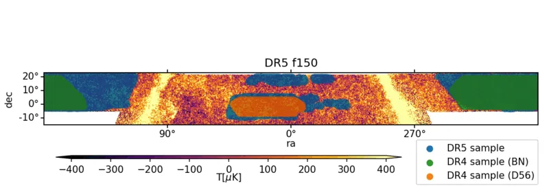

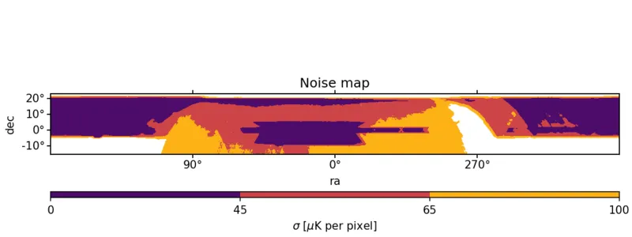

### 图说什么

上图：ACT+Planck DR5 f150 地图叠加 343,647 个 SDSS DR15 源（蓝色点），覆盖约 3700 deg²。绿色和橙色区域分别标示 BN（1633 deg²）和 D56（456 deg²）区域，由 ILC 地图覆盖。 [原文]

下图：DR5 f150 共加地图的逆白噪声方差图（inverse white noise variance map），以等式 Carré 投影的 0.5 角分像素显示。紫色区域标示 45 μK/pixel 截断——最终分析采用的更保守的噪声截断。橙色/黄色高噪声区域与 27% 的 DR15 样本重叠，被剔除。 [原文]

### 怎么看

- 上图是赤道坐标系投影，赤经从右到左增大。蓝色点密度反映 SDSS BOSS 巡天的天区选择函数。
- 下图的颜色编码：深紫色 = 低噪声（高逆方差）= 观测时间长的区域；橙/黄 = 高噪声区域。
- 选取 45 μK/pixel 截断而非 65 μK/pixel，是基于信号盲的不确定度分析：更保守的截断虽然损失 27% 的源，但显著改善了 jackknife 误差条。 [原文]

### 需要的物理

- **逆方差加权**（inverse variance weighting）：当不同观测位置的噪声水平不同时，给噪声低的区域更大权重，可以最小化叠加后的总方差。这就是为什么需要噪声方差图来做截断和加权。 [补充]
- **银道面掩模**和**点源掩模**是两个额外的天区截断：前者避免银河系尘埃/同步辐射污染，后者去掉明亮射电源或红外源，防止它们的信号被误认为 SZ 信号。 [补充]

---

## Figure 2 — 红移分布

**文件**：`Figure2.webp` | **对应章节**：§II.B | **关键公式**：无

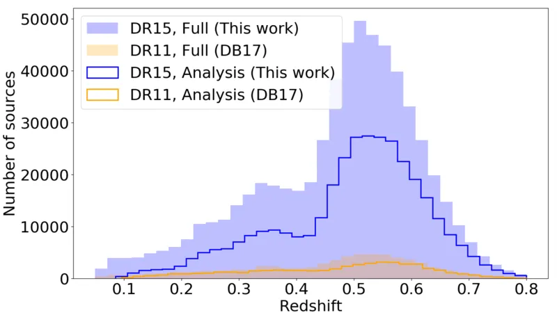

### 图说什么

比较 SDSS DR15 总样本（602,461 个源）和经过截断后的分析样本（343,647 个源）的红移分布，以及 DB17 中使用的 DR11/DR3 样本。DR15 分析样本的红移范围为 $0.08 < z < 0.8$，平均红移 $\langle z \rangle = 0.49$。 [原文]

### 怎么看

- **x 轴**：红移 $z$。
- **y 轴**：每个红移 bin 内的星系数量。
- DR15 样本（蓝色）比 DB17 样本大约 5 倍，这是信噪比提升的主要来源。
- 红移分布的峰值在 $z \approx 0.45$–$0.55$，对应 BOSS CMASS 样本的设计红移范围。 [补充]

### 需要的物理

- **发光红巨星系（LRG）**是质量大、颜色偏红的椭圆星系，它们是大质量暗物质晕的良好示踪物。BOSS 巡天专门针对它们进行光谱观测以获取精确红移。 [补充]
- 平均红移 $z \approx 0.5$ 意味着 2.1′ 的孔径半径对应约 0.8 Mpc 的物理尺度——大致是群/团暗物质晕的维里半径量级。 [原文]

---

## Figure 3 — 叠加子图

**文件**：`Figure3_DR5f150.webp` / `Figure3_DR5f090.webp` / `Figure3_DR4ILC.webp` | **对应章节**：§III | **关键公式**：Eq. 1–2

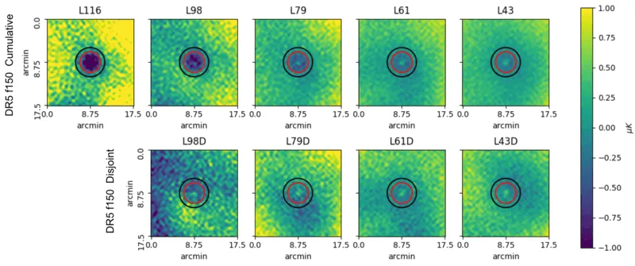

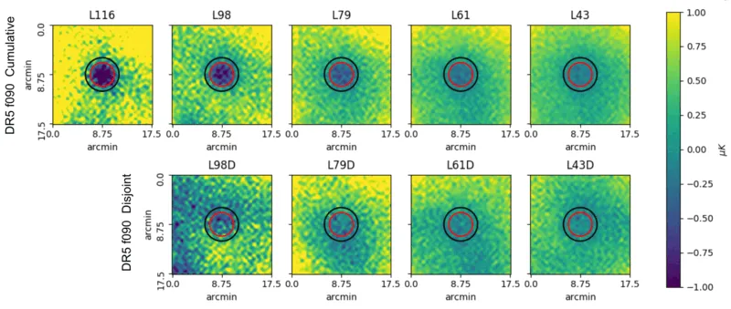

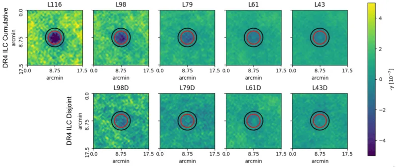

### 图说什么

三张地图（DR5 f150、DR5 f090、DR4 ILC）在 5 个累积 bin（上行）和 4 个独立 bin（下行）上的加权平均叠加子图。每张子图为 18′×18′，以星系位置为中心。红色圆圈标示 AP 圆盘半径 $R_1 = 2.1'$，黑色圆圈标示外环外径 $\sqrt{2} R_1$。子图已用环均值归一化（环内像素平均值为零）。 [原文]

### 怎么看

- **DR5 f150**（前两行）：中心清晰可见负信号（tSZ 在 150 GHz 产生温度下降），但也能看到亮斑——这是波束尺度上的尘埃辐射。L116（最高光度）bin 的亮斑反而最不明显。
- **DR5 f090**（中间两行）：tSZ 在 98 GHz 的信号更强（$|f_{\rm SZ}|$ 更大），中心的负信号更深。尘埃亮斑在 f090 中不明显——因为尘埃辐射在较低频率更弱。
- **DR4 ILC**（底部两行）：注意单位是负 $y$（取负以便与温度地图比较），中心信号为正值代表 tSZ 检测。ILC 已经通过多频率组合分离了 tSZ，尘埃的直接污染较小，但仍可在径向轮廓中看到微小影响。
- 从左到右光度递减，tSZ 信号也递弱——符合"更大质量晕→更热更多气体→更强 tSZ"的预期。 [原文]

### 需要的物理

- **tSZ 的频率依赖**：$f_{\rm SZ} = x(e^x+1)/(e^x-1) - 4$，其中 $x = h\nu / k_B T_{\rm CMB}$。在 150 GHz 处 $f_{\rm SZ} \approx -0.96$（负信号），98 GHz 处 $f_{\rm SZ} \approx -1.53$（更强的负信号），约 217 GHz 为零点。 [原文]
- **尘埃辐射的频率依赖**：修正黑体谱 $\propto \nu^{\beta+3}$，高频更强。因此 150 GHz 比 98 GHz 受尘埃污染更严重。 [补充]

---

## Figure 4 — 叠加子图的径向平均

**文件**：`Figure4.webp` | **对应章节**：§III | **关键公式**：无

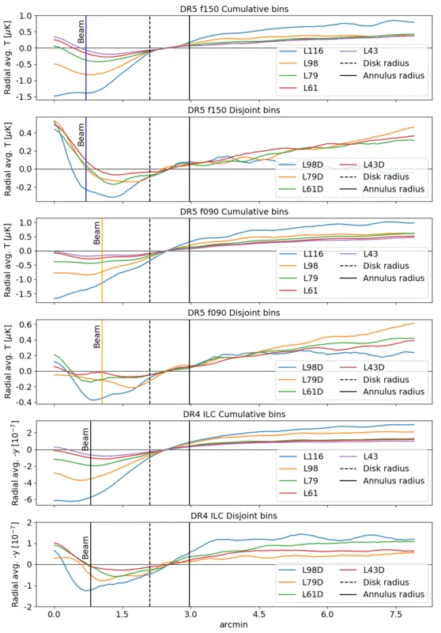

### 图说什么

将叠加子图重新像素化为 0.1′/pixel 后，沿径向方向取平均，得到从中心到外环的径向轮廓。三张地图（f150：蓝色，f090：橙色，ILC：黑色）分别画出。垂直虚线标示 AP 圆盘半径 2.1′，实线标示外环外径。三条竖线标示各地图的波束半径。 [原文]

### 怎么看

- tSZ 信号表现为从中心到外围的负值（或 ILC 中的正值），在约 2′ 处变平——说明 tSZ 信号集中在 2′ 以内。
- **关键特征**：在 f150 地图中，中心（$r < 1'$）出现明显的正向偏移（亮斑），在 L43、L61、L79 等 bin 中尤其明显。这来自源星系的尘埃辐射。在 f090 中这个亮斑消失了——确认其频率依赖性与尘埃一致。 [原文]
- 最高光度 bin（L116）的中心亮斑反而最小，可能因为高光度 LRG 是更老、更"passive"的椭圆星系，恒星形成率更低，尘埃更少。 [补充]

### 需要的物理

- **AP 信号 = 圆盘均值 − 环均值**：径向轮廓让我们看到信号的空间分布。如果 tSZ 信号完全在圆盘内，环提供的是纯背景估计。如果信号延伸到环内，AP 会低估真实 tSZ 信号。 [补充]
- 中心亮斑的角尺度与波束（1.3′ FWHM for f150）相当，说明尘埃源是空间上未分辨的——对应源星系本身而非周围结构。 [原文]

---

## Figure 5 — 尘埃校正效果

**文件**：`Figure5_rescaled.webp` | **对应章节**：§III.B, §III.C | **关键公式**：Eq. 3–4

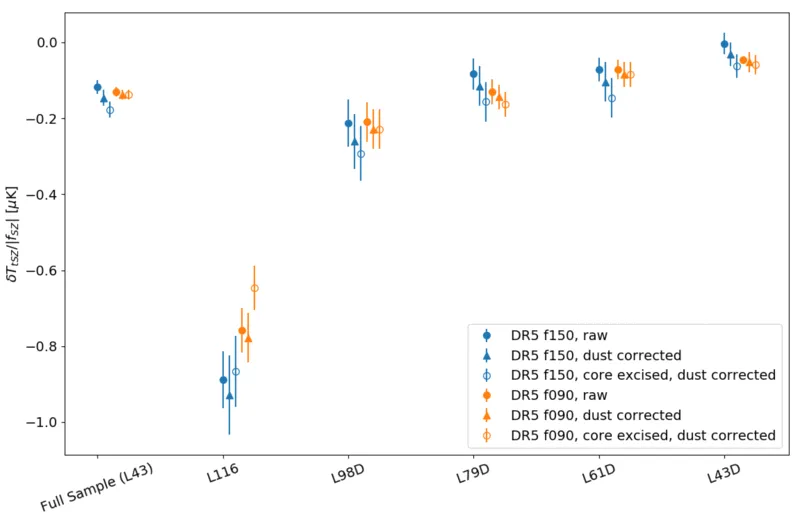

### 图说什么

对比了 f150 和 f090 地图中三种处理方式的 AP tSZ 温度信号（已乘以 $|f_{\rm SZ}|$ 以统一量纲）：原始 2.1′ AP（蓝色/橙色圆圈）、Herschel 尘埃校正后（三角形）、去核 AP（去除波束尺度中心盘后，方块）。误差条为 $1\sigma$ jackknife 估计。 [原文]

### 怎么看

- **Herschel 尘埃校正**（三角形 vs 圆圈）：对温度信号的影响很小（<$1\sigma$），因为尘埃贡献在 150 GHz 仅约 0.03–0.04 μK（Table III），远小于 tSZ 信号本身。但校正后不确定度略增（因为尘埃估计的误差被传播进来）。
- **去核 AP**（方块 vs 圆圈）：去掉中心波束范围内的像素后，L116 bin 的信号下降最明显——因为那里 tSZ 信号最集中但尘埃最少，去核丢失的主要是 tSZ 信号而非尘埃。对其他 bin 影响 <$1\sigma$。
- 最终分析采用 **Herschel 尘埃校正但不去核**的方案。 [原文]

### 需要的物理

- **修正黑体尘埃模型**（Eq. 4）：$I(\nu) = A_d [{\nu(1+z)}/{\nu_0}]^{\beta_d+3} \times [e^{h\nu_0/k_BT_d}-1]/[e^{h\nu(1+z)/k_BT_d}-1]$，其中 $\beta_d \approx 1.2$ 是尘埃光谱指数，$T_d \approx 21$–$30$ K 是尘埃温度。用 Herschel SPIRE 250/350/500 μm 数据拟合参数，然后外推到 150 和 98 GHz。 [原文]
- 尘埃辐射在 CMB 差分温度单位下需要一个 $[dB(\nu,T)/dT]^{-1}$ 因子来从强度单位转换。 [原文]

---

## Table II — 光度 bin 的属性

**对应章节**：§II.B | **关键公式**：无

### 表说什么

列出了每个光度 bin 的光度截断、等价晕质量截断、平均恒星质量、源数量 $N$、平均光度 $\langle L \rangle$、和平均红移 $\langle z \rangle$，分别对应 DR5（f150/f090）和 ILC 样本。标星号的 bin（L43、L61、L79 及其独立 bin）是与 C21 联合分析的 bin。 [原文]

### 怎么看

| Bin | $N$（DR5） | $\langle M_{\rm vir} \rangle$ cut / $10^{13} M_\odot$ | $\langle z \rangle$ |
|-----|-----------|-----------------------------------------------|-----|
| L43（全样本） | 343,647 | >0.52 | 0.49 |
| L79 | 103,159 | >1.66 | 0.53 |
| L116 | 23,504 | >3.70 | 0.58 |
| L43D（最低质量独立 bin） | 130,577 | 0.52–1.00 | 0.48 |
| L79D | 56,203 | 1.66–2.59 | 0.51 |

- 源数量从 L43 的 34 万递减到 L116 的 2.3 万——更高光度的源更稀少。
- 平均红移随光度略增（$0.48 \to 0.58$），因为 BOSS 选择函数在更高红移处偏好更亮的源。
- ILC 样本比 DR5 样本小（因 ILC 地图覆盖面积更小），但平均光度和红移一致。 [原文]

### 需要的物理

- **丰度匹配**（abundance matching）：将恒星质量-光度关系（$M_*/L = 3.0$，Chabrier IMF）和恒星质量-晕质量关系（Kravtsov 2014）结合，将光度映射到晕质量。这是一种统计方法，不是逐个星系的直接测量。 [原文]

---

## Figure 6 — Compton-$y$ 测量

**文件**：`Figure6.webp` | **对应章节**：§V.A | **关键公式**：Eq. 1

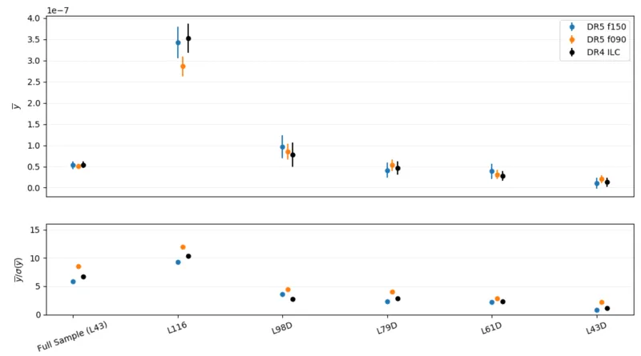

### 图说什么

上面板：三张地图在 5 个独立 bin + 全样本上的平均 Compton-$\bar{y}$（2.1′ 孔径内），包含尘埃和波束校正。下面板：对应的信噪比 $\bar{y}/\sigma(\bar{y})$。 [原文]

### 怎么看

- **上面板**：$\bar{y}$ 从 L43D 的约 $10^{-8}$ 级别增大到 L116 的约 $3.5 \times 10^{-7}$——光度（≈ 质量）越高，tSZ 信号越强。三张地图（f150 蓝色、f090 橙色、ILC 黑色）在所有 bin 上高度一致。
- **下面板**：信噪比从 L43D 的约 1$\sigma$ 增大到 L116 和全样本的 ~10$\sigma$。f090 的信噪比通常最高——因为 $|f_{\rm SZ}|$ 更大，tSZ 信号更强。
- 独立 bin 的信噪比低于累积 bin——因为源数量更少。 [原文]

### 需要的物理

- **Compton-$y$ 参数**是沿视线的电子热压力积分：$y = (\sigma_T / m_e c^2) \int n_e k_B T_e \, dl$。它同时依赖于气体密度和温度，因此高质量晕（更热、更密的 ICM）有更高的 $y$。 [补充]
- **波束校正**：f090 的波束（2.1′ FWHM）比 f150（1.3′）更大，更多信号被"抹平"到 AP 环中。校正因子为 1.3（31% 上调）。ILC 的波束（1.6′）需要乘以 0.95（5% 下调——因为 f150 波束有次级旁瓣）。 [原文]

---

## Table IV — 光学深度估计

**对应章节**：§V | **关键公式**：Eq. 3, 5

### 表说什么

汇总了三张地图在所有 bin 上的光学深度估计：理论预测 $\bar{\tau}_{\rm theory}$、tSZ 估计 $\bar{\tau}_{\rm tSZ}$（统计 + 系统误差）、tSZ 比例 $f_{c,{\rm tSZ}}$、以及 C21 的 kSZ 估计 $\bar{\tau}_{\rm kSZ}$ 和 $f_{c,{\rm kSZ}}$。 [原文]

### 怎么看

以 DR5 f150 为例（其他地图结论相似）：

| Bin | $\bar{\tau}_{\rm theory}$ | $\bar{\tau}_{\rm tSZ}$ | $f_{c,{\rm tSZ}}$ | $\bar{\tau}_{\rm kSZ}$ | $f_{c,{\rm kSZ}}$ |
|-----|---|---|---|---|---|
| L43（全样本） | $1.39 \times 10^{-4}$ | $1.28 \pm 0.10$ | 0.92 | $0.54 \pm 0.09$ | 0.39 |
| L43D | $0.70$ | $0.59 \pm 0.35$ | 0.85 | $0.46 \pm 0.24$ | 0.66 |
| L61D | $1.06$ | $1.10 \pm 0.25$ | 1.04 | $0.72 \pm 0.26$ | 0.68 |
| L79 | $2.42$ | $1.92 \pm 0.10$ | 0.79 | $0.88 \pm 0.18$ | 0.36 |

- tSZ 的 $f_c$ 在 0.72–1.04 之间——接近或达到理论预测。
- kSZ 的 $f_c$ 系统性偏低（0.33–0.68），但独立 bin 误差较大。
- L79 bin 中 tSZ 和 kSZ 的 $f_c$ 差异最大（$\sim$0.79 vs $\sim$0.36），是 2–3$\sigma$ 的不一致。 [原文]

### 需要的物理

- **理论 $\bar{\tau}$（Eq. 5）**：$\bar{\tau}_{\rm theory} = \sigma_T x_e X_H (1-f_\star) f_b M_{\rm vir}(<\theta_{2.1'}) / (d_A^2 m_p)$，假设晕内气体遵循 NFW 剖面。$f_b = \Omega_b/\Omega_M = 0.157$ 是宇宙重子比例，$f_\star$ 是恒星质量比例。 [原文]
- **系统误差**来自 $\bar{y}$-$\bar{\tau}$ 标度关系（Eq. 3）中 $\ln(\tau_0)$ 的 4% 和 $m$ 的 8% 不确定性，通过蒙特卡罗传播。 [原文]

---

## Figure 7 — 理论预测比例 $f_c$

**文件**：`Figure7.webp` | **对应章节**：§V.C | **关键公式**：Eq. 3, 5

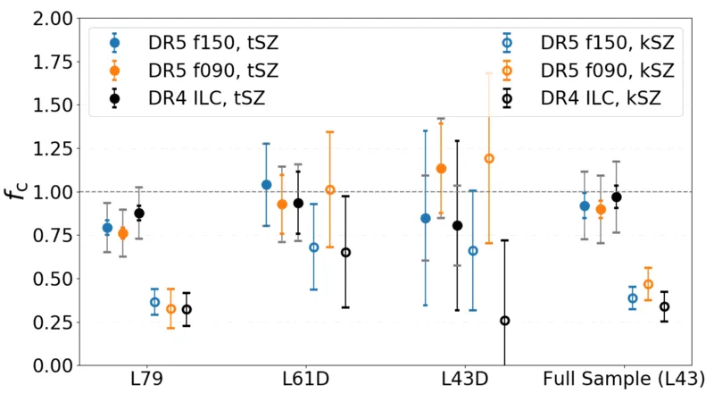

### 图说什么

全样本（L43）的三个独立子 bin 和全样本本身的 $f_c = \bar{\tau}_{\rm obs} / \bar{\tau}_{\rm theory}$：tSZ 估计（实心圆）和 kSZ 估计（空心圆），分别来自三张地图。灰色误差条标示 tSZ 的系统不确定性。 [原文]

### 怎么看

- **实心圆（tSZ）**：$f_c$ 在 0.7–1.0 之间，说明 tSZ 方法能"看到"大部分理论预测的重子。
- **空心圆（kSZ）**：$f_c$ 系统性低于 tSZ，在 0.3–0.7 之间。
- **关键差异**：L43D 和 L61D 两个 bin 中，tSZ 和 kSZ 在 $1\sigma$ 内一致（空心圆的误差条与实心圆重叠）。但在 L79 bin 中，kSZ 的 $f_c$ 明显更低——这驱动了全样本 L43 中的 2–3$\sigma$ 差异。 [原文]
- 三张地图的 tSZ 结果（蓝/橙/黑色实心圆）高度一致，验证了测量的稳健性。 [原文]

### 需要的物理

- $f_c < 1$ 意味着在 2.1′ 孔径内观测到的重子少于 NFW 预测——可能因为部分重子在晕外围或被 AGN 反馈推到更远处。 [补充]
- $f_c$ 不应被视为精确的重子比例测量，因为理论 $\bar{\tau}$ 依赖于光度-质量关系的不确定性，这些误差未被完整传播。$f_c$ 的主要价值在于 tSZ 与 kSZ 之间的相对比较。 [原文]

---

## Figure 8 — $\bar{\tau}_{\rm kSZ}$ vs $\bar{y}_{\rm tSZ}$ 与模拟标度关系

**文件**：`Figure8.webp` | **对应章节**：§V.C | **关键公式**：Eq. 3

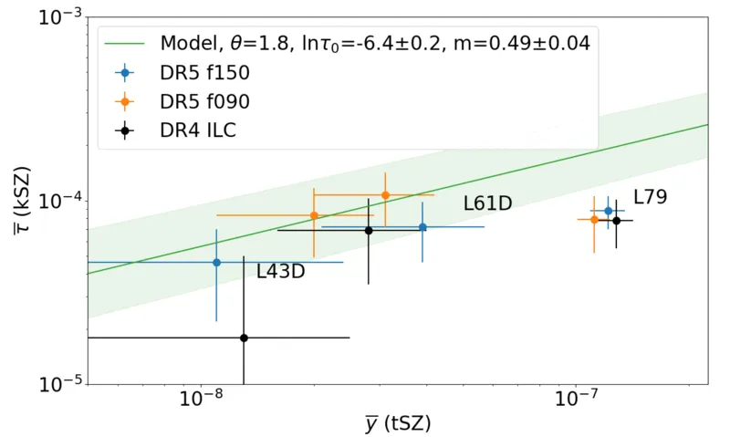

### 图说什么

将三个联合分析独立 bin 的 tSZ $\bar{y}$ 和 kSZ $\bar{\tau}$ 绘制在同一张 $\bar{y}$-$\bar{\tau}$ 图上，叠加 Battaglia（2017）流体动力学模拟的幂律标度关系（绿色实线，$1\sigma$ 阴影包络）。三张地图分别标出（蓝/橙/黑色）。 [原文]

### 怎么看

- **绿色模型线**：$\ln(\bar{\tau}) = -6.40 + 0.49 \ln(\bar{y}/10^{-5})$，来自 AGN 反馈模型模拟，孔径 $\Theta = 1.8'$（最接近本文 2.1′ 的可用标度关系）。
- **L43D 和 L61D**：数据点落在模型线及其 $1\sigma$ 阴影内——tSZ 和 kSZ 的独立路径与模拟一致。
- **L79**：kSZ 的 $\bar{\tau}$ 偏低，数据点落在模型线以下——这个 bin 的 kSZ 信号似乎给出了偏低的光学深度。
- 不同地图的数据点高度相关（因为共享了部分底层数据），不应视为完全独立。 [原文]

### 需要的物理

- 这张图直接展示了通向**经验 $\bar{y}$-$\bar{\tau}$ 关系**的路线：如果未来更多 bin 和更高信噪比的数据都落在一条一致的曲线上，就可以用观测直接标定这个关系，而不必依赖模拟。 [重述]
- L79 bin 偏离模型线，可能因为 kSZ 拟合中固定的宇宙学参数（如 $\sigma_8$、晕质量输入）不够准确，或者该质量范围内的晕物理（如 AGN 反馈强度）与模拟假设不同。 [重述]

---

## Figure 9 (Appendix B) — 光度分 bin 直方图

**文件**：`Figure_AppendixB.webp` | **对应章节**：Appendix B | **关键公式**：无

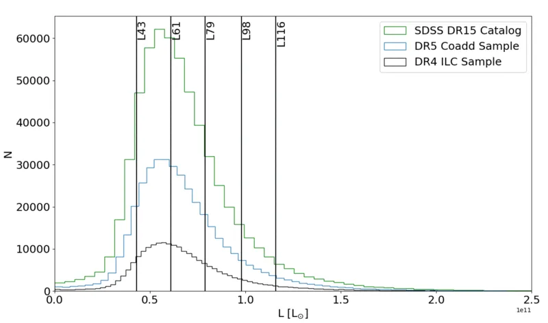

### 图说什么

SDSS DR15 的光度分布直方图，叠加了 5 条光度截断线。绿色为全样本（602k），蓝色为 DR5 分析样本（343k），黑色为 ILC 样本（190k）。 [原文]

### 怎么看

- 光度分布从 $4.3 \times 10^{10} L_\odot$ 开始（最低截断），在 $\sim 6 \times 10^{10} L_\odot$ 附近达到峰值，然后快速下降。
- 底部三条截断（L43、L61、L79）被设计为每个独立 bin 包含约 10 万个源——确保 kSZ 配对动量估计有足够信噪比。
- 顶部两条截断（L98、L116）仅用于 tSZ 分析——这些高光度 bin 中源太少无法有效做 kSZ，但 tSZ 叠加信号足够强。 [原文]

### 需要的物理

- bin 的设计体现了 tSZ 和 kSZ 对源数量的不同需求：tSZ 叠加的信噪比 $\propto \bar{y}\sqrt{N}$，源越多或信号越强都有利；kSZ 的配对动量估计器需要足够的源对（pairs），源太少会导致协方差矩阵不稳定。 [补充]

---

## 图间逻辑链

```
Fig 1（天区覆盖 + 噪声截断）
  ↓  选出 343,647 个源
Fig 2（红移分布：确认样本量比 DB17 提升 5 倍）
  ↓  按光度分 bin
Fig 9（光度分布 + bin 设计）
  ↓  切子图、叠加
Fig 3（叠加子图：直接可视化 tSZ 信号 + 尘埃亮斑）
  ↓  径向轮廓
Fig 4（径向平均：确认尘埃在 f150 中心、f090 无影响）
  ↓  尘埃校正 + 去核 AP 比较
Fig 5（尘埃校正效果：<1σ 影响，确认方案）
  ↓  提取 ȳ
Fig 6（Compton-y 测量：三地图一致，最高 12σ）
  ↓  ȳ → τ̄（模拟标度关系） + kSZ τ̄（C21）
Table IV（光学深度汇总 + fc 计算）
  ↓  tSZ vs kSZ vs theory 对比
Fig 7（fc 条形图：2/3 bin 一致，L79 bin 不一致）
  ↓  ȳ-τ̄ 关系检验
Fig 8（kSZ τ̄ vs tSZ ȳ 与模拟曲线：2/3 bin 在模型线上）
```

**全局结论**：ACT+Planck 的 tSZ 叠加测量在三张独立地图上一致地检测到高信噪比信号；tSZ 和 kSZ 在低质量 bin 中给出一致的光学深度估计，但在最高质量 bin 中存在 2–3$\sigma$ 张力。观测到的重子含量占理论预测的 1/3 到全部——与失踪重子存在于晕外围的图景一致。
