# 图表版：Rapid and Late Cosmic Reionization Driven by Massive Galaxies

- **论文**: Sims, Bevins, Fialkov et al. (2025)
- **arXiv**: 2504.09725
- **写作日期**: 2026-03-16

---

> **阅读指南**：本文档是论文的"图表版"完整解说——只看本文即可理解论文的核心逻辑与全部定量结果。
> 每张图按"前因 → 图说什么 → 怎么看 → 物理/公式 → 后果"五步展开。
> 选取了最核心的 **10 张图/表**，其余在末尾简要提及。

---

## 全局物理速查

| 符号 | 含义 | 备注 |
|------|------|------|
| $V_c$ | 暗物质晕最小圆速度 | $V_c$ 越大 → 只有大晕能形成星系 |
| $M_\mathrm{min}$ | 最小晕质量 | $M_\mathrm{min} \propto V_c^3 (1+z)^{-3/2}$ |
| $f_*$ | 恒星形成效率 (SFE) | 原子冷却晕中取常数 |
| $f_X$ | X 射线产生效率 | 控制 IGM 加热快慢 |
| $f_\mathrm{radio}$ | 射电辐射产生效率 | 影响 21-cm 背景温度 |
| $\tau_\mathrm{CMB}$ | CMB 光学深度 | $\tau = \sigma_T \int (1-x_\mathrm{HI})\, n_e\, \mathrm{d}l$ |
| $x_\mathrm{HI}(z)$ | IGM 中性氢体积平均比例 | 0 = 完全电离，1 = 完全中性 |
| $\Delta z_\mathrm{re}$ | 再电离持续时间 | $z(x_\mathrm{HI}=0.75) - z(x_\mathrm{HI}=0.25)$ |
| $z_{50}$ | 再电离中点 | $x_\mathrm{HI}(z_{50}) = 0.5$ |
| $D_\mathrm{KL}$ | KL 散度 | 后验相对先验的信息增益 (nat) |

---

## Table 1: 数据集汇总

### 前因
联合分析需要明确"手里有什么牌"——三类观测分别约束什么。

### 表说什么
论文将输入数据分为三大类：

| 数据类型 | 代表实验 | 约束物理量 | 似然模型 |
|---------|---------|-----------|---------|
| 21-cm 功率谱上限 | HERA + LOFAR + MWA (B24) | $\Delta^2_{21}(k,z)$ | 神经密度估计器 (NDE) |
| Lyman 线约束 | 暗像素分数、LAE ACF、QSO 阻尼翼、Ly$\alpha$ EW | $x_\mathrm{HI}(z)$ 在 $z \approx 5.6$–$7.9$ | CUL / Spline PDF |
| CMB 功率谱 | Planck $\tau_\mathrm{CMB}$、SPT patchy kSZ $\Delta z_\mathrm{re}$ | $\tau_\mathrm{CMB}$、$\Delta z_\mathrm{re}$ | NDE / Spline PDF |

### 怎么看
注意三类数据的**红移覆盖范围**和**约束的参数方向**完全不同——这是联合分析之所以有效的根基。

### 需要理解的物理/公式
- CUL（Contaminated Upper Limit）似然：暗像素分数和 LAE 聚集度测量只给出 $x_\mathrm{HI}$ 的上限，因为存在与中性 IGM 无关的"污染"成分 $\epsilon$；CUL 似然通过对 $\epsilon$ 边缘化来正确处理此问题。
- NDE：神经密度估计器把完整半数值模拟（21cmSPACE）的后验压缩成毫秒级可调用的函数，使高维采样可行。

### 后果
Table 1 定义了后续所有图的"输入端"。

---

## Table 2: 参数先验

### 前因
贝叶斯分析的第一步是定义先验。

### 表说什么

| 参数 | 先验 | 范围 |
|------|------|------|
| $V_c$ | $\log U(4.2,\,100)$ km/s | 分子冷却→大晕 |
| $f_*$ | $\log U(0.001,\,0.5)$ | |
| $f_X$ | $\log U(10^{-4},\,10^3)$ | |
| $\tau_\mathrm{CMB}$ | $U(0.04,\,0.10)$ | 线性均匀 |
| $f_\mathrm{radio}$ | $\log U(1,\,99500)$ | |
| $R_\mathrm{MFP}$ | 固定 40 Mpc | 不采样 |

### 需要理解的物理/公式
$V_c$ 的下端 4.2 km/s 对应分子冷却阈值（$M_\mathrm{min} \sim 10^6\,M_\odot$），上端 100 km/s 对应 $\sim 2\times10^{10}\,M_\odot$；16.5 km/s 是原子冷却阈值（$\sim 8\times10^7\,M_\odot$）。先验极宽，反映了在数据约束之前的巨大理论不确定性。

### 后果
先验的宽度直接影响后续 KL 散度和先验体积一致性的解读——先验越宽，相同后验的信息增益越大。

---

## Fig 2: 参数灵敏度图

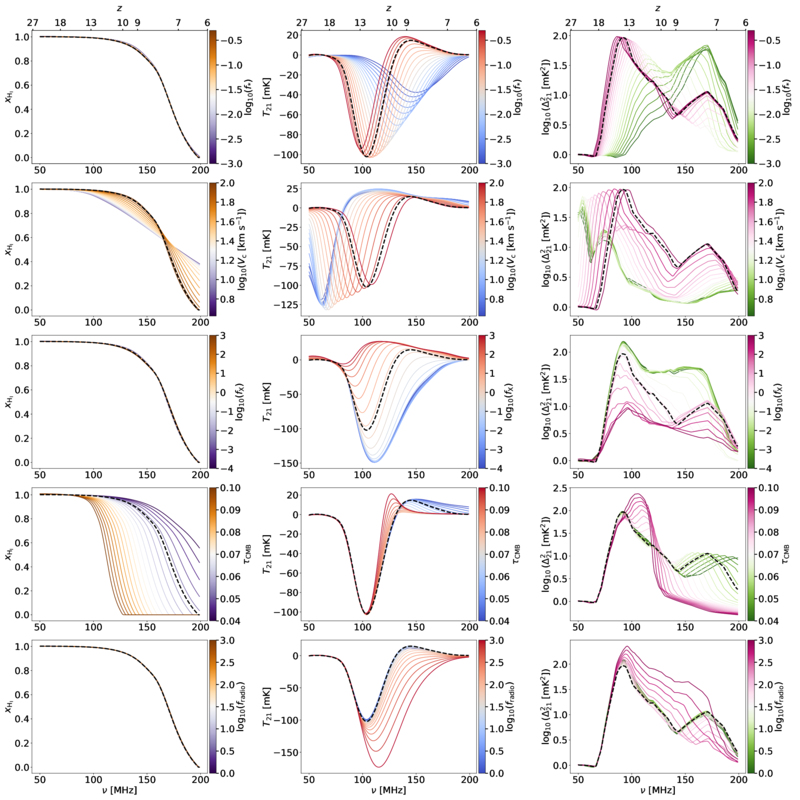

### 前因
在做联合分析之前，需要理解每个参数"怎样影响可观测量"。Fig 2 是模型的"说明书"。

### 图说什么
5 行 3 列。**行**对应 5 个参数（$V_c$, $f_*$, $f_X$, $\tau_\mathrm{CMB}$, $f_\mathrm{radio}$），**列**对应 3 个可观测量：
- 左列：中性氢分数 $x_\mathrm{HI}(z)$
- 中列：全天 21-cm 信号 $T_{21}(z)$
- 右列：21-cm 功率谱 $\Delta^2_{21}(k=0.1\,h\,\mathrm{Mpc}^{-1},\,z)$

每个面板中，将一个参数在先验范围内取 20 个等间距值（其余固定为基准值），画出对应的曲线簇。

### 怎么看
1. **$V_c$（第 1 行）**：增大 $V_c$ → $x_\mathrm{HI}(z)$ 曲线向低 $z$ 平移且变陡 → 再电离变晚、变快。同时 $T_{21}$ 吸收谷移向低 $z$，功率谱峰值也移向低 $z$。
2. **$f_*$（第 2 行）**：改变 $f_*$ 主要平移 $x_\mathrm{HI}(z)$ 的位置，但效果与 $V_c$ 近似简并（$f_*$ 大 ↔ $V_c$ 大，二者共同决定电离光子总产生率）。
3. **$f_X$（第 3 行）**：几乎不影响 $x_\mathrm{HI}(z)$，但强烈影响 $T_{21}$ 振幅——$f_X$ 越大 → IGM 被 X 射线加热越快 → 吸收谷越浅。
4. **$\tau_\mathrm{CMB}$（第 4 行）**：通过调节 $f_\mathrm{esc}$（隐含参数），移动 $x_\mathrm{HI}(z)$ 曲线位置。
5. **$f_\mathrm{radio}$（第 5 行）**：几乎不影响 $x_\mathrm{HI}$，但大幅放大 $T_{21}$ 和功率谱振幅。

### 需要理解的物理/公式
21-cm 差分亮温度 $\delta T_b \propto x_\mathrm{HI}(1 - T_\mathrm{CMB}/T_S)$。$f_X$ 控制自旋温度 $T_S$ 是否与气体动力学温度耦合并被加热，$f_\mathrm{radio}$ 控制背景辐射温度——两者共同决定 $T_S$ 与背景温度之差。

### 后果
灵敏度图预示了后续 KL 散度分析的基本格局：Lyman 线数据（约束 $x_\mathrm{HI}$）主要约束 $V_c$ 和 $\tau_\mathrm{CMB}$；21-cm 上限（约束 $T_{21}$ 和 $\Delta^2_{21}$ 振幅）主要约束 $f_X$ 和 $f_\mathrm{radio}$；$f_*$ 因与 $V_c$ 简并而难以独立约束。

---

## Fig 3: 信息三角图——KL 散度分析（4 个子面板）

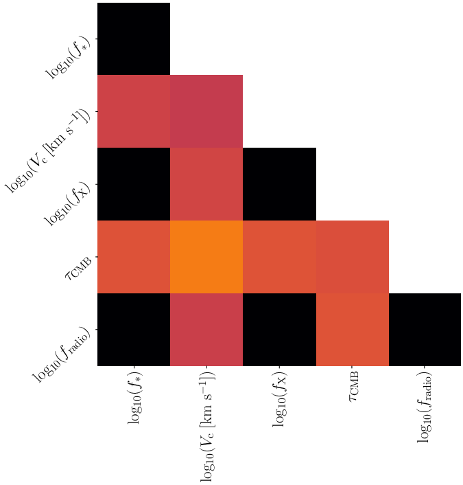
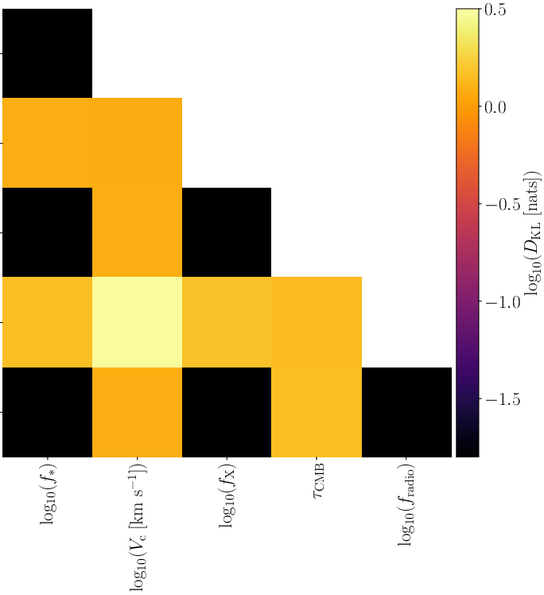
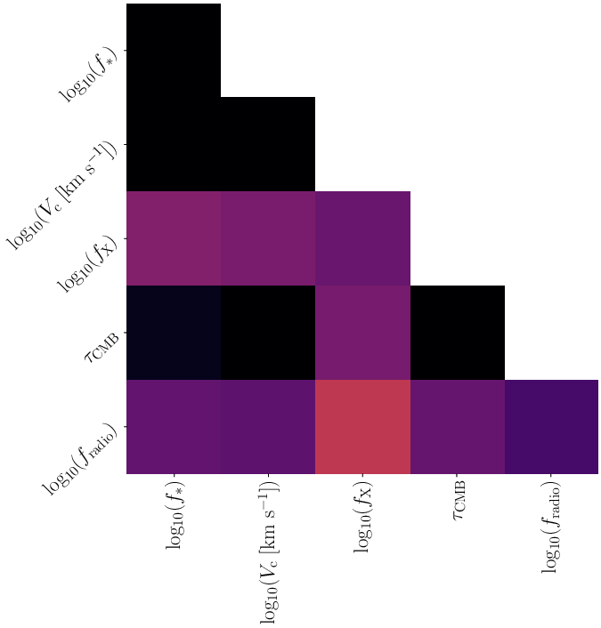
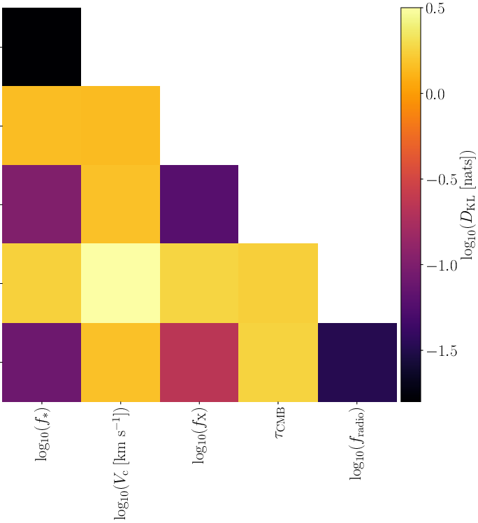

### 前因
Fig 2 展示了定性灵敏度。Fig 3 用信息论工具定量回答：**每种数据到底给了多少信息、给在了哪些参数上？**

### 图说什么
四个 5×5 三角图，分别对应 **(a) CMB**、**(b) Lyman 线**、**(c) 21-cm**、**(d) 联合分析**。对角线上是 1D 边缘 KL 散度，非对角线是 2D 联合 KL 散度。色标从黑色（$D_\mathrm{KL} = 0$，无信息）到亮色（高信息增益）。

### 怎么看
- **(b) Lyman 线**信息含量最高：$V_c$-$\tau_\mathrm{CMB}$ 平面上达数个 nat。
- **(a) CMB** 次之：主要信息在 $\tau_\mathrm{CMB}$ 和（通过 $\Delta z_\mathrm{re}$）$V_c$ 上，约 0.1–0.3 nat。
- **(c) 21-cm** 上限最少：主要信息在 $f_X$-$f_\mathrm{radio}$ 平面上，约 0.1 nat。
- **(d) 联合**：所有面板同时"亮起"，说明三类数据互补而非冗余。
- **$f_*$** 在所有面板中都近乎黑色——现有数据完全不约束 $f_*$。

### 需要理解的物理/公式
$$D_\mathrm{KL}(\boldsymbol{\theta} | \mathbf{D}) = \int P(\boldsymbol{\theta}|\mathbf{D}) \ln \frac{P(\boldsymbol{\theta}|\mathbf{D})}{\pi(\boldsymbol{\theta})} \, \mathrm{d}\boldsymbol{\theta}$$
$D_\mathrm{KL}=0$ 表示后验与先验完全一样（数据无信息量）。数值越大，数据提供的约束越强。单位是 nat（自然对数下的信息比特）。

### 后果
Fig 3 为后续所有约束图提供了"预期"：我们知道 Lyman 线将主导 $V_c$ 和 $\tau_\mathrm{CMB}$ 的约束，21-cm 主导 $f_X$ 和 $f_\mathrm{radio}$，$f_*$ 不受约束。

---

## Fig 5: 先验体积一致性

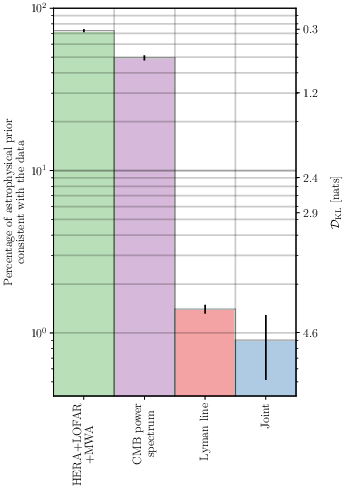

### 前因
Fig 3 展示了分参数的 KL 散度。Fig 5 将信息压缩成一个单一数字：5 维参数空间中，有百分之几的先验体积与数据一致？

### 图说什么
柱状图，横轴为数据集（21-cm、CMB、Lyman、Joint），纵轴为先验体积一致百分比 $100 f_c$。右侧副轴标注对应的 5D KL 散度值。

### 怎么看
| 数据集 | 先验一致比例 |
|--------|------------|
| 21-cm 上限 | $72.8 \pm 1.6\%$ |
| CMB | $49.5 \pm 1.7\%$ |
| Lyman 线 | $1.4 \pm 0.1\%$ |
| **联合** | **$0.9 \pm 0.4\%$** |

柱越短 → 约束越强。联合分析将 5D 先验体积压缩到不足 1%——比任何单一数据集都强。

### 需要理解的物理/公式
先验体积一致百分比 $f_c \approx e^{-D_\mathrm{KL}}$，其中 $D_\mathrm{KL}$ 是 5D 先验和后验之间的 KL 散度。这个近似在后验近似高斯时较精确。

### 后果
0.9% 意味着整个先验参数空间中仅有极小的一个角落与所有数据同时一致——论文能给出的参数约束之所以紧，正因为此。

---

## Fig 4: $V_c$-$\tau_\mathrm{CMB}$ 2D 后验

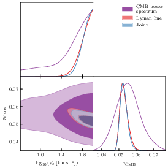

### 前因
Fig 3 告诉我们 Lyman 线和 CMB 都约束 $V_c$-$\tau_\mathrm{CMB}$ 平面。Fig 4 直接叠加展示三种分析的后验，检验数据一致性。

### 图说什么
$\log_{10}(V_c)$-$\tau_\mathrm{CMB}$ 平面上的 1D/2D 后验。三种颜色：
- **紫色**：CMB-only（Planck $\tau$ + SPT $\Delta z_\mathrm{re}$）
- **红色**：Lyman-only
- **蓝色**：Full Joint

### 怎么看
1. **一致性**：红色和紫色等高线大面积重叠 → 两类独立数据指向同一个参数区域，结论可靠。
2. **Lyman 线远比 CMB 精确**：红色等高线面积远小于紫色，与 Fig 3 的 KL 散度分析一致。
3. **$V_c$ 下限**：蓝色联合后验在 $\log_{10}(V_c) \gtrsim 1.7$（即 $V_c \gtrsim 50$ km/s）处集中。
4. **$\tau_\mathrm{CMB}$**：联合后验集中在 $\tau \approx 0.052$，比 Planck 单独给出的 $0.054 \pm 0.007$ 精确得多。

### 需要理解的物理/公式
CMB-only 为何也约束 $V_c$：SPT 的 patchy kSZ 效应约束了 $\Delta z_\mathrm{re}$。较大的 $V_c$ → 再电离更短 → $\Delta z_\mathrm{re}$ 更小；加上 Planck $\tau$ 的约束，大 $V_c$ + 适中 $\tau$ 的组合被偏好。

### 后果
Fig 4 是"大星系驱动再电离"结论的第一个直接证据图。三种独立数据集不约而同地指向大 $V_c$ → 过渡到 Fig 6 的完整 5 参数后验。

---

## Fig 6: 联合分析完整 5 参数后验三角图

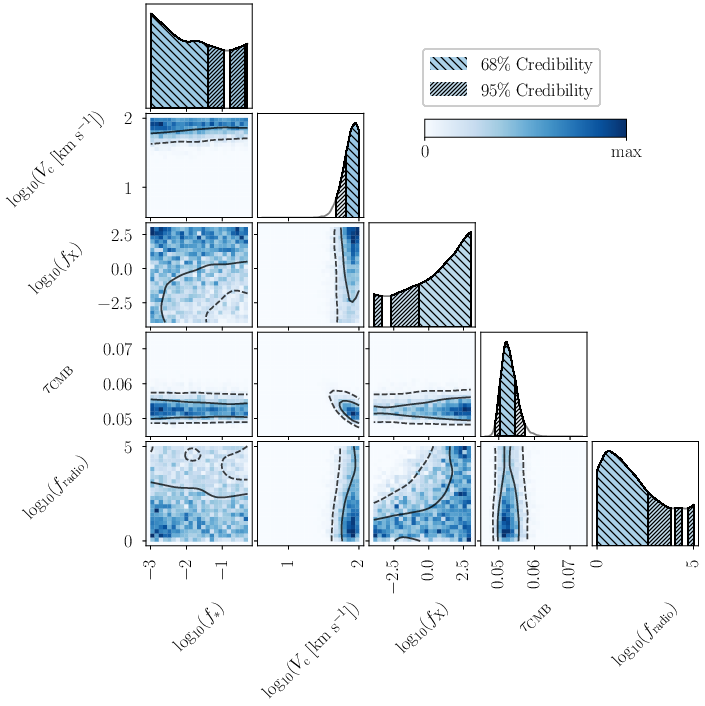

### 前因
前面的分析分别展示了信息结构和两参数切面。Fig 6 是全文的**核心结果图**——5 个参数的完整联合后验。

### 图说什么
5×5 三角图。对角线：5 个参数的 1D 边缘后验。非对角线：10 个 2D 联合后验。蓝色色标表示峰值归一化概率密度。实线/虚线等高线分别包含 68%/95% 概率。阴影区域（1D）分别为 68%（密斜线）和 95%（疏斜线）。

### 怎么看
逐参数解读：

1. **$\log_{10}(V_c)$**：后验堆积在先验上边界附近，$> 1.7$（即 $> 50$ km/s）在 95% 可信水平。大量小 $V_c$ 模型被排除。
2. **$\log_{10}(f_*)$**：后验几乎与先验一致——**完全不受约束**。
3. **$\log_{10}(f_X)$**：后验偏向较大值，$> -0.5$ 在 68% CL。排除了"极冷 IGM"模型。
4. **$\tau_\mathrm{CMB}$**：精确约束 $0.052^{+0.0016}_{-0.0018}$，是 Planck 单独约束 ($\pm 0.007$) 精度的约 4 倍改进。
5. **$\log_{10}(f_\mathrm{radio})$**：$< 2.6$ 在 68% CL，排除极强射电背景。

关键 2D 简并：
- $V_c$-$\tau_\mathrm{CMB}$：负相关——$V_c$ 越大（晚再电离），需要 $\tau$ 越小以匹配观测。
- $f_X$-$f_\mathrm{radio}$：排除左上角（低 $f_X$ + 高 $f_\mathrm{radio}$），因为那会产生过强的 21-cm 信号，超过上限。

### 需要理解的物理/公式
$$M_\mathrm{min} = \frac{4\pi}{3}\rho_\mathrm{crit}\Omega_m \left(\frac{V_c}{H(z) \cdot r_\mathrm{vir}/a}\right)^3 \propto V_c^3\,(1+z)^{-3/2}$$
$V_c \gtrsim 50$ km/s → $M_\mathrm{min} \gtrsim 2.6 \times 10^9\,M_\odot\,\big((1+z)/10\big)^{-3/2}$。这远超原子冷却阈值 ($16.5$ km/s, $\sim 10^8\,M_\odot$)，意味着再电离由大质量星系主导。

### 后果
Fig 6 直接支撑论文标题中的 "Massive Galaxies" 和后续对再电离历史、21-cm 信号的全部预测。

---

## Table 3: 参数约束汇总

### 前因
Fig 6–7 给出了图形化的后验。Table 3 将关键数字提炼为一张表，方便引用和比较。

### 表说什么

| 分析类型 | 参数 | 约束值 | 68% CL | 95% CL |
|---------|------|--------|--------|--------|
| CMB-only | $\log_{10}V_c$ | 下限 | $> 1.5$ | $> 0.8$ |
| | $\tau$ | $0.056^{+0.0055}_{-0.0076}$ | — | — |
| | $\Delta z_\mathrm{re}$ | 上限 | $< 2.5$ | $< 4.0$ |
| Lyman-only | $\log_{10}V_c$ | 下限 | $> 1.8$ | $> 1.7$ |
| | $\tau$ | $0.052^{+0.0016}_{-0.0018}$ | — | — |
| | $\Delta z_\mathrm{re}$ | 上限 | $< 1.4$ | $< 1.8$ |
| 21-cm-only | $\log_{10}f_X$ | 下限 | $> -0.5$ | $> -3.3$ |
| | $\log_{10}f_\mathrm{radio}$ | 上限 | $< 2.6$ | $< 4.6$ |
| **Full Joint** | $\log_{10}V_c$ | 下限 | $> 1.8$ | $> 1.7$ |
| | $\log_{10}f_X$ | 下限 | $> -0.5$ | $> -3.3$ |
| | $\tau$ | $0.052^{+0.0016}_{-0.0018}$ | — | — |
| | $\log_{10}f_\mathrm{radio}$ | 上限 | $< 2.6$ | $< 4.5$ |
| | $\Delta z_\mathrm{re}$ | 上限 | $< 1.4$ | $< 1.8$ |

### 怎么看
- 联合分析的 $V_c$ 和 $\tau$ 约束几乎与 Lyman-only 一致 → Lyman 线数据主导这两个参数。
- $f_X$、$f_\mathrm{radio}$ 仅有 21-cm 上限能约束。
- $f_*$ 未列入表中——因为完全不受约束。

### 后果
Table 3 是所有数值结论的"一站式参考"。

---

## Fig 8: $x_\mathrm{HI}(z)$ 先验/后验概率密度（3 个子面板）

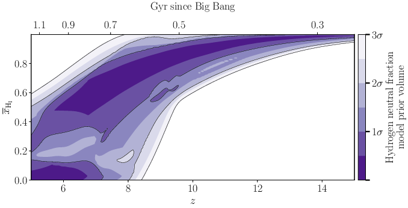
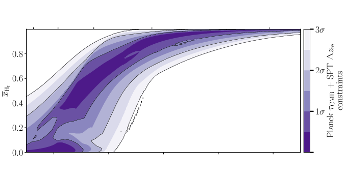
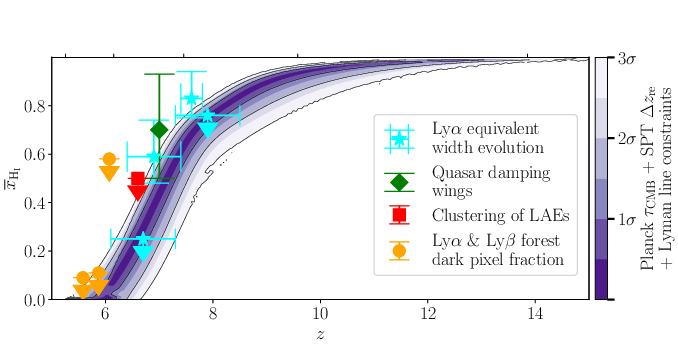

### 前因
前面约束了参数空间。Fig 8 将参数约束**翻译成物理可观测量**——再电离历史 $x_\mathrm{HI}(z)$。

### 图说什么
三个面板共享横轴 $z$（红移）和纵轴 $x_\mathrm{HI}$（0–1）。色标表示概率密度（归一化后的频率）。

- **(a) 先验**：$x_\mathrm{HI}(z)$ 允许极宽范围——再电离中点从 $z\sim5$ 到 $z\sim10$ 都有可能。
- **(b) CMB 后验**：Planck $\tau$ + SPT $\Delta z_\mathrm{re}$ 适度收紧了 $x_\mathrm{HI}(z)$ 的概率带，排除了极早再电离。
- **(c) 联合后验（叠加 Lyman 线数据点）**：后验急剧收窄为一条"S 形"窄带——$z \sim 8$ 时 $x_\mathrm{HI} > 0.75$（95% CL），$z \sim 6.2$ 时 $x_\mathrm{HI} < 0.25$（95% CL）。叠加的 Lyman 线数据点（不同颜色对应不同测量技术）全部落在窄带内。

### 怎么看
重点关注面板 **(c)**：
- **S 形曲线的陡峭程度**直接反映再电离之"快"——从 75% 中性到 25% 中性仅经历 $\Delta z < 1.8$，对应约 2 亿年。
- 数据点与模型后验的一致性表明模型成功拟合了所有 Lyman 线约束。
- 21-cm 上限对 $x_\mathrm{HI}(z)$ 几乎没有约束力（后验与先验不可区分），因此未画入。

### 需要理解的物理/公式
$$\tau_\mathrm{CMB} = \sigma_T \int_0^{z_\mathrm{CMB}} \frac{(1 - x_\mathrm{HI})\,n_e(z)\,c}{H(z)(1+z)} \,\mathrm{d}z$$
$x_\mathrm{HI}(z)$ 曲线越陡、中点越晚 → $\tau$ 越小。联合后验给出的 $\tau = 0.052$ 恰好与这条窄 S 形自洽。

### 后果
Fig 8 是论文标题中 "Rapid and Late" 的直接图形化证据。它为 Fig 9（$z_{50}$ 后验）和 Fig 10（21-cm 信号预测）奠定了基础。

---

## Fig 9: 再电离中点 $z_{50}$ 后验

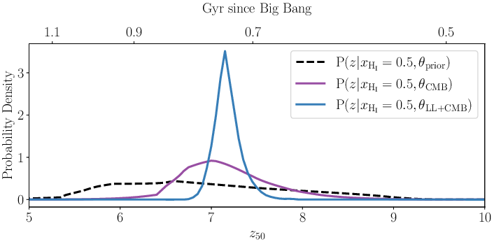

### 前因
Fig 8 展示了 $x_\mathrm{HI}(z)$ 的 2D 概率密度。Fig 9 将其压缩为单一标量——再电离中点 $z_{50}$（定义为 $x_\mathrm{HI}(z_{50}) = 0.5$ 的红移）。

### 图说什么
1D PDF，横轴为 $z_{50}$，纵轴为概率密度。三条曲线：
- **黑色虚线**：先验 → 宽分布，$z_{50} = 6.81^{+1.13}_{-0.86}$
- **紫色**：CMB-only 后验 → 适度收窄，$z_{50} = 7.11^{+0.54}_{-0.40}$
- **蓝色**：联合后验 → 尖锐峰，$z_{50} = 7.16^{+0.15}_{-0.12}$

### 怎么看
1. 先验到联合后验，$z_{50}$ 的不确定性从 $\sim \pm 1$ 收缩到 $\sim \pm 0.15$——约 7 倍改进。
2. 联合后验的峰值比先验略向高 $z$ 偏移（从 6.81 到 7.16），说明数据偏好较晚的再电离中点。
3. $z_{50} \approx 7.2$ 对应宇宙年龄约 7.5 亿年——再电离的"半程"发生在大爆炸后不到 8 亿年。

### 需要理解的物理/公式
$z_{50}$ 是 $x_\mathrm{HI}(z)$ 曲线与 $x_\mathrm{HI}=0.5$ 水平线的交点。它由 $V_c$ 和 $\tau_\mathrm{CMB}$ 共同决定——$V_c$ 越大 → 恒星形成推迟 → $z_{50}$ 移向低 $z$；$\tau$ 越大 → 更多早期自由电子 → $z_{50}$ 移向高 $z$。两者的平衡决定了 $z_{50} \approx 7.2$。

### 后果
$z_{50} = 7.16^{+0.15}_{-0.12}$ 是论文最精确的定量结论之一，可直接与未来 JWST、SKA 观测对比。

---

## Fig 10: 21-cm 信号先验/后验概率密度（8 个子面板）

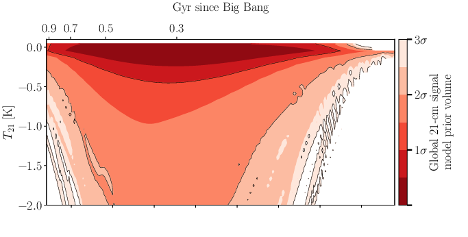
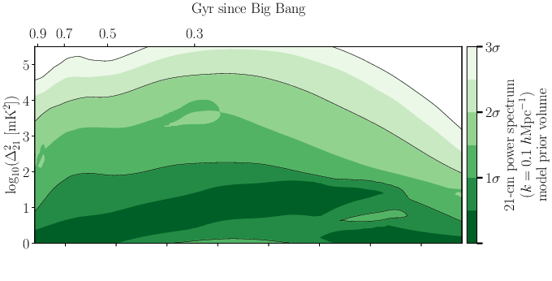
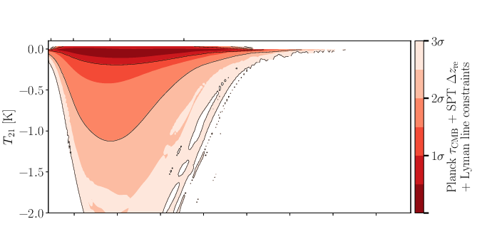
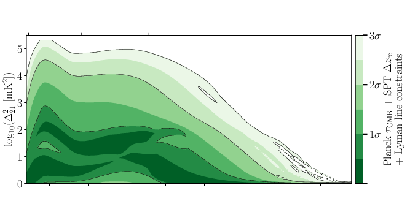
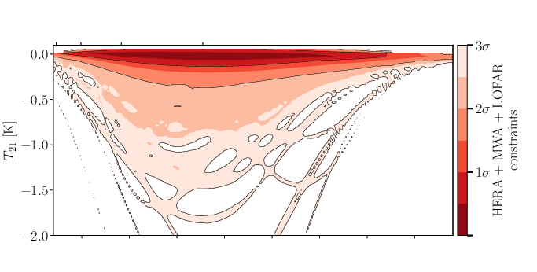
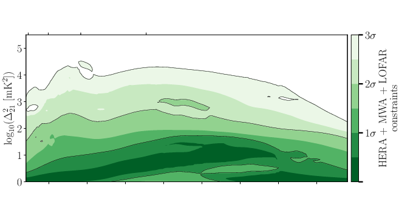
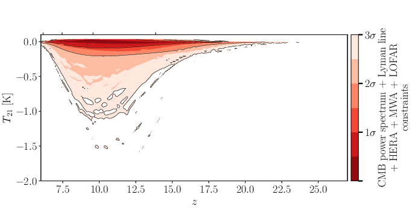
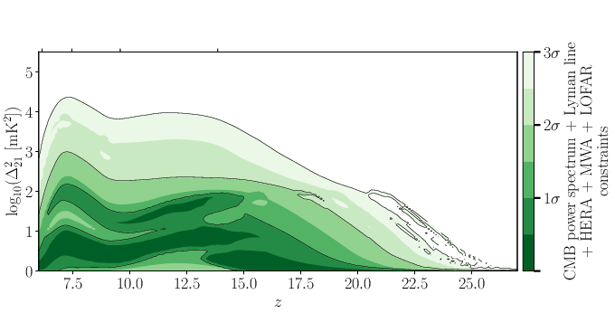

### 前因
参数约束最终的"应用"之一是预测 21-cm 信号——这是连接当前分析与未来实验（HERA Phase II, SKA）的桥梁。

### 图说什么
左列：全天 21-cm 信号 $T_{21}(z)$。右列：21-cm 功率谱 $\Delta^2_{21}(k=0.1\,h\,\mathrm{Mpc}^{-1},z)$。
四行分别对应：
1. **先验**
2. **CMB + Lyman 线后验**
3. **21-cm 上限后验**
4. **联合后验**

色标表示概率密度。

### 怎么看
**左列（全天 $T_{21}$）**：
- 先验 → 吸收谷峰值在 $z \approx 13$，深度可达 ~2 K。
- CMB+Lyman 后验 → 峰值移到 $z \approx 10$，深度上限 ~1 K。物理原因：大 $V_c$ 推迟恒星形成 → Ly$\alpha$ 耦合和 X 射线加热都推迟。
- 21-cm 后验 → 峰值位置不变（21-cm 上限不约束 $V_c$），但振幅被压缩（排除了极冷+极强射电的模型）。
- **联合 → 峰值移到 $z \approx 11$，深度 $< 0.18$ K（95% CL）**。

**右列（功率谱 $\Delta^2_{21}$）**：
- 先验 → 峰值在 $z \approx 16$。
- 联合 → 峰值移到 $z \approx 7$，振幅上限 $\sim 10^{2.8}$ mK$^2$。
- HERA 最新上限（$\sim 3.5 \times 10^3$ mK$^2$ at $z=7.9$）距离后验预测的 68% 上限约**一个数量级**——下一代实验有望探测。

### 需要理解的物理/公式
- $T_{21}$ 的深度由 $T_S$ 与 $T_\mathrm{rad}$ 之差决定：$f_X$ 加热 IGM → $T_S$ 升高 → 吸收浅；$f_\mathrm{radio}$ 增加射电背景 → $T_\mathrm{rad}$ 升高 → 吸收深。21-cm 上限排除低 $f_X$ + 高 $f_\mathrm{radio}$。
- 功率谱峰值在再电离中点附近最大——此时电离泡与中性区的空间对比度最强。联合后验将 $z_{50}$ 锁定在 ~7 → 功率谱峰也在 ~7。

### 后果
- 在 $z = 17.2$（EDGES 声称的信号位置），联合后验给出 $A < 62$ mK（95% CL），与 SARAS 3 排除 EDGES 异常信号的结论一致。
- 功率谱峰值移到低 $z$（$\sim 7$）处，前景辐射亮度下降约 6.6 倍——这对 21-cm 信号的可探测性是好消息。

---

## 其他图的简要说明

### Fig 1: 输入数据集概况
四个子面板分别展示 B24 21-cm 分析的 5 参数后验（Fig1a）、Lyman 线对 $x_\mathrm{HI}$ 的各类约束（Fig1b）、Planck $\tau$ 后验（Fig1c）和 SPT $\Delta z_\mathrm{re}$ 后验（Fig1d）。这些是联合分析的"原材料"展示，定性内容已被 Table 1 和 Fig 3–6 覆盖。

### Fig 7: 1D 参数后验按数据集比较
6 个面板分别画出 $V_c$、$f_X$、$f_\mathrm{radio}$、$\tau$、$\Delta z_\mathrm{re}$ 的 1D 后验，每条曲线对应不同数据组合。核心信息已包含在 Fig 6 和 Table 3 中。值得注意的是 $\Delta z_\mathrm{re}$ 面板（Fig7f）——联合后验给出 $< 1.4$（68% CL）和 $< 1.8$（95% CL），定量支持"快速再电离"。

### Fig B1:（附录）红移不确定性边缘化
展示在 LAE 数据中是否对红移不确定性做边缘化对 $V_c$-$\tau$ 后验的影响——纳入红移不确定性使约束放宽约 20%，但结论不变。

---

## 全文图表逻辑链

```
Table 1–2                    Fig 1
(输入数据 + 先验定义)         (输入数据可视化)
        │                       │
        └──────────┬────────────┘
                   ▼
               Fig 2
        (参数灵敏度：谁影响谁)
                   │
                   ▼
        Fig 3 ──→ Fig 5
  (KL 散度：每种数据     (先验体积：
   约束哪些参数)          整体约束有多强)
                   │
                   ▼
               Fig 4
   (V_c-τ 2D 后验：数据一致性)
                   │
                   ▼
           Fig 6 + Table 3
    (完整 5 参数联合后验 + 数字汇总)
            ╱             ╲
           ▼               ▼
     Fig 8 → Fig 9      Fig 10
 (再电离历史      (再电离中点    (21-cm 信号
  x_HI(z))       z_50)        预测)
```

**逻辑叙事线**：
1. **定义问题**（Table 1–2, Fig 1）：手里有什么数据、模型有什么参数。
2. **理解灵敏度**（Fig 2）：每个参数如何影响可观测量。
3. **量化信息**（Fig 3, 5）：每种数据贡献多少信息、约束哪些参数。
4. **检验一致性**（Fig 4）：独立数据指向同一区域。
5. **给出约束**（Fig 6, Table 3）：5 参数完整后验。
6. **翻译为物理图景**（Fig 8, 9）：再电离历史和中点。
7. **预测未来观测**（Fig 10）：21-cm 信号的后验预测密度。

---

## 总结

Sims et al. (2025) 联合分析 21-cm 功率谱上限、Lyman 线 IGM 中性分数测量和 CMB 功率谱约束，在 5 参数半数值模型框架下得出以下核心结论：

1. **大质量星系主导再电离**：$V_c \gtrsim 50$ km/s（95% CL），对应 $M_\mathrm{min} \gtrsim 2.6 \times 10^9\,M_\odot$，远超原子冷却阈值。
2. **再电离快速且晚期**：中点 $z_{50} = 7.16^{+0.15}_{-0.12}$，持续时间 $\Delta z_\mathrm{re} < 1.8$（95% CL），$z \sim 8$ 时 IGM 主要中性，$z \sim 6.2$ 时基本电离。
3. **三类数据高度互补**：Lyman 线主导 $V_c$-$\tau$ 约束，21-cm 主导 $f_X$-$f_\mathrm{radio}$ 约束，CMB 提供独立一致性检验。联合分析将先验体积压缩至 0.9%。
4. **$\tau_\mathrm{CMB}$ 精确测定**：$0.052^{+0.0016}_{-0.0018}$，比 Planck 单独约束精确 $\sim$ 4 倍。
5. **21-cm 信号预测利好探测**：功率谱峰值移至 $z \sim 7$（前景更弱），距 HERA 最新上限约一个数量级——下一代灵敏度提升有望首次探测。
6. **模型依赖性**：最关键假设是恒星形成效率 $f_*$ 不依赖晕质量。引入质量依赖的 SFE 后，低质量晕虽仍可能有恒星形成，但只要其 SFE 足够低就不改变再电离时间线——$V_c > 50$ km/s 的数字可能松动，但"晚而快的再电离由大质量星系驱动"的定性结论预计稳健。

---

*图表版完。基于 Sims, Bevins, Fialkov et al. (2025), arXiv: 2504.09725。*
*标注规则：[原文] = 忠实于论文内容；[补充] = 基于物理常识的辅助解释。*
