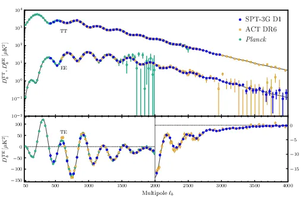
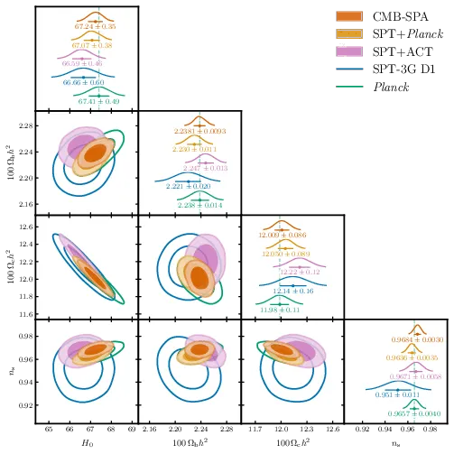
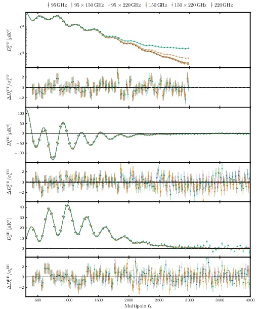
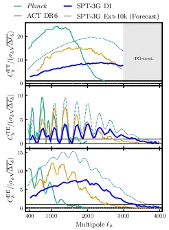
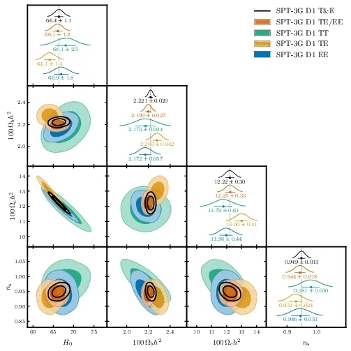
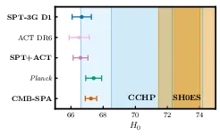
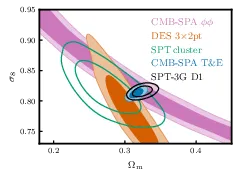
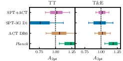
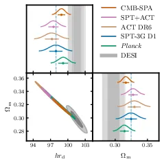
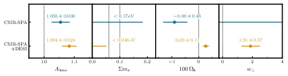

# SPT-3G D1: CMB Temperature and Polarization Power Spectra and Cosmology — 图表版

- **arXiv**: 2506.20707
- **作者**: Camphuis, Quan, Balkenhol et al. (SPT Collaboration, 2025)
- **阅读日期**: 2026-03-16
- **论文规模**: 83 页 / 42 图 / 11 表
- **本文精选**: 10 张核心图/表

---

## 物理背景速查

在进入逐图解读之前，先列出贯穿全文的关键物理量和概念。

| 符号 | 名称 | 物理含义 |
|------|------|----------|
| $\Omega_b h^2$ | 重子物质密度 | 控制声学峰的相对高度（奇偶峰比） |
| $\Omega_c h^2$ | 冷暗物质密度 | 控制物质-辐射等时（equality）的红移，影响峰高和转折尺度 |
| $\theta_*$ | 声学视角（angular scale of sound horizon） | 最精确的 CMB 参数，锚定峰的位置 |
| $n_s$ | 原初标量谱指数 | 度量原初扰动功率谱的倾斜，$n_s < 1$ 意味着红谱（大尺度功率略多） |
| $\ln(10^{10}A_s)$ | 原初扰动振幅（对数） | 决定功率谱整体归一化 |
| $\tau_{\rm reio}$ | 再电离光学深度 | 晚期再电离对大角度偏振的抑制，CMB 功率谱振幅 $\propto A_s e^{-2\tau}$ |
| $H_0$ | 哈勃常数（推导参数） | 由 $\theta_*$、$\Omega_b h^2$、$\Omega_c h^2$ 联合决定 |
| $\sigma_8$ | 物质密度涨落振幅 | 今天 $8\,h^{-1}\mathrm{Mpc}$ 球内的均方根质量涨落 |
| $\Omega_m$ | 物质密度参数 | $= \Omega_b + \Omega_c + \Omega_\nu$ |
| $r_{\rm drag}$ | 拖曳期声学视界 | BAO 标准尺，CMB 功率谱峰间距也由它决定 |
| $A_{\rm lens}$ | 透镜振幅 | 人为缩放引力透镜对功率谱的影响，$\Lambda$CDM 预测 $A_{\rm lens} = 1$ |
| $h r_d$ | BAO 复合标准尺 | $\equiv (H_0/100) \times r_{\rm drag}$，BAO 直接约束的组合量 |

**三种谱的直觉**：
- **TT**（温度自相关）：信号最强，但高 $\ell$ 受前景（尘埃、点源、SZ 效应）污染严重。
- **TE**（温度-偏振交叉）：前景污染极低，在 damping tail 仍保持高信噪比，是 SPT-3G 最有信息量的谱。
- **EE**（E 模偏振自相关）：前景最干净，但信号比 TT 弱得多；SPT-3G 在 $\ell > 1800$ 首次成为全球最灵敏。

---

## Fig 1: 三大实验 band powers 对比



### 前因

在 Planck 2018 之后，地面实验（ACT DR6、SPT-3G）逐步积累数据，试图在小角度和偏振测量上超越卫星。但三个实验是否一致？SPT-3G 在哪些角尺度上最有优势？这张图直接回答这两个问题。

### 图/表说什么

将 SPT-3G D1（蓝点）、ACT DR6（橙色空心方块）、Planck PR3（绿色空心圆）三个实验的"最小方差"（minimum-variance）band powers 画在一起。上排展示 TT 和 EE 的对数尺度；下排展示 TE 的线性尺度，并在 $\ell > 2000$ 区域插入放大图。黑色实线是 SPT-3G 数据的 $\Lambda$CDM 最佳拟合。

**核心信息**：
1. 三个完全独立的实验在宽广的 $\ell$ 范围内高度一致——$\Lambda$CDM 的胜利。
2. SPT-3G 在 EE 的 $\ell = 1800$–$4000$ 和 TE 的 $\ell = 2200$–$4000$ 是当前全球最精确的测量。
3. 在 $\ell < 1000$ 的大角度，Planck 因全天覆盖而占优（宇宙方差更小）。

### 怎么看

- **横轴**：多极矩 $\ell$（角尺度的倒数；$\ell \sim 180°/\theta$）。
- **纵轴**：$D_\ell = \ell(\ell+1)C_\ell / 2\pi$，单位 $\mu\mathrm{K}^2$。对数尺度让声学峰和 damping tail 同时可见。
- **上排 TT**：第一声学峰在 $\ell \approx 220$（图外），第二、三峰清晰可见。$\ell > 2000$ 处信号被前景淹没，SPT 因此将 TT 截至 $\ell = 3000$。
- **上排 EE**：偏振峰位置与 TT 交错（TT 的峰对应 EE 的谷），在 $\ell \sim 1000$ 附近有最高峰。关键是放大 $\ell > 1800$ 后可看到 SPT-3G（蓝点）误差棒最短。
- **下排 TE**：TE 谱有正有负（物理来源：温度和偏振的相位差），线性尺度才能看到过零点。放大图清楚展示了 SPT-3G 在 $\ell > 2200$ 的主导地位。

### 需要理解的物理/公式

**Band power 的构造**（论文 Eq. 37）：

$$\hat{C}^{XY;\mu\nu}_{b} = \sum_\ell Q_{b\ell} \frac{\bar{C}^{XY;\mu\nu}_\ell - A^{XY;\mu\nu}_\ell - I^{XY;\mu\nu}_\ell}{F_{\ell}^{XY;\mu\nu} B_{\ell}^{T;\mu} B_{\ell}^{T;\nu} P_{\ell}^2}$$

- 原始伪功率谱 $\bar{C}_\ell$ 减去滤波残差 $A_\ell$ 和 inpainting 残差 $I_\ell$，再除以转移函数 $F_\ell$、温度波束 $B_\ell^T$ 和像素窗函数 $P_\ell$。最后用 binning 算符 $Q_{b\ell}$ 压缩到 $\Delta\ell = 50$ 的 bin。

**最小方差组合**：将所有频率组合（$95\times95$, $150\times95$, ...）按其协方差矩阵加权合并为单一谱，最大化信噪比。图中展示的就是这个"最终产品"。

### 后果

三大实验一致 → 有充分理由将它们合并为 "CMBall" 数据集，获得迄今最强的 CMB 约束力。SPT-3G 在高 $\ell$ 偏振上的优势将在后续图表中转化为对宇宙学参数的强约束。

---

## Tab II: $\Lambda$CDM 参数约束总表

**论文 Table II**

| 参数 | Planck | SPT-3G D1 | ACT DR6 | Ground | CMBall |
|------|--------|-----------|---------|--------|--------|
| $10^4\theta_*$ | $104.184\pm 0.029$ | $104.171\pm 0.060$ | $104.157\pm 0.030$ | $104.158\pm 0.025$ | $104.162\pm 0.023$ |
| $100\,\Omega_b h^2$ | $2.238\pm 0.014$ | $2.221\pm 0.020$ | $2.257\pm 0.016$ | $2.247\pm 0.013$ | $2.2381\pm 0.0093$ |
| $100\,\Omega_c h^2$ | $11.98\pm 0.11$ | $12.14\pm 0.16$ | $12.26\pm 0.17$ | $12.22\pm 0.12$ | $12.009\pm 0.086$ |
| $n_s$ | $0.9657\pm 0.0040$ | $0.951\pm 0.011$ | $0.9682\pm 0.0069$ | $0.9671\pm 0.0058$ | $0.9684\pm 0.0030$ |
| $\ln(10^{10}A_s)$ | $3.042\pm 0.011$ | $3.054\pm 0.015$ | $3.038\pm 0.012$ | $3.042\pm 0.011$ | $3.0479\pm 0.0099$ |
| $\tau_{\rm reio}$ | $0.0535\pm 0.0056$ | $0.0506\pm 0.0059$ | $0.0513\pm 0.0060$ | $0.0514\pm 0.0059$ | $0.0559\pm 0.0055$ |
| **$H_0$** [km/s/Mpc] | **67.41±0.49** | **66.66±0.60** | **66.51±0.64** | **66.59±0.46** | **67.24±0.35** |
| $\sigma_8$ | $0.8099\pm 0.0051$ | $0.8158\pm 0.0058$ | $0.8171\pm 0.0055$ | $0.8169\pm 0.0042$ | $0.8137\pm 0.0038$ |
| $\Omega_m$ | $0.3145\pm 0.0067$ | $0.3246\pm 0.0091$ | $0.330\pm 0.010$ | $0.3277\pm 0.0072$ | $0.3166\pm 0.0051$ |
| $r_{\rm drag}$ [Mpc] | $147.13\pm 0.25$ | $146.92\pm 0.47$ | $146.20\pm 0.46$ | $146.43\pm 0.34$ | $147.07\pm 0.22$ |

### 前因

$\Lambda$CDM 只有 6 个自由参数。将三个 CMB 实验各自独立拟合同一模型，参数是否一致？这是对标准模型最基本的检验。

### 图/表说什么

1. **所有参数在 $1\sigma$ 以内一致**——SPT-3G 与 Planck 的参数级一致性为 $0.4\sigma$，与 ACT DR6 为 $1.1\sigma$。
2. **SPT-3G 单独约束力已接近 Planck**：$\sigma(H_0) = 0.60$ vs. Planck 的 $0.49$，差距仅 22%。
3. **Ground（SPT+ACT）在 $H_0$ 和 $\sigma_8$ 上达到 Planck 精度**：$\sigma(H_0) = 0.46$（Planck 为 $0.49$），这是地面实验首次达到这一里程碑。
4. **CMBall 是迄今最强的 CMB 约束**：$H_0 = 67.24 \pm 0.35$。

### 怎么看

- 采样参数（sampled）是 MCMC 直接采样的量，推导参数（derived）是从采样参数计算出来的。
- $H_0$ 是推导参数：固定 $\theta_*$ 后，$H_0$ 由 $\Omega_b h^2$ 和 $\Omega_c h^2$ 决定。SPT-3G 的 CMB 透镜数据对打破 $H_0$ 的简并方向至关重要。
- $n_s$ 的 SPT 误差较大（0.011 vs. Planck 0.004），因为 $n_s$ 主要由大角度峰的斜率决定，而 SPT 只覆盖 4% 天区。
- $\tau_{\rm reio}$ 所有列几乎相同（$\sim 0.051$），因为都使用了相同的 Planck PR4 先验。

### 需要理解的物理/公式

$H_0$ 的推导链：

$$\theta_* = \frac{r_s^*}{D_A^*}$$

- $r_s^*$：最后散射面的声学视界，由 $\Omega_b h^2$、$\Omega_c h^2$ 决定（通过影响声速和退耦时刻）。
- $D_A^*$：到最后散射面的角直径距离，由 $H_0$、$\Omega_m$、$\Omega_\Lambda$ 决定。
- 因此 $\theta_*$（测量最精确）+ 密度参数 → 唯一确定 $H_0$。

### 后果

一致性已确认 → 组合数据集的物理基础成立。$H_0 \approx 67$ 与 SH0ES 的 $73.17$ 之间存在 $6\sigma$ 以上的张力。

---

## Fig 2: $\Lambda$CDM 参数三角图



### 前因

Tab II 给出了一维数字，但参数之间存在复杂的简并关系（degeneracies）。三角图（triangle plot）是标准的可视化工具，用二维等高线展示参数间的相关性。

### 图/表说什么

对角线：各参数的一维后验分布（1D marginalised posterior），上方标注均值和 $68\%$ 置信区间。

非对角线：两两参数的二维 $68\%$ 和 $95\%$ 置信等高线。颜色编码：SPT-3G D1（蓝）、Planck（绿）、ACT DR6（棕）、Ground（紫）、CMBall（红）。

**核心信息**：五组等高线高度重叠。CMBall（红）区域最小，代表最强约束。

### 怎么看

- **$\Omega_c h^2$ vs. $H_0$ 面**：负相关。更多暗物质 → 更大 $\Omega_m$ → 降低 $H_0$（以保持 $\theta_*$ 不变）。等高线的长轴方向就是主简并方向。
- **$n_s$ vs. $\Omega_b h^2$ 面**：正相关。更高 $\Omega_b h^2$ 增加 Silk 阻尼后的峰高，$n_s$ 需要调高以补偿。
- **$\Omega_b h^2$ vs. $H_0$**：微弱正相关。$\Omega_b h^2$ 增大 → $r_s^*$ 减小 → 为保持 $\theta_*$，$D_A^*$ 减小 → $H_0$ 增大。
- 注意 SPT-3G（蓝）在某些面板中的等高线比 Planck（绿）更大，但在 $H_0$-$\Omega_c h^2$ 面大小接近。

### 需要理解的物理/公式

三角图的等高线由 MCMC 采样的后验密度得到。$68\%$ 等高线包含参数空间中后验密度最高的 $68\%$ 区域（highest posterior density region）。

### 后果

参数级一致性的视觉确认。三个独立 CMB 实验、不同天区、不同仪器、不同流水线，得到相互重叠的结果——这是 $\Lambda$CDM 模型令人印象深刻的成功。

---

## Fig 3: 所有频率组合的 Band Powers 与残差



### 前因

Fig 1 展示的是合并后的最小方差 band powers。但原始数据包含 6 种频率组合（$95\times95$, $150\times150$, $220\times220$, $150\times95$, $220\times150$, $220\times95$）。展示每一种的拟合情况，才能完整验证数据模型的准确性。

### 图/表说什么

**大面板**：每种频率组合的 TT、TE、EE band powers（数据点）与 $\Lambda$CDM + 完整数据模型的最佳拟合（曲线）。不同频率组合有不同的前景贡献（如 $220\times220$ 的 TT 在高 $\ell$ 比 $95\times95$ 高，因为尘埃辐射随频率增强），但模型都能精确匹配。

**小面板（残差）**：数据减去模型。低 $\ell$ 残差有相关性（信号主导、宇宙方差限制），高 $\ell$ 残差趋向随机（噪声主导）。

**关键数字**：全数据最佳拟合 $\chi^2 = 1359$（PTE = 0.52），说明模型对数据的描述极为出色。

### 怎么看

- TT 面板：注意在 $\ell > 2000$ 处，不同频率的 TT 曲线分叉——这是前景（点源、SZ 效应）的频率依赖性。模型包含了前景项所以仍能很好拟合。
- TE/EE 面板：偏振前景极弱，所有频率的曲线几乎重合。
- 残差面板：如果看到系统性偏离零线的结构，就意味着模型有问题。这里所有残差都与统计期望一致。

### 需要理解的物理/公式

完整数据模型包含 CMB 信号 + 前景 + 系统效应：

$$D_\ell^{\text{model}} = D_\ell^{\text{CMB, lensed}} + D_\ell^{\text{foreground}}(\nu_1, \nu_2) + D_\ell^{\text{systematics}}$$

前景项包括：射电和红外点源 Poisson 噪声、CIB 聚集、tSZ 效应、kSZ 效应、tSZ×CIB 交叉项。系统效应包括：超级透镜化（super-sample lensing）、绝对标定、波束不确定性、温度到偏振泄漏。

### 后果

PTE = 0.52 是"教科书级"的拟合优度——模型既不过拟合也不欠拟合。这给了我们信心，band powers 中的宇宙学信息是可靠的。

---

## Fig 4: 信噪比（SNR）对比



### 前因

"最精确"这个说法需要量化。信噪比（signal-to-noise ratio, SNR）逐 $\ell$ 展示了不同实验在不同角尺度上的相对灵敏度。

### 图/表说什么

三条实线分别代表 SPT-3G D1（蓝）、Planck（绿）、ACT DR6（橙）的逐 $\ell$ SNR（已归一到 $\Delta\ell = 1$）。蓝色虚线是 SPT-3G 完整巡天（AllSPT，含 Main+Summer+Wide，覆盖 25% 天空）的预测。

三个面板从上到下为 TT、TE、EE。

### 怎么看

- **SNR = 1 线**（黑色实线）：SNR 降至 1 以下意味着噪声开始主导。
  - SPT-3G EE：SNR > 1 直到 $\ell \lesssim 3300$。
  - SPT-3G TE：SNR > 1 直到 $\ell \lesssim 3300$。
- **TT**：Planck 在 $\ell < 1500$ 占优（全天观测，宇宙方差小），SPT-3G 在 $1500 < \ell < 3000$ 有优势但差距不大。注意 SPT 不报告 $\ell > 3000$ 的 TT，因此那里没有蓝线。
- **TE**：$\ell > 2200$ 处 SPT-3G 超过 ACT DR6，在 $1800 < \ell < 2200$ 两者相当。
- **EE**：$\ell > 1800$ 处 SPT-3G 占据绝对优势——这是论文最核心的数据卖点。
- **蓝色虚线**：AllSPT 预测将在全 $\ell$ 范围压倒性超越 Planck 和 ACT。

### 需要理解的物理/公式

SNR 的定义：

$$\text{SNR}_\ell = \frac{C_\ell^{\text{signal}}}{\sigma(C_\ell)}$$

其中 $\sigma(C_\ell)$ 包含宇宙方差和噪声。宇宙方差 $\propto 1/\sqrt{f_{\rm sky}(2\ell+1)}$，因此 Planck（$f_{\rm sky} \sim 0.7$）在大角度占优。噪声取决于探测器灵敏度和分辨率：SPT-3G 的噪声水平为 $3.3\,\mu\text{K-arcmin}$（温度）、$5.1\,\mu\text{K-arcmin}$（偏振），远低于 Planck。

### 后果

这张图是 SPT-3G 宣称"最精确偏振测量"的定量依据。它也揭示了 SPT-3G 当前的局限：覆盖天区太小（4%），在大角度被宇宙方差限制。AllSPT 将观测 25% 天空，彻底解决这个问题。

---

## Fig 5: TT vs. TE vs. EE 独立约束对比



### 前因

$\Lambda$CDM 模型要求 TT、TE、EE 给出一致的宇宙学参数——这是一个非平凡的自洽性检验。同时，比较它们各自的约束力可以揭示哪种谱对 SPT-3G 最有价值。

### 图/表说什么

三角图展示了仅用 TT（黄）、仅用 TE（蓝）、仅用 EE（红）、以及 TTTEEE 组合（黑）的 $\Lambda$CDM 参数约束。

**核心发现**：
1. TT、TE、EE 独立约束之间高度一致（PTE 表显示所有对之间一致性在 $1.2\sigma$ 以内）。
2. **TE 谱的约束力最强**——TE 的等高线最窄，接近 TTTEEE 组合。去掉 TT 只轻微放松约束。
3. 这与 Planck（TT 约束力最强）形成鲜明对比，反映了 SPT-3G 的偏振灵敏度优势。

### 怎么看

- 比较各颜色等高线的大小：蓝色（TE）最小 → TE 信息量最大。
- 黄色（TT）等高线相对较大，因为 SPT 的 TT 受限于 $\ell_{\rm max} = 3000$ 和较小天区。
- 黑色等高线（TTTEEE）与蓝色几乎完全重叠 → 说明 TE 已经主导了联合约束。

### 需要理解的物理/公式

**为什么 TE 比 TT 更有信息量？**

1. **前景更低**：TE 谱中前景贡献极小（射电点源和尘埃在偏振中很弱），允许 SPT 使用到 $\ell = 4000$ 而 TT 只能到 3000。
2. **damping tail 信息**：TE 谱在高 $\ell$ 的振荡幅度（相对于信号）比 TT 更大，因此对 $\Omega_b h^2$、$n_s$ 等参数的灵敏度更高。
3. **SPT 噪声优势**：偏振噪声 $5.1\,\mu\text{K-arcmin}$ 使得 TE 在 damping tail 保持高 SNR。

### 后果

TE 作为"最强谱"意味着 SPT-3G 的科学回报主要来自偏振测量能力。这指明了未来实验（SPT-3G AllSPT、CMB-S4）的优化方向：继续提升偏振灵敏度。

---

## Fig 6: $H_0$ 汇总 — Hubble 张力可视化



### 前因

Hubble 张力是当代宇宙学最大的谜题之一：早期宇宙探针（CMB + BAO）给出 $H_0 \sim 67$，晚期宇宙的距离阶梯测量（SH0ES）给出 $H_0 \sim 73$，差距超过 $5\sigma$。SPT-3G 作为新的独立 CMB 实验，能否确认这一张力？

### 图/表说什么

汇总各数据集对 $H_0$ 的约束，按数据组合排列。加粗标注的是本文结果。

**CMB 约束**（蓝/紫/绿色区域）：
- SPT-3G D1 alone: $66.66 \pm 0.60$（距 SH0ES $6.2\sigma$）
- Ground (SPT+ACT): $66.59 \pm 0.46$
- CMBall (SPT+ACT+Planck): $67.24 \pm 0.35$（距 SH0ES $6.4\sigma$）

**晚期宇宙测量**：
- SH0ES: $73.17 \pm 0.86$（橙色）
- CCHP: $70.4 \pm 1.9$（蓝色）

### 怎么看

- 横轴：$H_0$（km/s/Mpc），所有 CMB 结果聚集在 $\sim 67$ 附近，SH0ES 在 $\sim 73$ 处，中间有明显的"空白地带"。
- 各 CMB 实验的误差棒无论怎么组合都远离 SH0ES。CCHP 的结果位于两组之间，但不确定度较大（$\pm 1.9$）。
- 注意 SPT-3G **单独**就能以 $6.2\sigma$ 确认 Hubble 张力——这是以前任何单一地面实验未曾达到的。

### 需要理解的物理/公式

CMB 对 $H_0$ 的推断完全依赖 $\Lambda$CDM 模型。如果新物理改变了 $r_s^*$（如 early dark energy 或 modified recombination），CMB 推断的 $H_0$ 会改变。但本文表明在所有检验过的扩展模型中，CMB 与 SH0ES 的差距都未被完全消除。

张力的统计显著性计算：

$$\text{Tension} = \frac{|H_0^{\text{CMB}} - H_0^{\text{SH0ES}}|}{\sqrt{\sigma_{\text{CMB}}^2 + \sigma_{\text{SH0ES}}^2}}$$

SPT-3G alone: $|66.66 - 73.17| / \sqrt{0.60^2 + 0.86^2} \approx 6.2\sigma$。

### 后果

SPT-3G 独立确认 Hubble 张力，排除了"张力仅来自 Planck 系统误差"的可能性。三个独立 CMB 实验、不同仪器、不同天区、不同流水线，全部指向 $H_0 \sim 67$。

---

## Fig 7: $\sigma_8$–$\Omega_m$ 平面 — $S_8$ 张力状态



### 前因

除了 Hubble 张力，宇宙学中另一个备受关注的可能张力是 $S_8$ 张力：CMB 预测的宇宙结构增长振幅是否与低红移大尺度结构（LSS）观测一致？

### 图/表说什么

在 $\Omega_m$–$\sigma_8$ 平面上展示：
- **SPT-3G D1**（黑色）和 **CMBall primary**（蓝色）：CMB 约束
- **CMB lensing 联合**（粉色，SPT+ACT+Planck lensing）
- **DES-Y3 3×2pt**（橙色）：星系弱引力透镜 + 星系聚集
- **SPT 星系团**（绿色）

**核心信息**：所有探针在 $2\sigma$ 以内一致！$S_8$ 张力正在缓解。

### 怎么看

- 不同探针的简并方向不同（等高线长轴的斜率不同），这反映了各自对 $S_8^\alpha = \sigma_8(\Omega_m/0.3)^\alpha$ 的灵敏度差异（$\alpha$ 不同）。
- CMB 等高线（黑、蓝）沿 $\sigma_8 \propto \Omega_m^{-0.25}$ 方向延伸。
- DES-Y3（橙）沿 $\sigma_8 \propto \Omega_m^{-0.5}$ 方向延伸。
- 尽管方向不同，等高线在 $\Omega_m \sim 0.3$、$\sigma_8 \sim 0.81$ 附近交汇。
- 论文报告 CMBall primary 与 DES-Y3 一致性为 $1.8\sigma$，与 KiDS 最新结果一致性为 $0.86\sigma$。

### 需要理解的物理/公式

$S_8$ 的定义：

$$S_8 \equiv \sigma_8 \sqrt{\Omega_m / 0.3}$$

更一般地，$S_8^\alpha = \sigma_8 (\Omega_m/0.3)^\alpha$，其中 $\alpha$ 取决于特定探针。

CMB 约束 $\sigma_8$ 的途径：原初振幅 $A_s$ + 引力透镜 + 物质密度 → $\sigma_8$。

LSS 约束 $S_8$ 的途径：星系形状的微小形变（cosmic shear）统计量直接测量前景物质分布的功率。

### 后果

$S_8$ 张力的缓解意味着 $\Lambda$CDM 在描述结构增长方面依然成功。但更精确的未来数据（Rubin/LSST、Euclid）将对此做更严格的检验。

---

## Fig 8: $A_{\rm lens}$ 参数 — 透镜异常检验



### 前因

Planck 的 TT 数据长期显示一个 $2$–$3\sigma$ 的 $A_{\rm lens} > 1$ 异常：引力透镜对功率谱的"平滑"效应似乎比 $\Lambda$CDM 预测的更强。这可能暗示新物理，也可能是统计涨落或系统误差。地面实验能否提供独立判据？

### 图/表说什么

**左侧面板**：仅用 TT 数据的 $A_{\rm 2pt}$（引力透镜对 primary CMB 功率谱的影响幅度）后验。

**右侧面板**：使用 T&E 数据。

**表格**：各数据集的 $68\%$ 置信区间。

**核心结论**：
- Planck TT: $A_{\rm 2pt} = 1.239 \pm 0.095$（$\sim 2.5\sigma$ 偏离 1）
- Planck T&E: $A_{\rm 2pt} = 1.185 \pm 0.067$（$\sim 2.8\sigma$）
- **Ground TT**: $A_{\rm 2pt} = 1.014 \pm 0.098$（与 1 完美一致）
- **Ground T&E**: $A_{\rm 2pt} = 1.016^{+0.048}_{-0.054}$（与 1 完美一致）

### 怎么看

- 虚线标注 $A_{\rm lens} = 1$（$\Lambda$CDM 预测）。
- Planck（绿色）的后验明显偏向右侧（$> 1$）。
- Ground（紫色）的后验精确地以 1 为中心。
- SPT-3G alone（蓝色）在仅用 TT 时有较大误差（天区小），但加入偏振后约束大幅收紧并趋向 1。
- Ground 的 TT 结果与 Planck TT 结果相差 $\sim 2.3\sigma$，暗示 Planck 的 $A_{\rm lens}$ 异常可能不是宇宙学信号。

### 需要理解的物理/公式

$A_{\rm lens}$（论文中区分为 $A_{\rm 2pt}$ 和 $A_{\rm recon}$）的作用：

$$C_\ell^{\text{lensed}} = C_\ell^{\text{unlensed}} + A_{\rm 2pt} \times \Delta C_\ell^{\text{lensing}}$$

引力透镜使 CMB 功率谱的声学峰变平滑（高峰降低、低谷填高）。$A_{\rm lens} > 1$ 意味着"平滑过度"。

**为什么 Planck TT 看到 $A_{\rm lens} > 1$？** 可能的解释包括：(1) Planck TT 高 $\ell$ 数据中的统计涨落；(2) Planck 数据处理中的残余系统效应。PR4 和 CamSpec 重分析显示此异常有所降低。

### 后果

Ground 数据与 $A_{\rm lens} = 1$ 的一致性，使 Planck 异常更可能是统计涨落或系统效应。但加入 DESI BAO 后情况有趣的变化：CMBall+DESI 得到 $A_{\rm lens} = 1.084 \pm 0.024$（$3.5\sigma$），这是 CMB 与 BAO 在 $\Lambda$CDM 中张力的一个"投影"，而非 CMB 内部的异常。

---

## Fig 9: $\Omega_m$–$hr_d$ 平面 — CMB vs. DESI BAO 的 $2.8\sigma$ 张力



### 前因

DESI DR2 的 BAO 测量是 2025 年宇宙学最重要的新数据之一。BAO 直接约束的是 $\Omega_m$ 和 $hr_d$——这恰好也是 CMB 在 $\Lambda$CDM 下能精确推断的参数。两者一致吗？

### 图/表说什么

**上方**：$\Omega_m$–$hr_d$ 平面的二维等高线。DESI（灰色填充）偏好更低的 $\Omega_m$、更高的 $hr_d$。各种 CMB 组合（SPT, Planck, ACT, Ground, CMBall）的等高线都偏向更高的 $\Omega_m$、更低的 $hr_d$。

**下方表格**：量化张力程度。CMBall 与 DESI 之间的差异为 **$2.8\sigma$**。Ground 与 DESI 的差异更大：$3.7\sigma$。

### 怎么看

- DESI 等高线（灰色）和 CMB 等高线（彩色）之间有清晰的位移——它们不重叠。
- 所有 CMB 数据集都趋向右下方（高 $\Omega_m$，低 $hr_d$），DESI 趋向左上方。
- 注意 CMBall（红色）相比 Ground（紫色）稍微向 DESI 靠近，因为 Planck 大角度数据偏好略低的 $\Omega_m$。
- $2.8\sigma$ 介于"有趣"和"显著"之间——还不足以宣布新物理，但足以引起警觉。

### 需要理解的物理/公式

$hr_d$ 的物理含义：

$$hr_d \equiv \frac{H_0}{100\,\text{km/s/Mpc}} \times r_{\rm drag}$$

BAO 测量的是 $r_d / D_V(z)$ 或 $r_d \cdot H(z)$，其中 $D_V$ 是体积平均距离。结合多个红移 bin → 约束 $\Omega_m$ 和 $hr_d$。

CMB 独立推断 $r_d$（由声速积分决定）和 $H_0$（通过 $\theta_*$），因此也约束 $hr_d$。

**为什么会有张力？** 在 $\Lambda$CDM 中，CMB 和 BAO 对 $\Omega_m$ 和 $hr_d$ 的约束应该完全一致。不一致意味着：(1) 统计涨落；(2) 系统误差；(3) $\Lambda$CDM 不完整。

### 后果

这个 $2.8\sigma$ 张力是本文"超越 $\Lambda$CDM 搜索"的出发点。后续所有扩展模型（$A_{\rm lens}$、$N_{\rm eff}$、$\Omega_k$、$w_0w_a$、$\sum m_\nu$）都可以理解为：模型打开了额外的自由度，使 CMB 的 $\Omega_m$–$hr_d$ 等高线能"伸展"到与 DESI 重叠的区域。

---

## Fig 10: 扩展模型总结 — CMBall vs. CMBall+DESI



### 前因

前面已经看到 $\Lambda$CDM 下 CMB 与 DESI 存在 $2.8\sigma$ 张力。如果允许模型扩展（增加自由参数），联合拟合会偏好偏离标准模型吗？

### 图/表说什么

四个面板从左到右展示四个扩展参数：$A_{\rm lens}$、$\sum m_\nu$、$\Omega_k$、$w_\perp$（将 $w_0$-$w_a$ 沿 DESI 简并方向压缩为一个数）。

**上排（蓝色）**：仅用 CMBall 的约束。
**下排（橙色）**：CMBall + DESI 的约束。

虚线标注 $\Lambda$CDM 的预期值（$A_{\rm lens}=1$、$\sum m_\nu \geq 0.06\,\text{eV}$、$\Omega_k=0$、$w_\perp=0$）。

**核心发现**：
- CMBall alone（蓝色）在所有扩展参数上与 $\Lambda$CDM 一致。
- CMBall + DESI（橙色）在每个扩展参数上都发生偏移，偏离 $\Lambda$CDM $2$–$3\sigma$。

### 怎么看

- **$A_{\rm lens}$ 面板**：CMBall 给 $1.055 \pm 0.030$（$1.8\sigma$），加 DESI 后变为 $1.084 \pm 0.024$（$3.5\sigma$）。
- **$\sum m_\nu$ 面板**：CMBall 给上限 $< 0.17\,\text{eV}$（$95\%$），加 DESI 后被挤到 $< 0.048\,\text{eV}$——低于中微子振荡的最小质量（$0.06\,\text{eV}$ for NH），这在物理上令人不安。
- **$\Omega_k$ 面板**：CMBall 与零一致，加 DESI 后偏向正值 $0.26 \pm 0.11$（$2.4\sigma$），暗示"开放宇宙"。
- **$w_\perp$ 面板**：CMB alone 无法约束暗能量演化（蓝色水平线），但 CMBall+DESI 给出 $1.91 \pm 0.57$（$3.4\sigma$ 偏离零），暗示暗能量状态方程 $w(z)$ 偏离 $-1$。

### 需要理解的物理/公式

$w_\perp$ 的定义（论文 Eq. 68）：

$$w_\perp \equiv w_a + 3.5(w_0 + 1)$$

这是沿 DESI 数据在 $w_0$–$w_a$ 平面的主简并方向的投影。$w_\perp = 0$ 对应 $\Lambda$CDM（$w_0 = -1$, $w_a = 0$），$w_\perp > 0$ 对应 $w_0 > -1$、$w_a < 0$ 的暗能量演化。

$\chi^2$ 改善量（论文 Table IX）——扣除额外自由度后转换为等效高斯显著性：
| 模型 | $\Delta\chi^2$（CMBall+DESI vs. $\Lambda$CDM） | 额外参数 | 等效显著性 |
|------|------|------|------|
| $A_{\rm lens}$ | 9.5 | 1 | $3.1\sigma$ |
| $\Omega_k$ | 6.3 | 1 | $2.5\sigma$ |
| $\sum m_\nu$ | 7.8 | 1 | $2.8\sigma$ |
| $w_0 w_a$ | 13.5 | 2 | $3.2\sigma$ |

### 后果

这是全文最具前瞻性的图。它传达的信息是：**$\Lambda$CDM 仍然没有被单一探针推翻，但 CMB 与 BAO 的联合分析在多个扩展方向上一致地看到 $2$–$3\sigma$ 的偏移。** 这些信号可能是统计涨落（毕竟只有 $\sim 3\sigma$），也可能是新物理的第一缕曙光。未来的 DESI DR3、CMB-S4、SPT-3G AllSPT 将给出答案。

---

## 全文图表逻辑链

下面用一条链条串联 10 张核心图/表的论证逻辑：

```
[Fig 3: 全频 band powers + 残差]
    ↓ 验证数据质量（PTE = 0.52）
[Fig 4: SNR 对比]
    ↓ 定量确认 SPT-3G 在 TE/EE 高ℓ 最灵敏
[Fig 1: 三大实验 band powers 对比]
    ↓ 三个实验高度一致 → 有理由组合
[Fig 5: TT vs TE vs EE 独立约束]
    ↓ SPT-3G 的约束主要由 TE 驱动，ΛCDM 内部自洽
[Tab II: ΛCDM 参数表]
    ↓ 量化参数约束：SPT ≈ Planck，Ground ≥ Planck，CMBall 最强
[Fig 2: ΛCDM 三角图]
    ↓ 参数级一致性的视觉确认
[Fig 6: H₀ 汇总]
    ↓ 所有 CMB → H₀ ≈ 67，与 SH0ES ≈ 73 差 6σ+ → Hubble 张力确认
[Fig 7: σ₈-Ω_m 平面]
    ↓ CMB 与 LSS 在结构增长上一致 → S₈ 张力缓解
[Fig 8: A_lens]
    ↓ Ground 数据无 lensing 异常 → Planck 异常可能非宇宙学信号
[Fig 9: Ω_m-hr_d 平面]
    ↓ CMB 与 DESI BAO 之间 2.8σ 张力 → 驱动扩展模型搜索
[Fig 10: 扩展模型总结]
    ↓ CMB alone 不偏好超越 ΛCDM，但 +DESI → 多方向 2-3σ 偏移
```

**全链条的叙事**：SPT-3G 的深度偏振数据 → 通过严格验证 → 确认 $\Lambda$CDM 在 CMB 内部完全自洽 → 独立确认 Hubble 张力 → 缓解 $S_8$ 张力 → 消除 Planck 透镜异常 → 但发现 CMB 与 DESI BAO 出现新的 $2.8\sigma$ 张力 → 在扩展模型中体现为 $2$–$3\sigma$ 的偏离标准模型信号。

---

## 总结

### SPT-3G D1 的三个核心成就

1. **偏振测量达到全球最灵敏**：在 EE 的 $\ell = 1800$–$4000$ 和 TE 的 $\ell = 2200$–$4000$，SPT-3G 的误差棒是三大实验中最小的。TE 谱成为 SPT-3G 最有信息量的通道。

2. **地面实验首次匹敌 Planck**：Ground（SPT+ACT）在 $H_0$、$\sigma_8$ 上的约束精度达到或超过 Planck 卫星。CMBall 组合给出 CMB 迄今最强的宇宙学约束：$H_0 = 67.24 \pm 0.35$、$\sigma_8 = 0.8137 \pm 0.0038$。

3. **发现 CMB-BAO 新张力**：CMBall 与 DESI DR2 在 $\Lambda$CDM 下差异 $2.8\sigma$。虽不足以宣布新物理发现，但在 $A_{\rm lens}$、$\Omega_k$、$w_0w_a$、$\sum m_\nu$ 多个扩展方向一致出现 $2$–$3\sigma$ 偏移——这是未来需要密切关注的方向。

### 未解决的问题

- **Hubble 张力**：$6.4\sigma$（CMBall vs. SH0ES），所有检验过的扩展模型（modified recombination + curvature 可降至 $1.9\sigma$，但以牺牲模型简洁性为代价）均未完全消解。
- **CMB vs. DESI**：$2.8\sigma$ 是统计涨落还是新物理？需要 DESI DR3 和 SPT-3G AllSPT 的更高精度数据来判断。
- **中微子质量**：CMBall+DESI 给出 $\sum m_\nu < 0.048\,\text{eV}$（95% CL），低于正常序列最小值 $0.06\,\text{eV}$——与粒子物理实验矛盾，可能反映了 CMB-BAO 张力的投影。
- **偏振波束的独立标定**：论文指出，EE 谱的约束力受限于偏振波束（polarized beam）的不确定性；如果能从外部精确标定波束，EE 的约束将进一步收紧。

### 展望

SPT-3G 还有大量数据尚未使用：Summer fields（$2600\,\text{deg}^2$）分析已接近完成，2024 年的 Wide Survey（$6000\,\text{deg}^2$）正在分析中。AllSPT 将覆盖 25% 天空、$\sim 10000\,\text{deg}^2$，彻底消除宇宙方差限制，并在信噪比上全面超越 Planck。再加上 CMB-S4 在 2030 年代的部署，地面 CMB 实验将主导宇宙学的下一个十年。
