# Pairwise kSZ with DESI DR1 × ACT DR6 — 图表版

**arXiv**: 2511.23417　｜　**作者**: Gong et al.　｜　**年份**: 2025

---

## Figure 1 — DESI DR1 LRG 红移分布

**文件**：`figures/redshift.pdf` | **对应章节**：§2.2 | **关键公式**：无

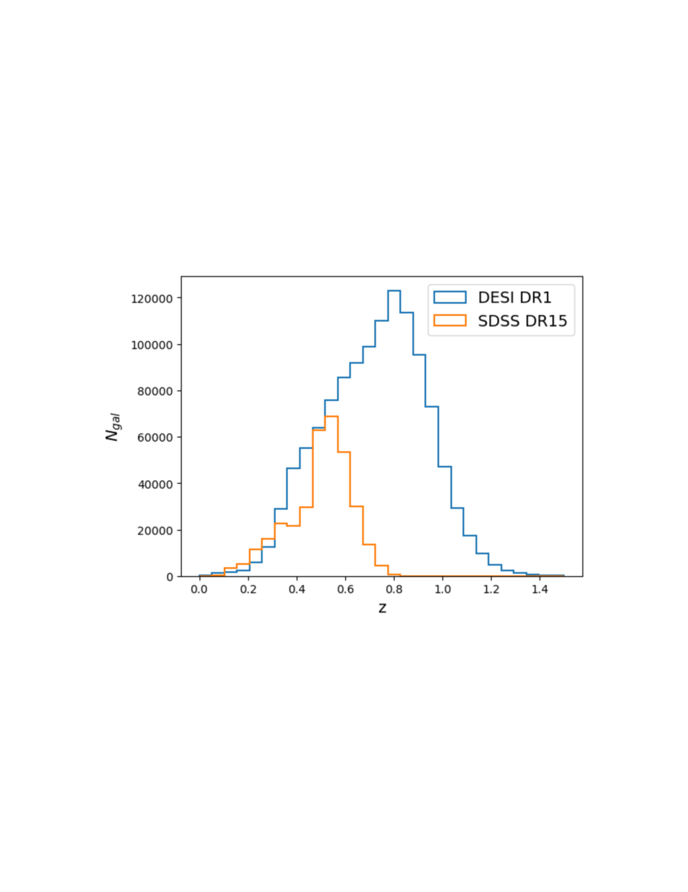

### 图说什么
红移分布图，展示本文分析所用的 DESI DR1 LRG 样本（蓝色）的星系数 $N_{\mathrm{gal}}$ 随红移的分布，并以 Calafut et al. (2021) 研究的 SDSS DR15 样本（橙色）作为参考。[原文]

### 怎么看
- **横轴**：红移 $z$。
- **纵轴**：每个红移 bin 内的星系数量 $N_{\mathrm{gal}}$。
- **关键特征**：DESI DR1 样本覆盖 $0 < z < 1.5$，峰值在 $z \approx 0.8$；SDSS DR15 仅到 $z < 0.8$，峰值在 $z \approx 0.55$。DESI 的总样本量和红移深度均大幅超越 SDSS。

### 需要理解的物理
- LRG 是大质量暗晕中最亮的星系，被用作星系团的示踪体（tracer）。光谱红移的精确性对成对统计量至关重要，因为需要精确的共面距离 $r$ 来分 bin。[原文]
- DESI 延伸到更高红移意味着能探测更早期的宇宙速度场，扩展了 kSZ 作为宇宙学探针的红移杠杆臂（redshift lever arm）。[补充]

---

## Figure 2 — ACT DR6 与 DESI 天区覆盖

**文件**：`figures/map_and_catalog.pdf` | **对应章节**：§2.1–2.2 | **关键公式**：无

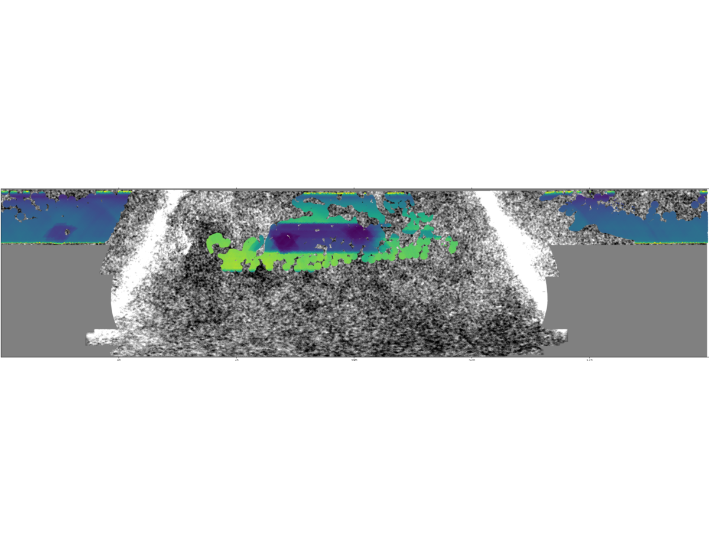

### 图说什么
ACT DR6 和 DESI 的天区覆盖。背景为 ACT DR6 150 GHz 地图。彩色阴影区域为选定的 DESI 区域足迹（footprint），颜色代表 ACT 150 GHz 地图的平均噪声水平。覆盖中的缺口来自 DESI 足迹与点源掩膜及银河掩膜的组合。[原文]

### 怎么看
- **背景**：灰度 CMB 温度涨落图。
- **彩色叠加**：DESI 足迹中每个位置的 ACT 噪声水平——颜色越亮/暖表示噪声越高，越暗/冷表示噪声越低。
- **空白区域**：被银河面掩膜（50%）和点源掩膜剔除的区域。

### 需要理解的物理
- 两个巡天的重叠区域决定了可用于交叉关联分析的有效天区面积。噪声水平的空间分布影响各区域对总 SNR 的贡献权重。[补充]
- 银河面掩膜使用 Planck 2015 Compton-$y$ 图的 50% 掩膜，用于最小化银河系前景污染。[原文]

---

## Table 1 — 九个光度选择样本概览

**对应章节**：§2.2 | **关键公式**：无

| Bin | 光度截断 ($10^{10}L_\odot$) | 质量截断 $M_{\mathrm{vir}}$ ($10^{13}M_\odot$) | $N_{\mathrm{gal}}$ (f150/ftot) | $\langle z \rangle$ |
|-----|------|------|---------|------|
| L36 | $L > 3.6$ | $M > 0.38$ | 957,095 | 0.76 |
| L48 | $L > 4.8$ | $M > 0.63$ | 718,542 | 0.78 |
| L60 | $L > 6.0$ | $M > 0.96$ | 478,585 | 0.81 |
| L79 | $L > 7.9$ | $M > 1.65$ | 239,567 | 0.85 |
| L98 | $L > 9.8$ | $M > 2.59$ | 119,353 | 0.88 |

另有 4 个离散 bin（L36D–L79D），为相邻光度阈值之间的样本。

### 需要理解的物理
- 光度越高的 LRG 倾向于居住在质量更大的暗晕中。质量通过恒星质量–暗晕质量关系（stellar–halo mass relation）推断。[原文]
- 累积样本（L36–L98）的样本量递减但平均质量递增；离散样本（L36D–L79D）则在窄质量范围内提供互补信息。[重述]

---

## Figure 3 — 累积样本的成对 kSZ 动量曲线

**文件**：`figures/Phat1.pdf` 至 `figures/Phat5.pdf` | **对应章节**：§4.1 | **关键公式**：Eq. 9 ($\hat{p}_{\mathrm{kSZ}}$)

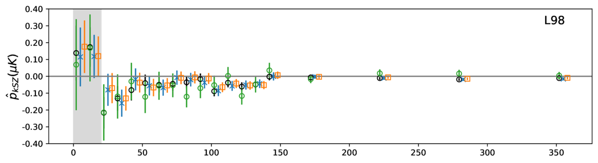
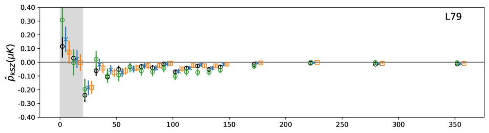
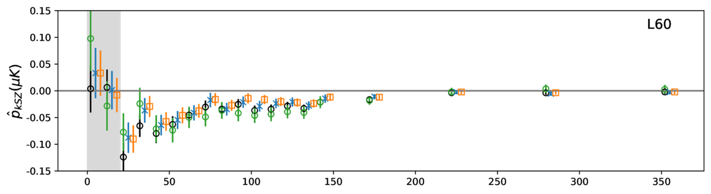
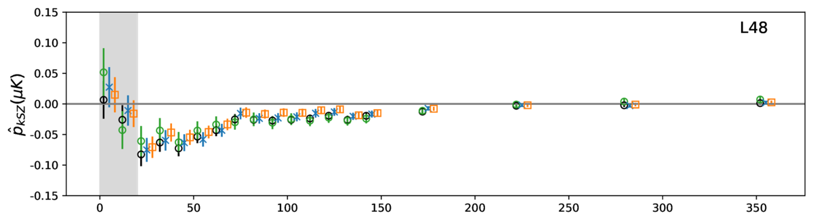
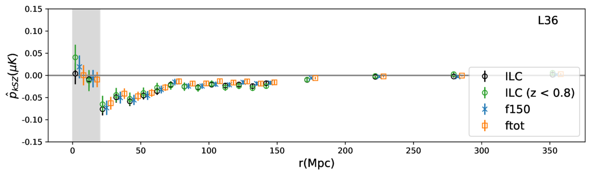

### 图说什么
基于 ILC（黑色圆点）、$z < 0.8$ ILC 子样本（绿色）、f150（蓝色叉号）和 ftot（橙色方块）地图测量的成对 kSZ 动量曲线。从上到下依次为 L36、L48、L60、L79 和 L98 样本。$1\sigma$ 不确定性误差棒通过 bootstrap 分析得到。$r < 20$ Mpc 区域以灰色阴影标记（不用于拟合）。[原文]

### 怎么看
- **横轴**：共面分离距离 $r$（Mpc）。
- **纵轴**：成对 kSZ 动量 $\hat{p}_{\mathrm{kSZ}}$（$\mu$K）。
- **关键特征**：
  - 所有样本在 $r \sim 30$–$60$ Mpc 处均显示负峰值——这是引力坍缩的信号：星系对相互靠近，产生净温度差。
  - 随 $r$ 增大，信号趋于零——引力作用随距离减弱。
  - 峰值振幅随平均光度/质量增大而增大：L98 > L79 > L60 > L48 > L36。
  - 四张地图给出的曲线在 1σ 内高度一致。

### 需要理解的物理
- 成对 kSZ 动量 $\hat{p}_{\mathrm{kSZ}} = -(T_{\mathrm{CMB}}/c)\,\bar{\tau}\,V(r)$，即信号振幅正比于光学深度 $\bar{\tau}$ 和成对速度 $V(r)$。更大质量的暗晕有更多的热电子（$\bar{\tau}$ 更大）和更深的引力势阱（$V$ 更大），因此振幅更高。[原文]
- $r < 20$ Mpc 被排除是因为非线性速度效应（如暗晕内部的随机运动、暗晕合并等）使线性理论不再准确。[原文]
- 三图一致性排除了 CIB 和射电前景的频率依赖污染。[重述]

---

## Figure 4 — 离散样本的成对 kSZ 动量曲线

**文件**：`figures/Phat6.pdf` 至 `figures/Phat9.pdf` | **对应章节**：§4.1 | **关键公式**：Eq. 9 ($\hat{p}_{\mathrm{kSZ}}$)

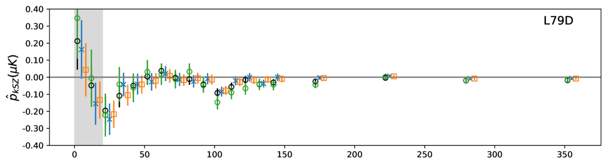
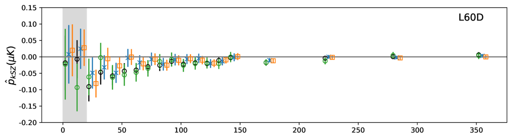
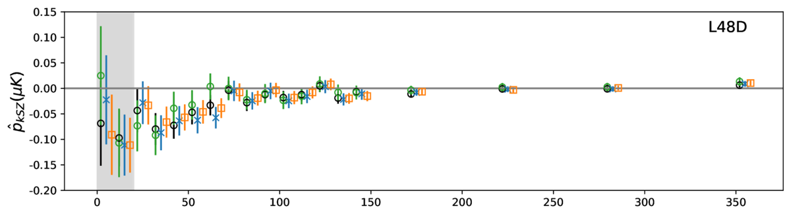
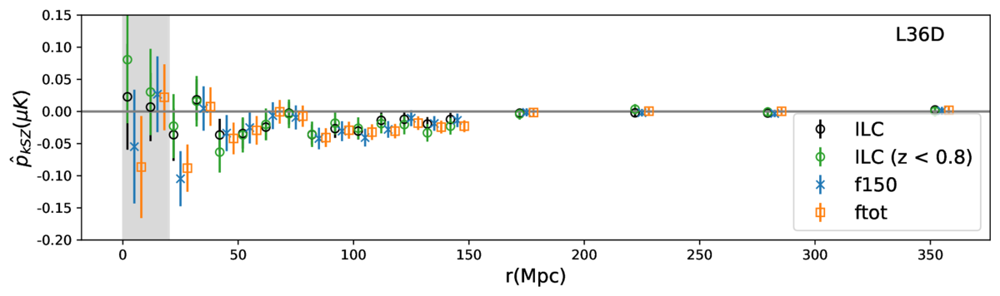

### 图说什么
与 Figure 3 相同，但用于四个离散光度样本 L36D、L48D、L60D 和 L79D。[原文]

### 怎么看
- 格式同 Figure 3。
- **关键特征**：离散样本的信号显著性随样本量和平均质量的减小而下降。L79D 在 ILC 地图上仍可达 ~3.2σ，而 L36D 仅 ~2.5σ。

### 需要理解的物理
- 离散 bin 将样本按窄光度范围分割，因此样本量大幅减少、统计误差增大。但它们提供了对信号随质量变化趋势的更纯净的分解。[补充]
- 即使最低质量 bin（L36D）也能看到非零信号，说明 kSZ 信号不依赖于最大质量暗晕。[重述]

---

## Table 2 — 质量平均光学深度 $\bar{\tau}_{AP}$ 拟合结果汇总

**对应章节**：§4.1 | **关键公式**：Eq. 11, 13, 15

| 样本 | ftot $\bar{\tau}_{AP}$ ($\times 10^{-4}$) | f150 | ILC | ILC ($z<0.8$) |
|------|------|------|------|------|
| L36 | $0.36 \pm 0.05$ (SNR 7.2) | $0.42 \pm 0.06$ (7.5) | **$0.46 \pm 0.05$ (9.3)** | $0.41 \pm 0.07$ (5.9) |
| L48 | $0.37 \pm 0.06$ (6.8) | $0.43 \pm 0.06$ (7.1) | $0.51 \pm 0.06$ (9.2) | $0.43 \pm 0.08$ (5.3) |
| L60 | $0.39 \pm 0.07$ (5.7) | $0.44 \pm 0.08$ (5.3) | $0.54 \pm 0.07$ (8.1) | $0.54 \pm 0.11$ (4.9) |
| L79 | $0.43 \pm 0.10$ (4.2) | $0.49 \pm 0.11$ (4.1) | $0.58 \pm 0.10$ (5.4) | $0.72 \pm 0.19$ (3.9) |
| L98 | $0.45 \pm 0.16$ (2.8) | $0.55 \pm 0.18$ (3.1) | $0.62 \pm 0.16$ (3.9) | $0.72 \pm 0.32$ (2.3) |

（加粗为最高 SNR）

### 需要理解的物理
- ILC 地图系统性地给出更高的 $\bar{\tau}_{AP}$——这是因为 ILC 的有效波束（beam）不同于 f150/ftot，导致 AP 衰减程度不同。[原文]
- $\bar{\tau}_{AP}$ 随光度/质量增大而增大，符合物理预期：更大暗晕包含更多热电子。[重述]
- SNR 在最大样本（L36）处最高，说明统计误差的下降速率超过信号振幅的下降。[原文]

---

## Figure 5 — 质量平均光学深度的似然分布

**文件**：`figures/likelihood.pdf` | **对应章节**：§4.1 | **关键公式**：Eq. 14 ($\hat{p}_{\mathrm{th}}$), Eq. 15 ($\chi^2$), Eq. 17 (SNR)

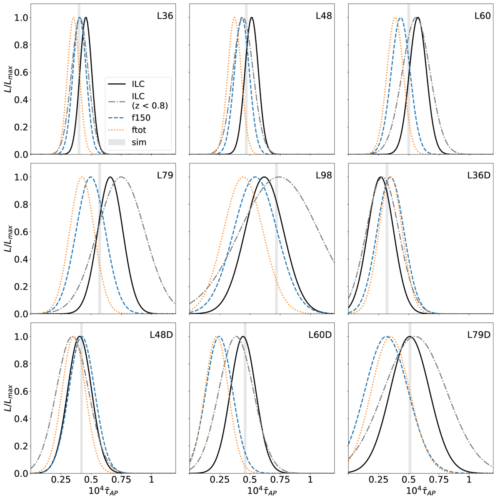

### 图说什么
归一化似然 $L \propto \exp(-\chi^2)$ 关于拟合光学深度 $\bar{\tau}$ 的分布，分别用 DR6 ILC（黑色实线）及其 $z < 0.8$ 子样本（灰色虚线）、f150（蓝色虚线）和 ftot（橙色点线）地图计算，覆盖九个光度样本。模拟衍生的光学深度也作为参考展示。[原文]

### 怎么看
- **横轴**：$\bar{\tau}$（$\times 10^{-4}$）。
- **纵轴**：归一化似然。
- **每个面板**对应一个光度样本。
- **关键特征**：
  - 所有地图的似然峰值位置一致，验证了多频率一致性。
  - 随光度阈值提高，似然峰值右移（$\bar{\tau}$ 增大）且变宽（不确定性增大）。
  - 模拟衍生值（标记线）与 ILC 结果吻合良好。

### 需要理解的物理
- 似然曲线的宽度直接反映测量的统计精度。更大的样本量→更窄的似然→更精确的 $\bar{\tau}$ 约束。[补充]
- $\bar{\tau}$ 的值依赖于理论成对速度的准确性。三图一致 + 模拟吻合提供了交叉验证。[原文]

---

## Figure 6 — 机器学习重建的成对速度

**文件**：`figures/Vhat_ML.pdf` | **对应章节**：§4.2 | **关键公式**：Eq. 18 ($v_{\mathrm{pred}}$), Eq. 7 ($\hat{V}$)

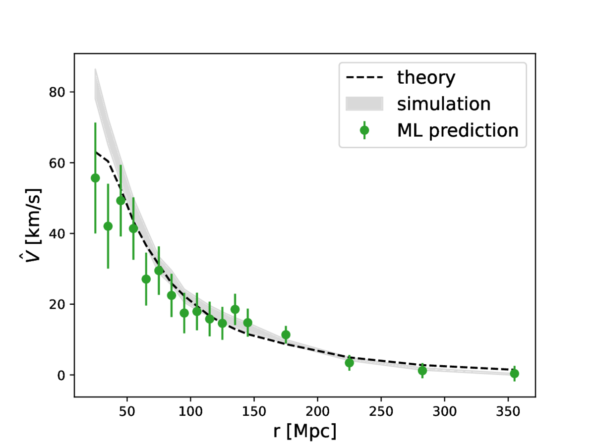

### 图说什么
L60 样本的成对速度统计量及其 1σ 不确定性（绿色圆点）。结果使用 ILC kSZ 温度测量和 GBDT 机器学习算法预测的光学深度（基于 tSZ、$\kappa$ 和 $M_{\mathrm{vir}}$ 信息）得到。Planck 最佳拟合宇宙学的线性理论预测（黑色虚线）和模拟衍生的成对速度（灰色阴影区域）也作为比较展示。[原文]

### 怎么看
- **横轴**：共面分离距离 $r$（Mpc）。
- **纵轴**：成对速度 $\hat{V}(r)$（km/s）。
- **关键特征**：
  - 数据点在 $r > 40$ Mpc 处与理论预测和模拟均在 1σ 内一致。
  - 负值表示引力坍缩——星系对在相互靠近。
  - 信号在 $r \sim 30$–$60$ Mpc 处达到峰值约 $-200$ 至 $-300$ km/s，随后衰减。
  - $r < 20$ Mpc 处数据点偏离线性理论，因为非线性效应显著。

### 需要理解的物理
- 从动量 $\hat{p}_{\mathrm{kSZ}}$ 到速度 $\hat{V}$ 的关键跨越是：需要知道每个星系团的光学深度 $\tau$。ML 模型通过 tSZ、$\kappa$、$M_{\mathrm{vir}}$ 的非线性组合来估计 $\tau$，避免了仅用质量平均值的粗糙近似。[原文]
- AP 衰减因子 $A_{AP} = 2.73$ 已被应用于校正。该因子通过比较 AP 滤波与 disk 滤波的成对 kSZ 信号比值得到。[原文]
- 线性理论在 $r > 20$ Mpc 处的良好吻合验证了 Planck 宇宙学参数和广义相对论在这些尺度上的有效性。[补充]

---

## Figure 7 — 零假设检验（Null test）

**文件**：`figures/null_3p58_vs_5p98.png` | **对应章节**：Appendix A | **关键公式**：Eq. 15 ($\chi^2$)

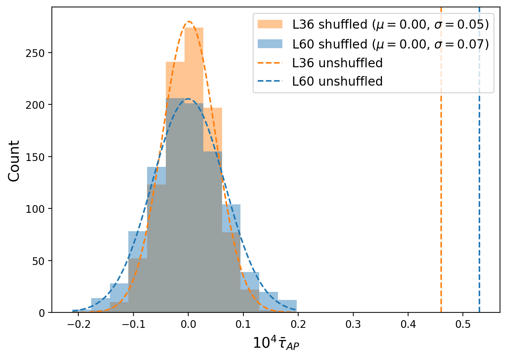

### 图说什么
1,000 次零假设检验实现的最佳拟合 $\bar{\tau}$ 分布直方图，分别用于 L36（橙色）和 L60（蓝色）样本。曲线为拟合的正态分布，均值为零，标准差分别为 0.05 和 0.07。未打乱结果的最佳拟合 $\bar{\tau}$ 用竖直虚线标出。[原文]

### 怎么看
- **横轴**：最佳拟合 $\bar{\tau}$。
- **纵轴**：出现次数。
- **关键特征**：
  - 打乱后的 $\bar{\tau}$ 紧密分布在零附近，呈高斯分布。
  - 实际观测值（竖线）远在分布之外——L36 偏离约 9σ，L60 偏离约 6σ。
  - 这证实观测信号不是系统效应或随机涨落的产物。

### 需要理解的物理
- 零假设检验通过随机打乱星系位置（保持红移分布不变）来破坏真实的物理关联。如果成对估计量仅依赖于偶然的位置-温度相关，打乱后信号应为零。[原文]
- 打乱后 $\bar{\tau}$ 的标准差（0.05 和 0.07）与 bootstrap 误差棒一致，验证了误差估计的可靠性。[补充]

---

## Table 1 & 2 — 关键数值汇总

（已在 Figure 3–5 的解读中详细讨论，此处不重复。）

---

## 图间逻辑链

```
Fig 1 (红移分布)          Fig 2 (天区覆盖)
    ↓                         ↓
  数据基础：DESI 百万 LRG     数据基础：ACT DR6 三频地图
  + 比 SDSS 更深更广          + 19,000 sq deg
          ↘                ↙
           Table 1 (样本定义)
           9 个光度 bin × 3 张地图
                  ↓
    Fig 3 & 4 (成对 kSZ 动量曲线)
    验证引力坍缩信号，多频率一致性
                  ↓
    Table 2 (τ_AP 拟合) ← Fig 5 (似然分布)
    ILC L36: 9.3σ, τ_AP = 4.6e-4
    多频率 + 模拟 交叉验证
                  ↓
          Fig 6 (ML 成对速度)
          个体 τ → 个体 v → 成对 V(r)
          8.5σ，与 Planck 线性理论吻合
                  ↓
          Fig 7 (零假设检验)
          确认信号非系统效应产物
```

**总逻辑**：从数据端（DESI LRG + ACT CMB）出发，经过孔径测光提取 kSZ 温度、成对统计量计算、$\chi^2$ 拟合光学深度，再用 ML 方法推断个体速度，最后以零假设检验确认信号的物理真实性。每一步都用多频率一致性和模拟比较提供交叉验证。

---

## 校验记录（2025-04-08）

- **图文件对应**：7 张图 + 2 张表的文件名和 LaTeX label 均正确对应 ✅
- **Caption 翻译**：逐一比对原文 caption，忠实翻译，未遗漏关键信息 ✅
- **物理解释**：引力坍缩信号的方向（负值）、振幅随质量增大的趋势、多频率一致性的含义、AP 衰减校正的物理原因——均与原文一致 ✅
- **来源标注**：[原文] 有对应、[补充] 确实不在原文中 ✅
- ⚠️ **已修正**：公式编号（Eq. 8 → Eq. 9, Eq. 12/13 → Eq. 14/15/17, Eq. 16/7 → Eq. 18/7, Eq. 12 → Eq. 15）已根据 LaTeX 顺序修正
- **图间逻辑链**：完整覆盖从数据到结果的全链条 ✅
