# Comparison of Map-Making Algorithms for CMB Experiments — 图表版

**arXiv**: astro-ph/0501504　｜　**作者**: Poutanen et al.　｜　**年份**: 2006

---

## Figure 1 — 扫描策略的命中数分布

**文件**：`fig1.ps`　|　**对应章节**：§3　|　**关键公式**：—

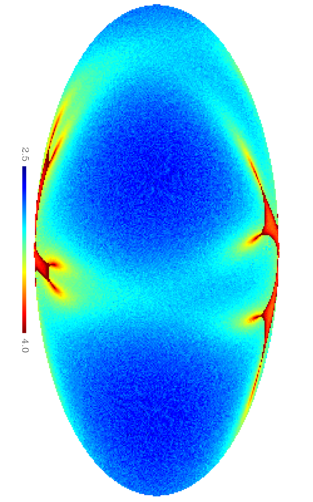

### 图说什么

展示了本研究所用 cycloidal 扫描策略下，$N_{\rm side} = 512$ 像素的命中数（hits per pixel）分布。颜色标度为 $\log_{10}(n_{\rm hit})$。黄道坐标系。 [原文]

### 怎么看

- 两极区域（黄道极附近）命中数最高（颜色最亮），因为扫描环在极区交汇
- 黄道面附近命中数最低但仍 > 0——在此分辨率下天空覆盖率为 100% [原文]
- 命中数的分布直接决定了每个像素的白噪声水平：$\sigma_{\rm pix} \sim \sigma / \sqrt{n_{\rm hit}}$ [补充]

### 需要理解的物理

Planck 的自转轴与光轴成 85° 角，每分钟一圈画近大圆。自转轴每小时重指向一次，沿着反日方向以 10° 振幅做周期 6 个月的摆动（cycloidal 策略）。这种策略保证全天覆盖，同时在极区产生大量交叉点——这正是 destriping 需要的冗余信息。 [原文 + 补充]

---

## Figure 2 — ROMA 输出图

**文件**：`fig2.ps`　|　**对应章节**：§4　|　**关键公式**：Eq. 2

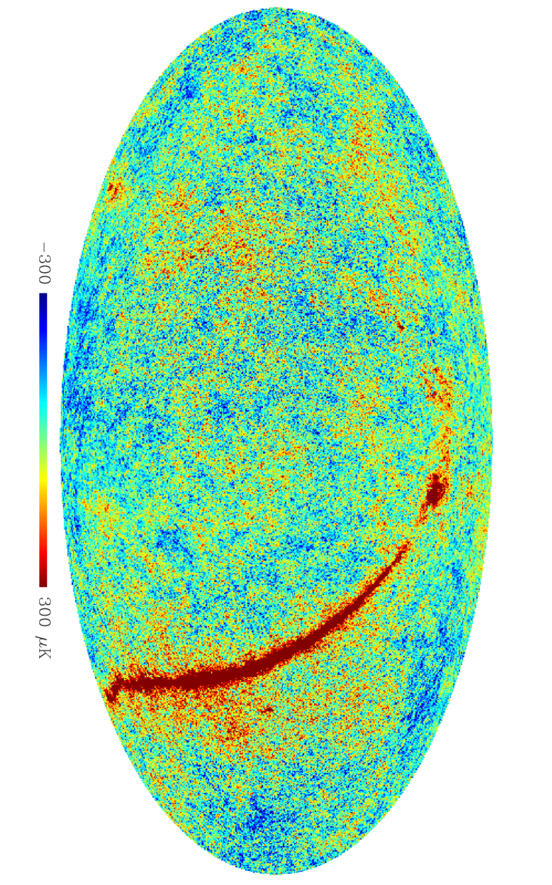

### 图说什么

Case 1（CMB + 前景 + 噪声，对称波束，$f_k = 0.03$ Hz）的 ROMA 输出图。单位为 100 GHz 天线温度（Kelvin）。降采样到 $N_{\rm side} = 256$ 显示，已去除单极。 [原文]

### 怎么看

- 银道面附近的亮带是银河前景辐射
- 大尺度的温度涨落（冷热斑）是 CMB 各向异性
- MapCUMBA 和 destriping 的输出图在此尺度上看起来一样——差别需要做差分图才能看到 [原文]

### 需要理解的物理

这是单个探测器一年数据的输出，噪声水平约 138 μK（std），比最终 Planck 多探测器合成图高 $\sqrt{24}$ 倍。 [原文]

---

## Figure 3 — ROMA 重建误差图

**文件**：`fig3.ps`　|　**对应章节**：§4　|　**关键公式**：Eq. A14

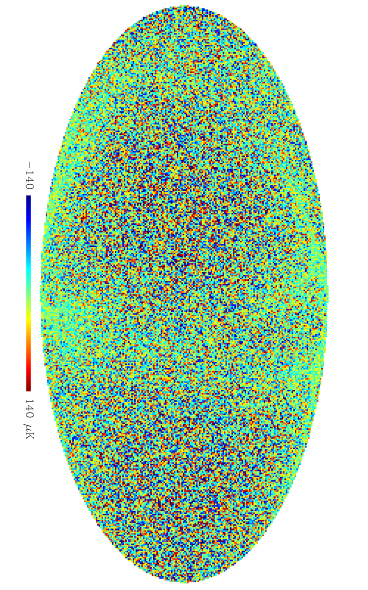

### 图说什么

Case 1 的 ROMA 重建误差图 $\boldsymbol{\varepsilon} = \mathbf{m}_{\rm output} - \mathbf{m}_{\rm binned\ noiseless}$。单位为天线温度（Kelvin）。 [原文]

### 怎么看

- 这张图展示了制图过程中引入的所有误差——理想情况下应该全是零
- 大尺度条纹来自未完全去除的 $1/f$ 噪声残留
- 三个代码的重建误差图在此尺度上看起来相似 [原文]

### 需要理解的物理

重建误差 $\boldsymbol{\varepsilon} = \boldsymbol{\varepsilon}_p + \boldsymbol{\varepsilon}_n$，其中信号分量 $\boldsymbol{\varepsilon}_p$ 源于像素化噪声，噪声分量 $\boldsymbol{\varepsilon}_n$ 是仪器噪声经制图处理后的残留。总误差以噪声分量为主（std ~138 μK vs. ~0.9 μK）。 [原文]

---

## Figure 4 — 差分图：ROMA vs. Destriping / MapCUMBA

**文件**：`fig4a.ps`, `fig4b.ps`　|　**对应章节**：§4　|　**关键公式**：—

| a) ROMA − Destriping | b) ROMA − MapCUMBA |
|:---:|:---:|
| 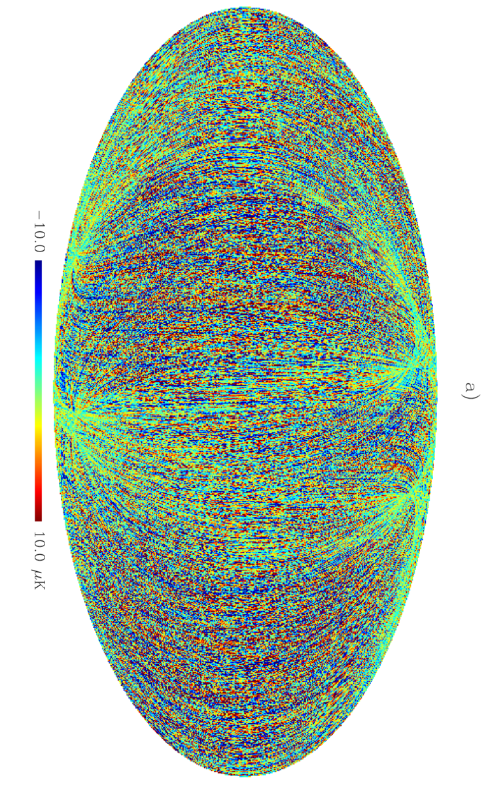 | 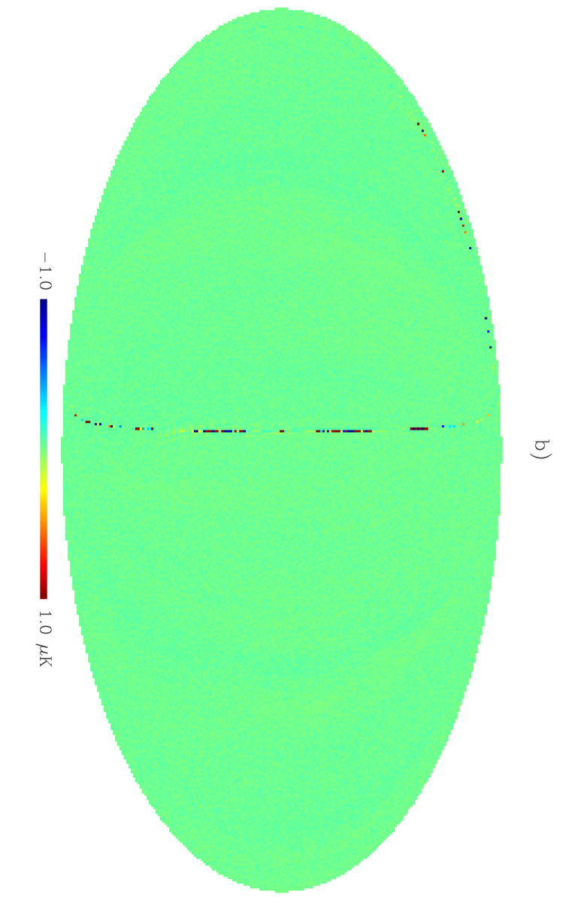 |

### 图说什么

**a)** ROMA 输出图减去 destriping 输出图的差分图。**b)** ROMA 输出图减去 MapCUMBA 输出图的差分图。Case 1。 [原文]

### 怎么看

- **图 a)**（ROMA − destriping）：std = 10.09 μK，有明显的大尺度结构——反映了两种方法对 $1/f$ 噪声处理方式的不同
- **图 b)**（ROMA − MapCUMBA）：std = 0.15 μK，比图 a) 小约 70 倍——两个 ML 代码几乎完全等价
- 图 b) 中仅有的显著特征对应于 TOD 末尾最后一个重指向周期，原因是 ROMA 用零填充延伸 TOD，而 MapCUMBA 用循环延拓（copying samples from beginning to end and vice versa）——这是纯粹的数值实现差异 [原文]

### 需要理解的物理

这组图是论文的核心对比之一。0.15 μK 的 ROMA–MapCUMBA 差异在 CMB 信号（~100 μK 量级）面前可以忽略，确认了两个独立实现的 ML 算法是一致的。 [重述]

---

## Figure 5 — 信号重建误差：ML vs. Destriping

**文件**：`fig5a_400.ps`, `fig5b_400.ps`　|　**对应章节**：§4　|　**关键公式**：Eq. A16, A18

| a) ROMA | b) Destriping |
|:---:|:---:|
| 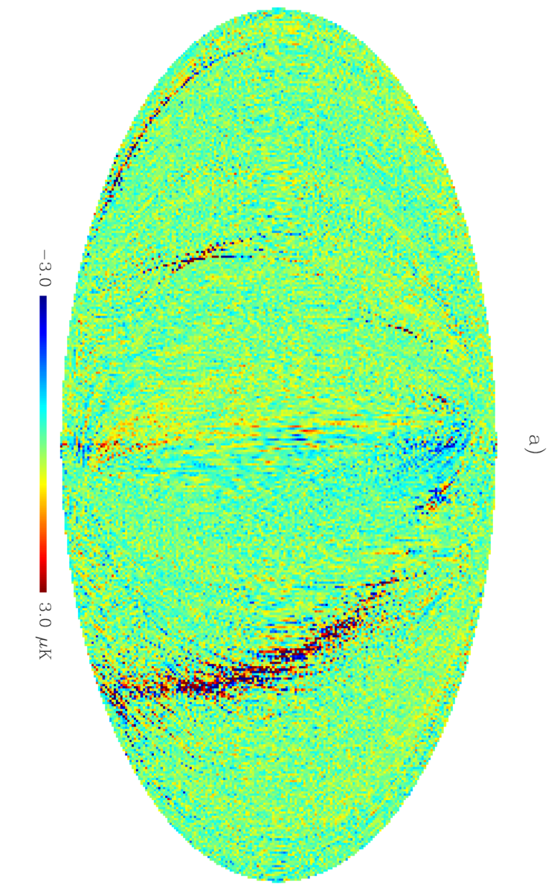 | 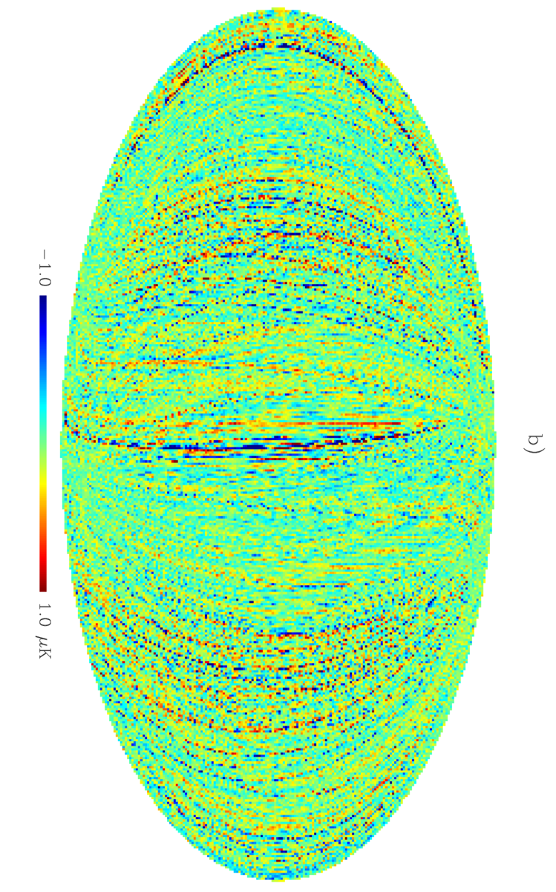 |

### 图说什么

信号分量重建误差图 $\boldsymbol{\varepsilon}_p$，即纯信号输出图与 binned noiseless map 的差分。**a)** ROMA，**b)** destriping。Case 1（含前景）。注意两图的颜色标度不同。 [原文]

### 怎么看

- **ROMA（图 a）**：银道面附近有显著误差，最大达 ~100 μK——前景信号在像素内梯度最强的地方，像素化噪声最大，ML 的噪声滤波器把它放大了
- **Destriping（图 b）**：误差分布更均匀，最大值仅 ~3 μK——baseline 模型是 ring 级别的，不会逐像素放大前景梯度
- std 比值：0.88 μK（ROMA）vs. 0.28 μK（destriping）——ML 的信号误差是 destriping 的 3 倍

### 需要理解的物理

这是论文最关键的发现之一。信号误差 $\boldsymbol{\varepsilon}_p$ 源于像素化噪声。ML 的噪声滤波器在膝频以下的所有频率分量上都会"校正"像素化噪声，而 destriping 只在零频（uniform baseline）上校正。频率窗口更窄 → 信号误差更小。见 Appendix A 的详细推导。 [原文]

---

## Figure 6 — 重建误差的角功率谱

**文件**：`fig6.eps`　|　**对应章节**：§4　|　**关键公式**：—

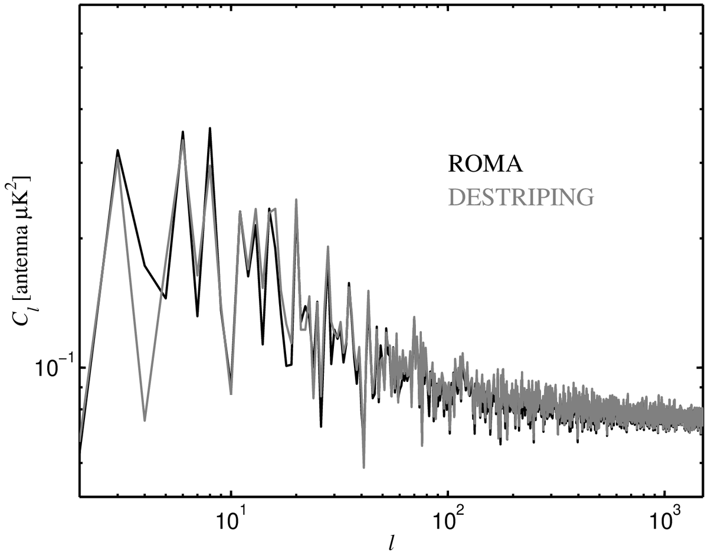

### 图说什么

ROMA 和 destriping 的重建误差图 $\boldsymbol{\varepsilon}$ 的角功率谱。Case 4。ROMA 和 MapCUMBA 的谱无法区分。 [原文]

### 怎么看

- 低 $\ell$ 端（大尺度）destriping 的误差功率更高——$1/f$ 噪声残留更多
- 高 $\ell$ 端两者趋于平坦——白噪声主导
- 整体上 destriping 在大多数 $\ell$ 处功率更高 [原文]

### 需要理解的物理

虽然 destriping 的信号误差更小，但总误差（信号 + 噪声）更大，因为噪声分量是主导项。ML 利用完整的噪声协方差信息，能更有效地压低相关噪声。 [重述]

---

## Figure 7 — 误差功率谱比值

**文件**：`fig7.eps`　|　**对应章节**：§4　|　**关键公式**：—

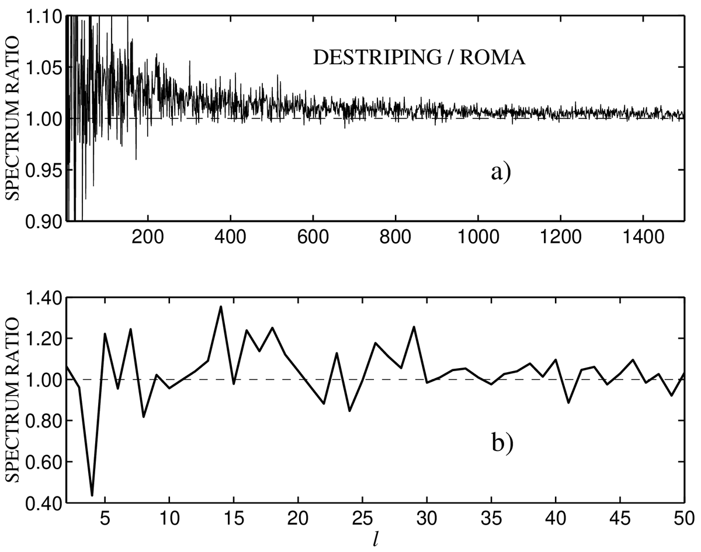

### 图说什么

Fig. 6 中 destriping 与 ROMA 的重建误差功率谱之比。**a)** 全 $\ell$ 范围。**b)** 低 $\ell$ 放大。 [原文]

### 怎么看

- 比值在大多数 $\ell$ 处 > 1，确认 destriping 的总残留噪声更高
- 但有少数 $\ell$ 处比值 < 1——作者认为这只是单次噪声实现的随机涨落 [原文]
- 低 $\ell$ 放大图显示比值在 $\ell < 50$ 处波动较大

---

## Figure 8 — MC 噪声偏差

**文件**：`fig8.eps`　|　**对应章节**：§4　|　**关键公式**：Eq. 8

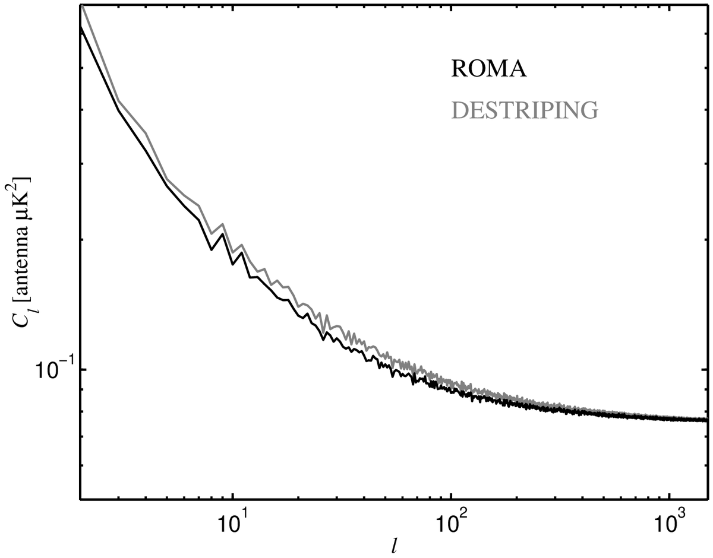

### 图说什么

100 次 MC 噪声模拟的平均角功率谱（噪声偏差 $\langle \widetilde{N}_\ell \rangle$）。ROMA 和 destriping 分别显示。Cases 3/4（纯噪声）。 [原文]

### 怎么看

- destriping 的噪声偏差在所有 $\ell$ 上都更高——对应其更高的图噪声
- 差异在低 $\ell$ 端更明显——$1/f$ 噪声的影响集中在大尺度
- 这条曲线直接用于功率谱估计中减去噪声贡献

### 需要理解的物理

噪声偏差是功率谱估计 $\widehat{C}_\ell^{\rm B} = (\widetilde{C}_\ell - \langle \widetilde{N}_\ell \rangle) / F_\ell$ 中的关键量。高精度的噪声偏差估计需要大量 MC 模拟——这正是 destriping 的计算优势发挥作用的地方。 [补充]

---

## Figure 9 — Binned noiseless map 的功率谱

**文件**：`fig9.eps`　|　**对应章节**：§5　|　**关键公式**：Eq. 6, 7

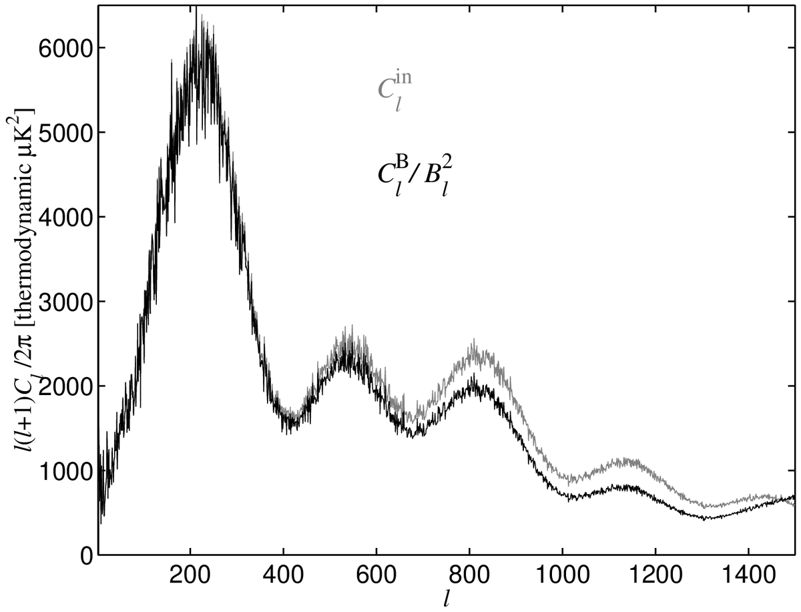

### 图说什么

binned noiseless map 的角功率谱 $C_\ell^{\rm B}$（黑线）和 CMB 天空的输入功率谱 $C_\ell^{\rm in}$（灰线），均已用对称波束反卷积。Case 3。 [原文]

### 怎么看

- 低 $\ell$ 两条线几乎重合——大尺度上像素化效应可忽略
- 高 $\ell$ 处 $C_\ell^{\rm B}$ 逐渐偏低——这是像素窗函数（pixel window）的效应
- $C_\ell^{\rm B}$（而非 $C_\ell^{\rm in}$）才是制图算法真正试图恢复的目标

### 需要理解的物理

作者刻意将比较对象定为 $C_\ell^{\rm B}$ 而非 $C_\ell^{\rm in}$，因为 binned noiseless map 正是制图方法的数学假设所对应的"真实天空"——把亚像素结构平均掉之后的天空。这样就把制图误差从像素化、波束等其他效应中干净地分离出来了。 [原文]

---

## Figure 10 — 功率谱估计

**文件**：`fig10a.eps`, `fig10b.eps`　|　**对应章节**：§5　|　**关键公式**：Eq. 8, 9

| a) 逐 $\ell$ | b) 分 bin ($\Delta\ell = 25$) |
|:---:|:---:|
| 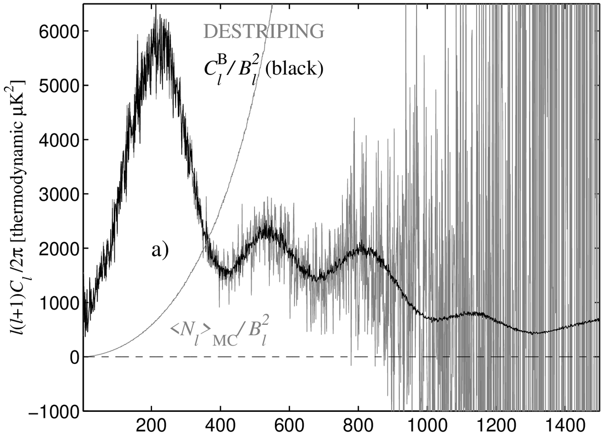 | 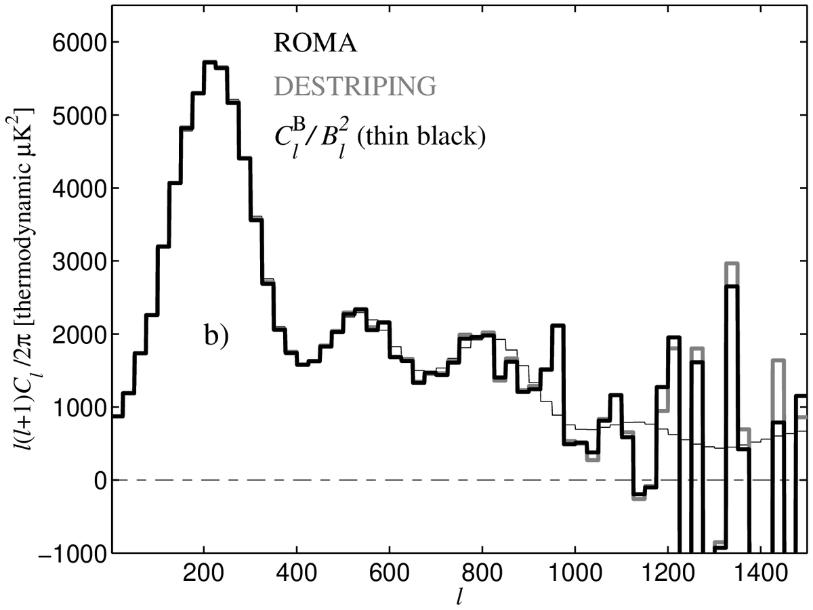 |

### 图说什么

**a)** destriping 的功率谱估计 $\widehat{C}_\ell^{\rm B}$（灰线），$C_\ell^{\rm B}$（黑线）和 MC 噪声偏差（灰虚线）。ROMA 估计与 destriping 几乎重合。**b)** 同上但 $\ell$ 分 bin 到 $\Delta\ell = 25$。Case 3。 [原文]

### 怎么看

- 在 $\ell \lesssim 350$ 处信号主导，估计与 $C_\ell^{\rm B}$ 吻合良好
- $\ell \gtrsim 350$ 后噪声开始主导（单探测器数据）
- 分 bin 后（图 b）可以看到 ROMA 和 destriping 在 $\ell > 1000$ 处有微小差异

### 需要理解的物理

$\ell \sim 350$ 是信噪比 = 1 的位置。单个探测器的灵敏度在 $\ell > 350$ 后不足以探测 CMB 信号——实际 Planck 有 24 个 100 GHz 探测器联合，信噪比交叉点会推到更高 $\ell$。 [补充]

---

## Figure 11 — 归一化功率谱估计误差（未校正 $F_\ell$）

**文件**：`fig11.eps`　|　**对应章节**：§5.1　|　**关键公式**：Eq. 10, 11, 12

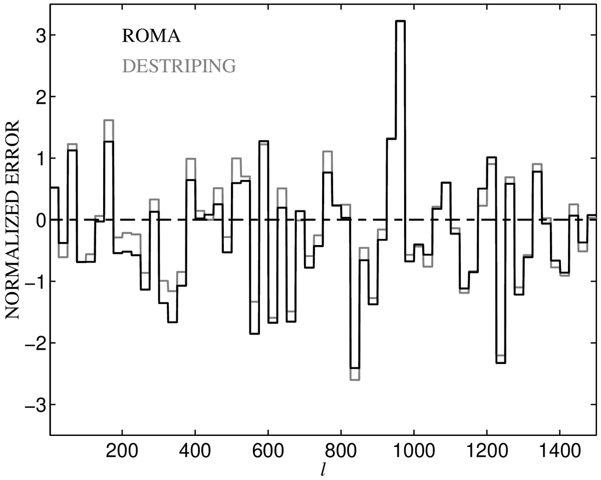

### 图说什么

功率谱估计误差 $\Delta \widehat{C}_\ell = \widehat{C}_\ell^{\rm B} - C_\ell^{\rm B}$，分 bin 后除以解析近似的标准差进行归一化。$F_\ell = 1$（未校正）。 [原文]

### 怎么看

- 归一化后波动的 std 应约为 1
- ROMA 和 destriping 的曲线在 $\ell < 800$ 处有系统性差异——这正是未校正的 $F_\ell$ 造成的偏差
- 差异幅度小于 std（即小于误差条），但存在趋势

### 需要理解的物理

这张图的意义在于展示"偏差虽小但存在"——如果只看一次实现，偏差被噪声淹没，但对 ensemble 来说它是系统性的。 [重述]

---

## Figure 12 — 滤波函数 $F_\ell$

**文件**：`fig12.eps`　|　**对应章节**：§5.1　|　**关键公式**：Eq. 8

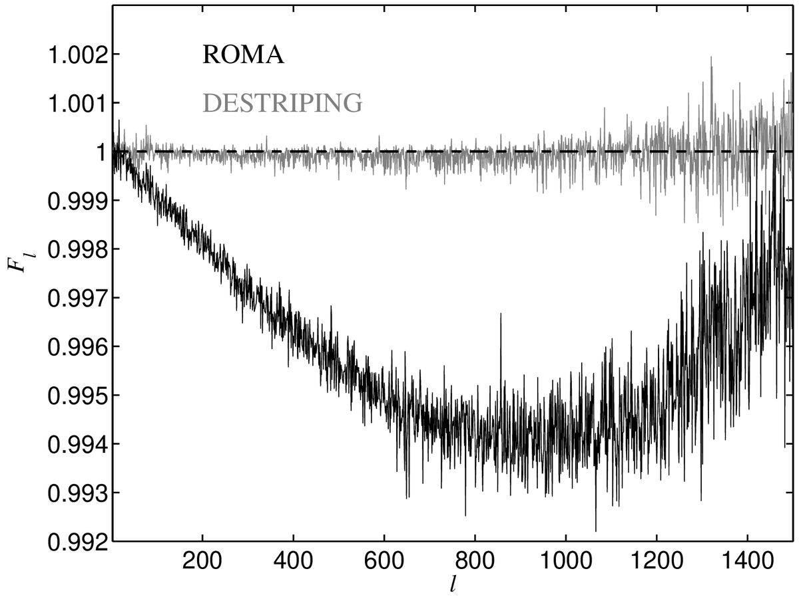

### 图说什么

ROMA 和 destriping 的滤波函数 $F_\ell$，从纯信号 CMB-only TOD 的输出图谱除以 binned noiseless map 谱得到。 [原文]

### 怎么看

- **destriping**：$F_\ell \approx 1$——制图对信号几乎无畸变
- **ROMA**：$F_\ell$ 在 $\ell = 800 \sim 1000$ 处偏离最大，约 0.994——即信号被压低了约 0.6%
- MapCUMBA 的 $F_\ell$ 与 ROMA 无法区分 [原文]

### 需要理解的物理

$F_\ell$ 偏离 1 的原因是 ML 的噪声滤波器对信号（通过像素化噪声）产生了畸变。$\ell \sim 800\text{–}1000$ 对应的角尺度约 10'–13'，接近像素尺寸（$N_{\rm side} = 512$ 对应 ~6.9'）和波束大小（FWHM ~10.7'），正是亚像素效应最强的区域。 [补充]

---

## Figure 13 — 归一化功率谱估计误差（校正 $F_\ell$ 后）

**文件**：`fig13.eps`　|　**对应章节**：§5.1　|　**关键公式**：Eq. 8, 10

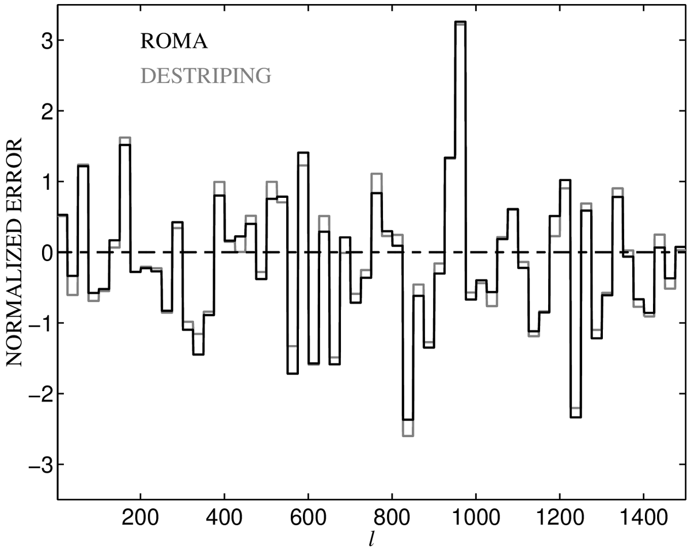

### 图说什么

与 Fig. 11 相同，但功率谱估计已用 Fig. 12 的 $F_\ell$ 校正。 [原文]

### 怎么看

- 校正后 ROMA 和 destriping 的归一化误差明显更加一致（尤其 $\ell < 600$）
- 剩余差异主要来自两种方法的噪声水平不同（随机项，非系统性偏差）
- 对比 Fig. 11：$F_\ell$ 校正有效地消除了 ML 的系统性偏差 [原文]

### 需要理解的物理

这张图证明了：虽然 ML 制图会引入信号偏差，但该偏差可通过估计和校正 $F_\ell$ 来消除。校正后两种方法的功率谱估计在统计上等价。 [重述]

---

## Figure 14 — 误差条比值

**文件**：`fig14.eps`　|　**对应章节**：§5.2　|　**关键公式**：Eq. 13, 14

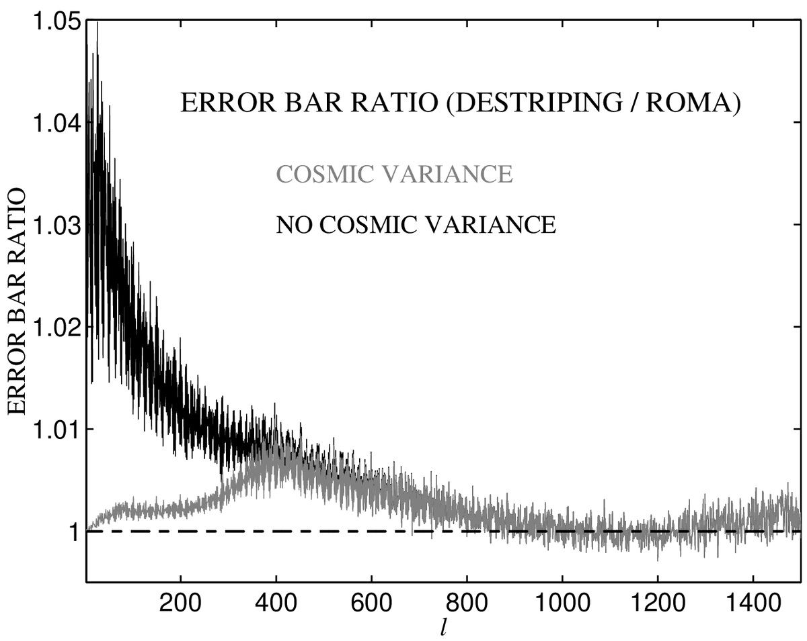

### 图说什么

destriping 与 ROMA 的功率谱估计误差条（$1\sigma$）比值。黑线：估计特定 CMB 实现的 $C_\ell^{\rm B}$（无宇宙方差）。灰线：估计理论功率谱 $C_\ell^{\rm th}$（含宇宙方差）。 [原文]

### 怎么看

- **黑线**（无宇宙方差）：destriping 误差条比 ROMA 大约 5%（最大相对差异），在 $\ell \lesssim 1000$ 处最为显著
- **灰线**（含宇宙方差）：低 $\ell$ 处宇宙方差主导，两者趋于相同；高 $\ell$ 处与黑线重合（噪声主导）
- 高 $\ell$ 端 destriping 更大的噪声被其更大的 $F_\ell$（接近 1）部分补偿 [原文]

### 需要理解的物理

约 5% 的误差条差异——这就是 ML 相对于 destriping 的全部统计优势。考虑到 ML 需要的计算资源是 destriping 的数百倍，以及 ML 在实际中还需要估计噪声功率谱（引入额外不确定性），这个优势幅度值得仔细权衡。 [补充]

---

## Figure A1 — 像素化噪声的功率谱密度

**文件**：`fig_a1a.eps`, `fig_a1b.eps`　|　**对应章节**：Appendix A　|　**关键公式**：Eq. A23

| a) CMB + 前景 | b) 仅 CMB |
|:---:|:---:|
| 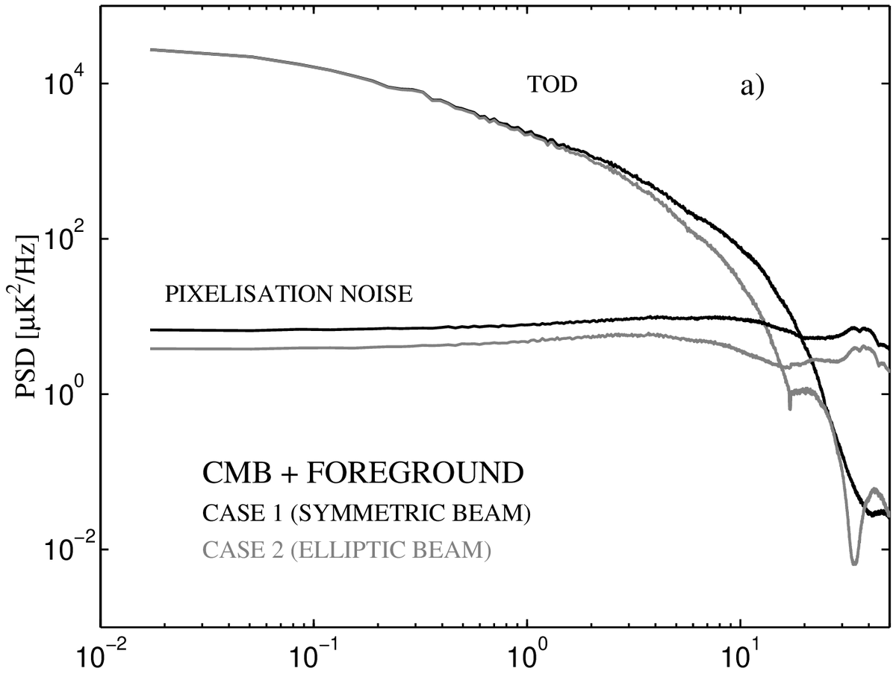 | 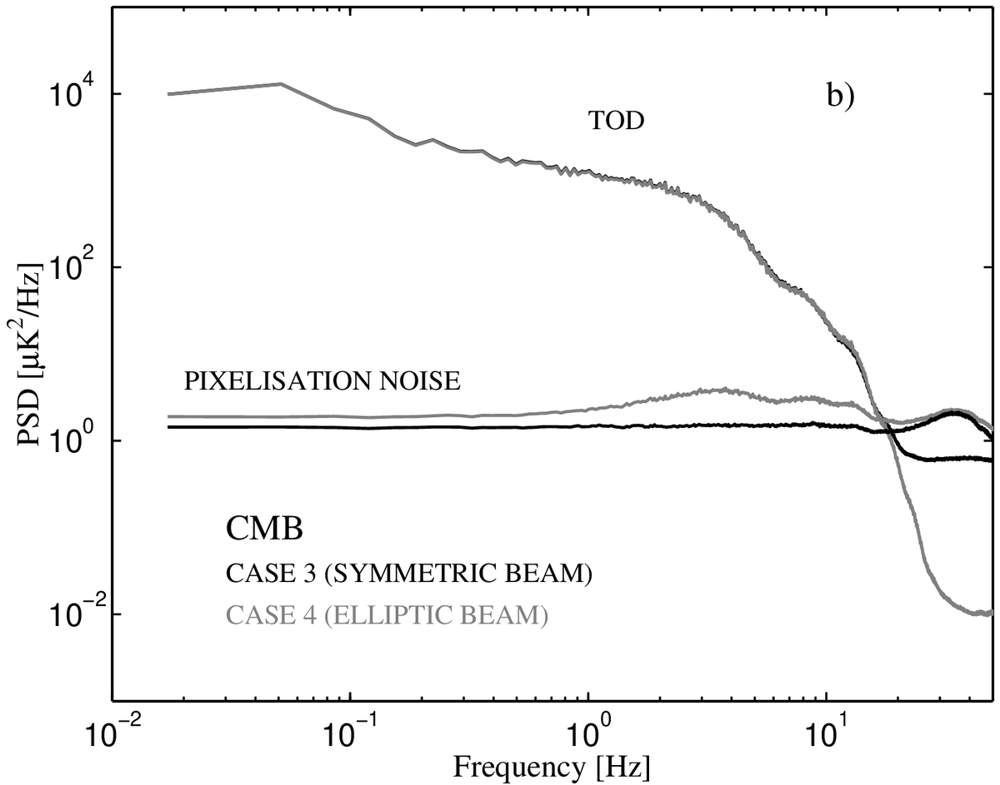 |

### 图说什么

信号 TOD 和对应像素化噪声的平均功率谱密度（PSD）。**a)** CMB + 前景。**b)** 仅 CMB。各 Case 分别标注。 [原文]

### 怎么看

- **信号 TOD 的 PSD**：低频高、高频低——大尺度 CMB 涨落 + 波束平滑
- **像素化噪声的 PSD**：几乎平坦——近似白噪声型
- 含前景时（图 a）像素化噪声水平更高——前景的空间梯度更强，亚像素结构更大
- 图 a) 中对称波束的像素化噪声高于椭圆波束，图 b) 中相反——这反映的是 TOD 生成方法的差异（totalconvolver vs. 扫描高分辨图），而非波束本身的物理效应 [原文]

### 需要理解的物理

像素化噪声的"白噪声"特性是理解 ML 信号误差的关键。ML 的噪声滤波器在膝频以下的频段放大 TOD 中的所有白噪声型成分——本意是压低仪器 $1/f$ 噪声，但像素化噪声在同一频段内也是平坦的，因此被一起放大了。 [重述]

---

## Figure B1 — 输入谱与 binned map 谱的比值

**文件**：`fig_b1.eps`　|　**对应章节**：Appendix B　|　**关键公式**：Eq. B6, B9

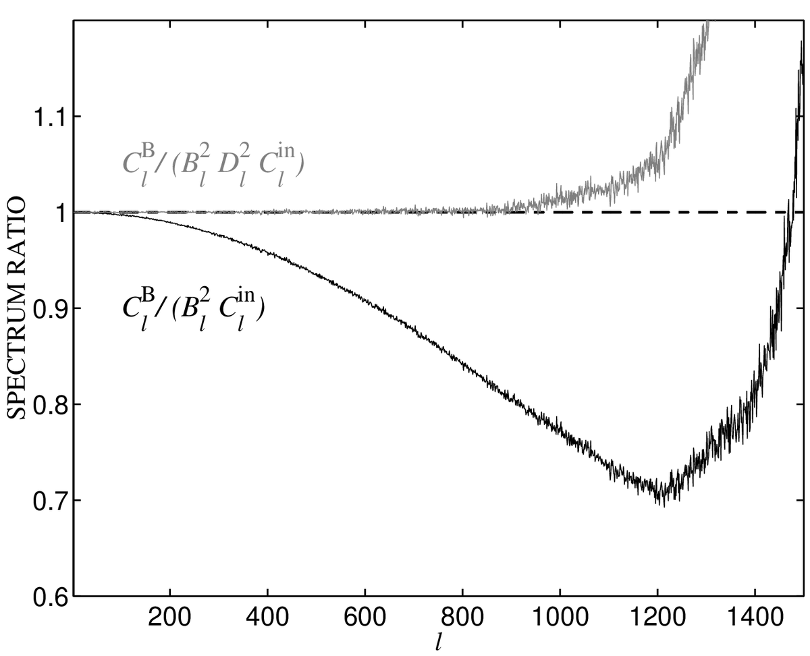

### 图说什么

$C_\ell^{\rm B} / C_\ell^{\rm in}$ 的比值（黑线），以及用近似像素窗函数 $D_\ell^2(512)/D_\ell^2(1024)$ 校正后的比值（灰线）。Case 3。 [原文]

### 怎么看

- 黑线在 $\ell \lesssim 800$ 处单调下降——主要是像素窗函数的平滑效应
- 灰线在 $\ell \lesssim 800$ 处接近 1——像素窗函数校正有效
- 高 $\ell$（$> 800$）处灰线急剧上升——非均匀亚像素采样导致的模式耦合（mode coupling），从低 $\ell$ 向高 $\ell$ 泄漏功率 [原文]

### 需要理解的物理

HEALPix 的像素窗函数 $D_\ell$ 假设像素内的命中均匀且对称分布——实际上不同亚像素的命中数不同（Case 3 中每个 $N_{\rm side} = 512$ 像素包含 4 个 $N_{\rm side} = 1024$ 子像素，命中数不均匀），这导致 mode coupling 矩阵 $M_{\ell\ell'}^{\rm B}$ 有非零非对角元素，把低 $\ell$ 的功率耦合到高 $\ell$。这个效应与制图算法无关，是像素化和采样本身的效应。 [原文]

---

## 图间逻辑链

```
Fig 1（扫描命中数）
  → 决定了每个像素的噪声水平和交叉点冗余度

Fig 2-3（输出图 / 误差图）
  → 宏观看三个代码的图长得差不多

Fig 4（差分图）
  → 定量揭示：ML 内部差异 ≪ ML 与 destriping 的差异

Fig 5（信号误差图）★
  → 核心发现：ML 信号误差 > destriping，且集中在前景梯度处

Fig A1（像素化噪声 PSD）
  → 解释 Fig 5 的物理原因：像素化噪声近白，ML 滤波器放大了它

Fig 6-8（误差功率谱 / MC 噪声偏差）
  → 从图域转到谱域：destriping 总噪声更高

Fig 9（binned noiseless map 的谱）
  → 建立功率谱比较的基准

Fig 10（功率谱估计）
  → 两种方法的估计在此尺度上难以区分

Fig 11（归一化误差，未校正）
  → 暴露 ML 的系统性偏差

Fig 12（滤波函数 $F_\ell$）★
  → 定量给出偏差大小：ML ~0.6%，destriping ~0

Fig 13（归一化误差，校正后）
  → 校正 $F_\ell$ 后偏差消失，两种方法等价

Fig 14（误差条比值）★
  → 最终结论：destriping 误差条比 ML 大约 5%
```
